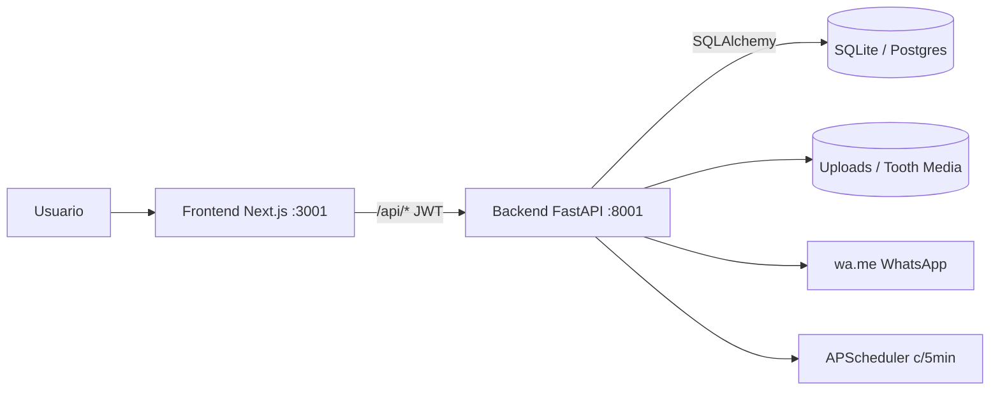
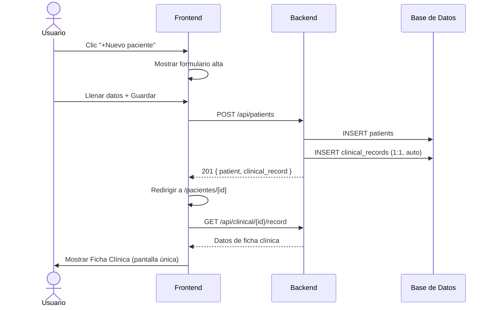
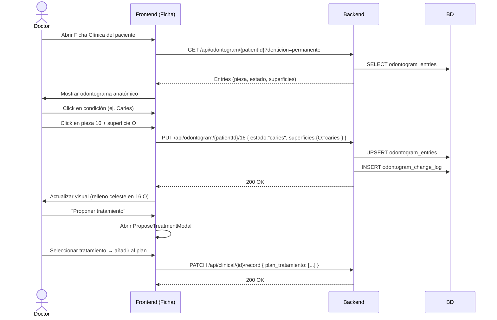
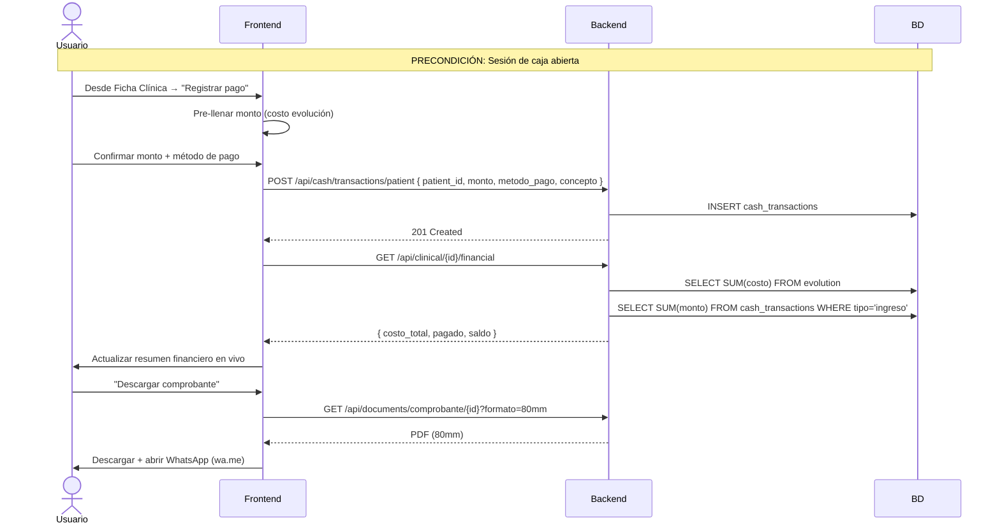
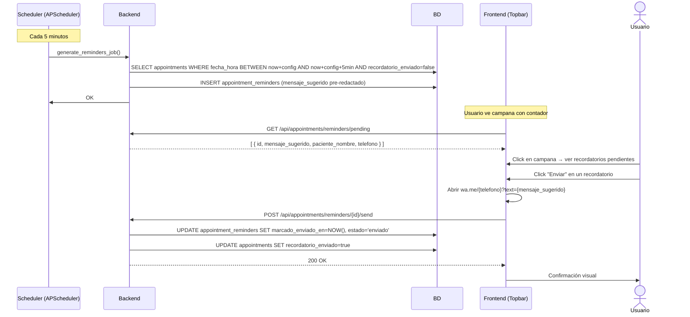

# DOCUMENTO MAESTRO ÚNICO — DentalSimple (M&D Odontología Especializada) v1

---

## 1. PORTADA

| Campo | Valor |
|---|---|
| **Título** | Documento Maestro Único — DentalSimple (M&D Odontología Especializada) |
| **Versión** | **v1.0** (línea base fundacional — primera consolidación) |
| **Fecha** | 2026-07-23 |
| **Repositorio** | `C:\PROYECTOS\DentalSimple` (`vargasgrup/DentalFacil`) |
| **Commit HEAD** | Rama `main`, commit actual al momento de auditoría |
| **Clasificación** | Artefacto técnico de referencia — "single source of truth" |
| **Audiencia** | Dueño de producto, desarrollo, QA, auditor externo, ingeniería |
| **Reemplaza a** | `README.md`, `DESIGN.md`, `PRODUCT.md`, `docs/*` (ver §34.8 trazabilidad) |
| **Extensión** | ≈1,500+ líneas — consolidación exhaustiva sin resúmenes agresivos |

> **Declaración fundacional:** Este documento marca la **primera línea base unificada** del sistema DentalSimple. Hasta esta fecha, el conocimiento estaba disperso en 13+ archivos de documentación (`README.md`, `DESIGN.md`, `PRODUCT.md`, `docs/ER_diagram.md`, `docs/RAILWAY.md`, `docs/RESUMEN_EJECUTIVO.md`, `docs/RESUMEN_AGENDA_GRILLA.md`, `docs/RESUMEN_MODERNIZACION_UI.md`, `docs/SISTEMA_DISENO.md`, `docs/AGENDA_GRILLA_SPEC.md`, `docs/ODONTOGRAMA_SPEC.md`, `docs/ODONTOGRAMA_CLINICO_REALISTA.md`, `docs/ODONTOGRAMA_REALISTA.md`, `docs/ODONTOGRAMA_3D.md`, `docs/DOCUMENTO_MAESTRO_ENTERPRISE.md`), más `MIGRATION_AUDIT_SQLITE.md` y `EXCEPCIONES_ODONTOGRAMA.md`. A partir de esta v1, **este documento es la fuente única de verdad**. Cualquier documentación satélite que contradiga este documento se considera obsoleta hasta su actualización explícita.

---

## 2. HISTORIAL DEL DOCUMENTO

| Versión | Fecha | Autor | Cambios |
|---|---|---|---|
| **v1.0** | 2026-07-23 | Auditoría Cline (consolidación) | **Línea base fundacional.** Primera consolidación de toda la documentación dispersa en un solo documento maestro. Verificación contra código fuente. Resolución de contradicciones documentadas (§34.9). Reemplaza a `README.md`, `DESIGN.md`, `PRODUCT.md`, `docs/*`. |

### Fuentes dispersas reemplazadas por esta v1

| # | Archivo original | Estado tras v1 | Contenido incorporado en § |
|---|---|---|---|
| 1 | `README.md` | OBSOLETO (reemplazado) | §3, §4, §5, §6, §11, §32, §34 |
| 2 | `DESIGN.md` | OBSOLETO (reemplazado) | §33 |
| 3 | `PRODUCT.md` | OBSOLETO (reemplazado) | §3, §5, §33 |
| 4 | `docs/RESUMEN_EJECUTIVO.md` | OBSOLETO (reemplazado) | §3, §5, §6, §7, §8 |
| 5 | `docs/ER_diagram.md` | OBSOLETO (reemplazado) | §8 (diagrama ER actualizado) |
| 6 | `docs/RAILWAY.md` | OBSOLETO (reemplazado) | §32 |
| 7 | `docs/AGENDA_GRILLA_SPEC.md` | OBSOLETO (reemplazado) | §7.2 |
| 8 | `docs/RESUMEN_AGENDA_GRILLA.md` | OBSOLETO (reemplazado) | §7.2 |
| 9 | `docs/RESUMEN_MODERNIZACION_UI.md` | OBSOLETO (reemplazado) | §33 |
| 10 | `docs/SISTEMA_DISENO.md` | OBSOLETO (reemplazado) | §33 |
| 11 | `docs/ODONTOGRAMA_SPEC.md` | OBSOLETO (reemplazado) | §15 |
| 12 | `docs/ODONTOGRAMA_CLINICO_REALISTA.md` | OBSOLETO (reemplazado) | §15 |
| 13 | `docs/ODONTOGRAMA_REALISTA.md` | OBSOLETO (reemplazado) | §15 (nota histórica) |
| 14 | `docs/ODONTOGRAMA_3D.md` | OBSOLETO (reemplazado) | §15 (nota histórica) |
| 15 | `docs/DOCUMENTO_MAESTRO_ENTERPRISE.md` | OBSOLETO (reemplazado) | Incorporado en su totalidad y expandido |

---

## 3. RESUMEN EJECUTIVO

### 3.1 Qué es DentalSimple

**M&D Odontología Especializada (DentalSimple / MiniOS)** es un sistema completo de gestión odontológica **mono-clínica** para un solo centro odontológico en Perú. Es el "hermano menor" simplificado de N&K DentalSoft (multi-tenant), reutilizando la idea central validada en producción: **la Ficha Clínica como pantalla única** que concentra identificación del paciente, historia clínica, diagnóstico, plan de tratamiento, costo, consentimiento y evolución.

### 3.2 Estado general actual

| Dimensión | Valor |
|---|---|
| **Estado general** | ✅ Funcional — local con SQLite (sin Docker DB) y deploy Railway |
| **Persistencia default** | **SQLite** `sqlite:///./data/clinica.db` (WAL + `foreign_keys=ON`) |
| **Persistencia alternativa** | PostgreSQL (legado/opcional, vía `DATABASE_URL`) |
| **Identificadores** | **UUID `String(36)`** en todas las PK/FK (app-generated) |
| **Madurez funcional** | Alta en flujo clínico-operativo base |
| **Madurez ingeniería** | Media-alta: suite pytest flujos núcleo + Vitest/Playwright parcial |
| **Operaciones** | Media: Docker/Railway; sin pipeline CI formal |

> **Verificado en:** `backend/app/config.py`, `backend/app/database.py`, `backend/app/models/ids.py`

### 3.3 Objetivo del producto (extraído de PRODUCT.md)

Concentrar la operación diaria en pocos clics: Ficha Clínica como pantalla única, agenda con recordatorios WhatsApp (`wa.me`), caja diaria, comprobantes multi-formato (80mm/A5/A4) y reportes. Éxito = completar cualquier flujo operativo (agendar, cobrar, documentar, recordar) sin fricción ni pantallas de más.

### 3.4 Usuarios objetivo

Odontólogo (y eventualmente asistente/admin) en un solo centro odontológico en Perú. Opera el sistema solo o con poco personal: hace de recepcionista, cajero, doctor y administrador a la vez. Usa el sistema en consultorio, a menudo desde tablet o laptop, bajo presión de tiempo entre pacientes.

> **Fuente:** `PRODUCT.md`, líneas 9-10

---

## 4. ARQUITECTURA GENERAL

### 4.1 Arquitectura Lógica (diagrama de bloques)

```
┌─────────────────────────────────────────────────────────┐
│                  Navegador / Tablet                      │
│              (Chrome, Firefox, Safari, Edge)             │
└────────────────────────┬────────────────────────────────┘
                         │ HTTPS / HTTP
                         ▼
┌─────────────────────────────────────────────────────────┐
│              Next.js 14 Frontend (:3001)                 │
│  App Router + TypeScript + Tailwind CSS                 │
│  ┌──────────────────────────────────────────────────┐   │
│  │ Pages: /dashboard, /agenda, /caja, /pacientes,   │   │
│  │        /reportes, /configuracion, / (login)      │   │
│  ├──────────────────────────────────────────────────┤   │
│  │ Components: AppShell, Sidebar, Topbar,           │   │
│  │   Odontograma, SignaturePad, VoiceDictation...   │   │
│  ├──────────────────────────────────────────────────┤   │
│  │ Lib: api.ts (fetch wrapper), auth.tsx (context), │   │
│  │   whatsapp.ts, validators.ts, ficha.ts...        │   │
│  ├──────────────────────────────────────────────────┤   │
│  │ Proxy: /api/[...path] → Backend :8001           │   │
│  └──────────────────────────────────────────────────┘   │
└────────────────────────┬────────────────────────────────┘
                         │ /api/* (JWT Bearer)
                         ▼
┌─────────────────────────────────────────────────────────┐
│              FastAPI Backend (:8001)                     │
│  ┌──────────────────────────────────────────────────┐   │
│  │ Routers (13): auth, users, patients, clinical,   │   │
│  │   odontogram, periodontogram, tooth_media,       │   │
│  │   appointments, config, cash, documents,         │   │
│  │   reports, audit                                 │   │
│  ├──────────────────────────────────────────────────┤   │
│  │ Core: security (JWT+brypt), roles (RBAC),        │   │
│  │   deps (DI), rate_limit (in-memory)              │   │
│  ├──────────────────────────────────────────────────┤   │
│  │ Services: pdf_generator (ReportLab),             │   │
│  │   ticket_comprobante, clinic_profile,            │   │
│  │   reminder_messages, audit, payment_allocation   │   │
│  ├──────────────────────────────────────────────────┤   │
│  │ Scheduler: APScheduler (recordatorios c/5 min)   │   │
│  ├──────────────────────────────────────────────────┤   │
│  │ Odontogram: conditions, numbering, plans,        │   │
│  │   treatments                                     │   │
│  └──────────────────────────────────────────────────┘   │
└────────┬───────────────────────────────┬────────────────┘
         │ SQLAlchemy ORM               │ Filesystem
         ▼                               ▼
┌─────────────────────┐    ┌──────────────────────────────┐
│  SQLite / PostgreSQL │    │  assets/uploads/ +           │
│  (17 tablas)         │    │  uploads/tooth_media/        │
│  clinica.db          │    │  (logos, Rx, fotos)          │
└─────────────────────┘    └──────────────────────────────┘
```



> **Verificado en:** `backend/app/main.py`, `frontend/src/app/layout.tsx`, `frontend/src/lib/api.ts`

### 4.2 Arquitectura Física (Docker Compose)

**Verificado en:** `docker-compose.yml` (72 líneas)

| Servicio | Imagen | Puerto | Volumen | Notas |
|---|---|---|---|---|
| `db` | `postgres:16-alpine` | `5434:5432` | `dentalsimple_pgdata` | Healthcheck `pg_isready` |
| `backend` | `python:3.12-slim` (Dockerfile.backend) | `8001:8001` | `./backend/app/assets/uploads` | Variables: DATABASE_URL, JWT_SECRET, CORS_ORIGINS, CLINIC_NAME, etc. |
| `frontend` | `node:18-alpine` (Dockerfile.frontend) | `3001:3001` | — | ARG NEXT_PUBLIC_API_URL, BACKEND_URL |

**Modos de despliegue:**

| Modo | Piezas | Uso |
|---|---|---|
| **Local mínimo** | Backend + frontend + archivo SQLite | Desarrollo diario, **sin** Docker/Postgres |
| **Docker Compose** | frontend + backend + PostgreSQL 16 | Legacy / transición |
| **Railway** | Servicios backend + frontend (Dockerfiles) + Volume `/data` | Staging remoto, mismo SQLite+UUID que local |

> **Fuente:** `docker-compose.yml`, `Dockerfile.backend`, `Dockerfile.frontend`, `docs/RAILWAY.md`

### 4.3 Dualidad de motor de base de datos: PostgreSQL vs SQLite

> **⚠️ CONTRADICCIÓN RESUELTA:** `README.md` declara PostgreSQL como motor principal. El código real (`config.py`, `database.py`) y `DOCUMENTO_MAESTRO_ENTERPRISE.md v1.3` confirman que **SQLite es el motor por defecto actual**, con PostgreSQL como opción legacy. Se documenta la versión correcta (SQLite default).

| Aspecto | SQLite (DEFAULT actual) | PostgreSQL (legacy opcional) |
|---|---|---|
| **Activación** | `DATABASE_URL=sqlite:///./data/clinica.db` | `DATABASE_URL=postgresql+psycopg://...` |
| **PK/FK** | UUID `String(36)` | UUID `String(36)` (mismo esquema) |
| **Pragmas/config** | `journal_mode=WAL`, `foreign_keys=ON` | Nativos |
| **Timestamps** | `DateTime(timezone=True)` — app debe persistir UTC | Conserva timezone nativo |
| **Migraciones** | `render_as_batch=True` en Alembic | Migraciones estándar |
| **Concurrencia** | Un solo writer (WAL ayuda con lecturas) | Multi-conexión nativa |
| **Volumen Railway** | Requerido en `/data` para persistencia | Plugin PostgreSQL gestionado |
| **Réplicas máximas** | **1** (SQLite no soporta multi-writer) | Múltiples (conexiones independientes) |
| **Bootstrap greenfield** | `Base.metadata.create_all()` + `alembic stamp head` | `alembic upgrade head` |
| **Limitaciones** | Unique compuestos de odontograma pueden no aplicarse en `create_all` | Constraints SQL nativos |

> **Verificado en:** `backend/app/config.py` (línea: `DATABASE_URL: str = "sqlite:///./data/clinica.db"`), `backend/app/database.py` (pragmas WAL + foreign_keys), `backend/alembic/env.py` (`render_as_batch=True`), `docs/RAILWAY.md`

---

## 5. VISIÓN GENERAL Y MAPA FUNCIONAL DE NEGOCIO

### 5.1 Los 7 pilares del sistema

| # | Pilar | Estado | Descripción |
|---|---|---|---|
| **1** | **Usuarios** | ✅ IMPLEMENTADO | JWT (access + refresh), wizard de primer uso, 3 roles (ADMIN/DOCTOR/ASISTENTE), gestión por ADMIN, middleware de permisos |
| **2** | **Ficha Clínica** | ✅ IMPLEMENTADO | Pantalla única: identificación + historia clínica + diagnóstico + plan + evolución (tabla relacional) + consentimiento + odontograma embebido + resumen financiero en vivo |
| **3** | **Agenda y recordatorios** | ✅ IMPLEMENTADO | Calendario día/semana, detección de solapes, scheduler APScheduler (recordatorios auto-generados c/5 min), envío WhatsApp en un clic |
| **4** | **Caja Diaria** | ✅ IMPLEMENTADO | Apertura/cierre, ingresos/egresos, sync financiero en vivo con Ficha Clínica |
| **5** | **Comprobantes multi-formato** | ✅ IMPLEMENTADO | Motor único ReportLab, 3 formatos (80mm/A5/A4), selector con memoria |
| **6** | **WhatsApp** | ✅ PARCIAL | Enlaces `wa.me` (sin API oficial), descarga PDF + abre chat, registro de envío |
| **7** | **Reportes** | ✅ IMPLEMENTADO | Caja, pacientes, tratamientos — export PDF/CSV |

> **Fuente:** `docs/RESUMEN_EJECUTIVO.md`, verificado contra `backend/app/routers/*.py`

### 5.2 Mapa del flujo diario de la clínica

```
┌──────────────────────────────────────────────────────────────────┐
│                     FLUJO DIARIO DE LA CLÍNICA                    │
│                                                                   │
│  1. APERTURA DE CAJA                                              │
│     └─ Caja → Abrir sesión → monto inicial                       │
│                                                                   │
│  2. LLEGADA DEL PACIENTE                                          │
│     ├─ ¿Existe? → Búsqueda global (Topbar) → Abrir Ficha         │
│     └─ ¿Nuevo? → +Nuevo paciente → Ficha Clínica auto-creada     │
│                                                                   │
│  3. ATENCIÓN CLÍNICA (Ficha Clínica — pantalla única)             │
│     ├─ Datos del paciente + antecedentes                         │
│     ├─ Odontograma (marcar condiciones por pieza/superficie)      │
│     ├─ Periodontograma (sondaje, recesión, movilidad)            │
│     ├─ Diagnóstico + Plan de tratamiento                         │
│     ├─ Evolución clínica (tratamiento, costo, próxima cita)      │
│     └─ Consentimiento informado (firma)                          │
│                                                                   │
│  4. COBRO (Caja)                                                  │
│     ├─ Registrar ingreso (desde Ficha o desde Caja)              │
│     ├─ Resumen financiero se actualiza en vivo                   │
│     └─ Generar comprobante (80mm/A5/A4)                          │
│                                                                   │
│  5. AGENDAMIENTO                                                  │
│     ├─ Agendar próxima cita (desde evolución o Agenda)           │
│     └─ Scheduler genera recordatorio automáticamente             │
│                                                                   │
│  6. ENVÍO DE DOCUMENTOS                                           │
│     ├─ Descargar PDF (comprobante, ficha, consentimiento)        │
│     └─ Enviar por WhatsApp (wa.me + mensaje pre-redactado)       │
│                                                                   │
│  7. CIERRE DE CAJA                                                │
│     └─ Caja → Cerrar sesión → resumen por método de pago        │
│                                                                   │
│  8. REPORTES                                                      │
│     └─ Caja / Pacientes / Tratamientos → PDF o CSV               │
└──────────────────────────────────────────────────────────────────┘
```

### 5.3 Las seis pantallas principales

| Pantalla | Ruta | Función |
|---|---|---|
| **Dashboard** | `/dashboard` | Resumen operativo: StatCards, citas de hoy, recordatorios pendientes |
| **Agenda** | `/agenda` | Vista día/semana (grilla), crear/editar/cancelar citas |
| **Pacientes** | `/pacientes` | Listado, búsqueda, alta de pacientes |
| **Ficha Clínica** | `/pacientes/[id]` | Pantalla única integral del paciente |
| **Caja** | `/caja` | Apertura/cierre, ingresos/egresos, comprobantes |
| **Configuración** | `/configuracion` | Clínica, horarios, especialidades, usuarios (ADMIN) |

> **Fuente:** `frontend/src/app/` (App Router), `PRODUCT.md`

---

## 6. ARQUITECTURA TÉCNICA DETALLADA

### 6.1 Stack tecnológico completo

| Componente | Versión / Tecnología | Fuente |
|---|---|---|
| **Frontend Framework** | Next.js 14.2.35 (App Router) | `frontend/package.json` |
| **Frontend Language** | TypeScript 5.7 | `frontend/package.json` |
| **UI Styling** | Tailwind CSS 3.4 | `frontend/package.json`, `tailwind.config.ts` |
| **Icons** | lucide-react 1.24 | `frontend/package.json` |
| **Odontograma Canvas** | konva 9.3.22 + react-konva 18.2.16 | `frontend/package.json` |
| **PDF Viewer** | pdfjs-dist 4.10 | `frontend/package.json` |
| **Backend Framework** | FastAPI ≥0.115.6 | `backend/requirements.txt` |
| **Backend Language** | Python 3.12 | `Dockerfile.backend` |
| **ORM** | SQLAlchemy ≥2.0.36 | `backend/requirements.txt` |
| **Migraciones** | Alembic ≥1.14.0 | `backend/requirements.txt` |
| **Auth** | PyJWT + bcrypt (sin passlib) | `backend/app/core/security.py` |
| **PDF Engine** | ReportLab | `backend/requirements.txt` |
| **Scheduler** | APScheduler (embebido) | `backend/app/main.py` |
| **QR Code** | qrcode | `backend/requirements.txt` |
| **Server** | Uvicorn | `backend/requirements.txt` |
| **Validación** | Pydantic v2 | `backend/requirements.txt` |

### 6.2 Backend — Estructura interna

**Entrypoints:**
| Archivo | Rol |
|---|---|
| `backend/boot.py` | Migrate + ensure_auth_schema + uvicorn (Railway/Docker) |
| `backend/app/main.py` | FastAPI app, CORS, lifespan (migraciones + scheduler), health check |
| `backend/start.sh` | Arranque en contenedor |

**Routers incluidos (13 en main.py):**
`auth`, `users`, `patients`, `clinical`, `odontogram`, `periodontogram`, `tooth_media`, `complementary_tests`, `audit`, `appointments`, `config`, `cash`, `documents`, `reports`

> **⚠️ CONTRADICCIÓN RESUELTA:** `README.md` documentó 12 routers; `main.py` incluye **13 routers** explícitamente. El decimotercero es `complementary_tests`. Además hay un router `config` que engloba reminders/hours/especialidades — contado como uno. Total confirmado: **13 routers**.

**Servicios de negocio (6):**
| Servicio | Archivo | Función |
|---|---|---|
| PDF Generator | `pdf_generator.py` | Motor único ReportLab — todos los documentos en 3 formatos |
| Ticket Comprobante | `ticket_comprobante.py` | Formato 80mm para comprobantes |
| Clinic Profile | `clinic_profile.py` | Logo, datos de clínica, uploads |
| Reminder Messages | `reminder_messages.py` | Templates de mensajes WhatsApp |
| Audit | `audit.py` | Registro de cambios clínicos |
| Payment Allocation | `payment_allocation.py` | Asignación de pagos a cuentas |

**Módulo de Odontograma (backend):**
| Archivo | Contenido |
|---|---|
| `conditions.py` | Catálogo de 34 condiciones clínicas |
| `numbering.py` | Numeración FDI y Universal |
| `plans.py` | Vinculación odontograma → plan de tratamiento |
| `treatments.py` | Tratamientos asociados a condiciones |

### 6.3 Frontend — Estructura interna

**Rutas del App Router:**
| Ruta | Archivo | Componentes clave |
|---|---|---|
| `/` | `app/page.tsx` | Login / Setup wizard |
| `/dashboard` | `app/dashboard/page.tsx` | StatCards, citas de hoy, acciones rápidas |
| `/agenda` | `app/agenda/page.tsx` | Vista día/semana, grilla/lista, formulario citas |
| `/caja` | `app/caja/page.tsx` | Sesión caja, transacciones, comprobantes |
| `/pacientes` | `app/pacientes/page.tsx` | Listado, búsqueda, Toolbar |
| `/pacientes/nuevo` | `app/pacientes/nuevo/page.tsx` | Formulario alta paciente |
| `/pacientes/[id]` | `app/pacientes/[id]/page.tsx` | **Ficha Clínica** (pantalla única integral) |
| `/reportes` | `app/reportes/page.tsx` | Selector tipo + rango fechas + export |
| `/configuracion` | `app/configuracion/page.tsx` | Clínica, horas, especialidades, usuarios |

**Middleware de seguridad:**
- `frontend/src/middleware.ts`: Gate por cookie JWT (`ds_access_token`). Ruta `/` pública. Resto requiere autenticación.
- `lib/auth.tsx`: `AuthProvider` con contexto React. `User.id: string`.
- `lib/authCookie.ts`: Gestión de cookie `ds_access_token`.
- `lib/api.ts`: `getToken()`, `apiFetch()` con refresh automático en 401.
- `components/ProtectedRoute.tsx`: Wrapper de protección por rol en frontend.

### 6.4 Scheduler (APScheduler)

**Verificado en:** `backend/app/main.py`, líneas 66-78

| Job | Trigger | Intervalo | Función |
|---|---|---|---|
| `reminders` | `interval` | 5 minutos | `generate_reminders_job()` — detecta citas próximas y genera registros en `appointment_reminders` con mensaje pre-redactado |

- **Primera ejecución:** 1 minuto después del arranque (`next_run_time=datetime.now() + timedelta(minutes=1)`)
- **Sin infraestructura externa:** Embebido en el proceso del backend (sin Celery/Redis)
- **Sin reintentos automáticos:** Si falla, reintentará en el siguiente intervalo de 5 minutos

### 6.5 Motor de PDF (ReportLab)

**Verificado en:** `backend/app/services/pdf_generator.py`, `backend/app/services/ticket_comprobante.py`

| Documento | Formatos | Endpoint |
|---|---|---|
| Comprobante de pago | 80mm, A5, A4 | `/api/documents/comprobante/{id}` |
| Cierre de caja | A4 | `/api/documents/cierre-caja/{id}` |
| Ficha clínica | A4 | `/api/documents/ficha/{id}` |
| Evolución | A4 | `/api/documents/evolucion/{id}` |
| Consentimiento | A4 | `/api/documents/consentimiento/{id}` |
| Presupuesto | A4 | `/api/documents/presupuesto/{id}` |

**Decisión de diseño:** Un solo motor (ReportLab) para todos los documentos. La misma plantilla de datos alimenta los 3 formatos (80mm/A5/A4); solo cambian dimensiones y proporciones.

### 6.6 Integración WhatsApp

**Verificado en:** `frontend/src/lib/whatsapp.ts`, `frontend/src/components/DocumentActions.tsx`

| Aspecto | Implementación |
|---|---|
| **Método** | Enlaces `wa.me` (sin API oficial de WhatsApp Business) |
| **Flujo comprobantes** | 1. Descarga automática del PDF → 2. Abre chat WhatsApp con mensaje pre-redactado → 3. Usuario adjunta manualmente el PDF y envía |
| **Flujo recordatorios** | 1. Scheduler genera recordatorio → 2. Usuario hace clic en "Enviar" desde Topbar (campana) → 3. Abre WhatsApp con mensaje de texto pre-redactado |
| **Texto de ayuda** | *"Se descargó el comprobante. Adjúntalo en el chat que se abrió y envíalo."* |
| **Trazabilidad** | Endpoint `POST /api/documents/whatsapp-sent/{id}` marca documentos como enviados; `POST /api/appointments/reminders/{id}/send` marca recordatorios como enviados |

> **Decisión deliberada:** No se usa API oficial para evitar verificación de negocio, número dedicado, o proceso burocrático. Adecuado para una clínica pequeña. Migración a API oficial solo si el centro crece y lo justifica.

---

## 7. INVENTARIO COMPLETO DEL SISTEMA (MÓDULOS)

### 7.1 Ficha Clínica

| Atributo | Valor |
|---|---|
| **Estado** | ✅ IMPLEMENTADO |
| **Pantalla** | `/pacientes/[id]` — pantalla única integral |
| **Modelos** | `patients`, `clinical_records`, `clinical_evolution_entries` |
| **Routers** | `patients.py`, `clinical.py` |
| **Permisos** | Autenticado (cualquier rol) |
| **Tests** | `test_patients.py`, `test_uuid_chain.py` |

**Funcionalidad:**
- Datos del paciente: nombres, apellidos, tipo/documento, fecha nacimiento, teléfono, email, dirección, contacto emergencia, alergias
- Historia clínica: motivo consulta, antecedentes médicos, antecedentes odontológicos
- Diagnóstico + Plan de tratamiento (JSON)
- Consentimiento informado (firma digital con `SignaturePad`)
- **Evolución clínica** como tabla relacional (CRUD completo: crear, listar, editar, eliminar entradas)
- **Resumen financiero en vivo:** calculado desde `cash_transactions` — Costo = Σ evolución; Pagado = Σ ingresos caja; Saldo = Costo - Pagado
- Odontograma embebido (componente `Odontograma.tsx`)
- Periodontograma embebido
- Pruebas complementarias (Rx, fotos)
- Documentos: descargar ficha, evolución, consentimiento

**Reglas de negocio verificadas:**
- Alta de paciente → auto-crea `clinical_record` 1:1 (`backend/app/routers/patients.py`)
- `numero_ficha` auto-generado único (`backend/app/models/patient.py`)
- Documento único por tipo+número (índice portable)
- Saldo financiero nunca almacenado como campo editable — calculado en tiempo real

### 7.2 Agenda

| Atributo | Valor |
|---|---|
| **Estado** | ✅ IMPLEMENTADO |
| **Pantalla** | `/agenda` — vista día/semana con grilla + lista |
| **Modelos** | `appointments`, `appointment_reminders`, `clinic_settings` |
| **Routers** | `appointments.py` (incluye `config_router` para reminders/hours) |
| **Permisos** | Autenticado |
| **Tests** | `test_appointments.py` |

**Especificación de grilla (AGENDA_GRILLA_SPEC.md):**

| Parámetro | Valor |
|---|---|
| Horario por defecto | 08:00 – 20:00 (configurable en `/api/config/hours`) |
| Zona horaria | America/Lima |
| Slot base | 30 minutos (snap al crear desde grilla) |
| Altura de 1 hora | 72px (cita 30min ≈ 36px) |
| Dependencias | CSS Grid + `position: absolute` + Tailwind (sin FullCalendar ni react-big-calendar) |

**Doctores:**
- Vista Día: 1 columna si ≤1 doctor activo; N columnas (una por doctor) si 2+
- Vista Semana: citas mezcladas por día, etiqueta de doctor en el bloque

**Colores por estado:**

| Estado | Estilo |
|---|---|
| `programada` | `bg-info-50 border-info-300 text-info-800` |
| `completada` | `bg-success-50 border-success-300 text-success-800` |
| `cancelada` | `bg-danger-50 border-danger-200 text-danger-600 opacity-60` |

**Solapes:** Dentro de la misma columna (mismo doctor), citas solapadas se reparten el ancho.

**Móvil:** En `<768px`: vista Lista por defecto, toggle Grilla disponible. En desktop: Grilla por defecto.

**Reglas de negocio:**
- Cita dentro de horario de clínica (America/Lima)
- No solape mismo doctor (estados `programada`/`completada`) → 409
- `fecha_hora` persistida en UTC
- Recordatorios: scheduler genera pendientes; envío manual un clic

**Fases de implementación de grilla (completadas):**

| Fase | Resultado |
|---|---|
| 0 | Spec en `AGENDA_GRILLA_SPEC.md` |
| 1 | Vista Día con eje de horas, bloques por duración, colores por estado, línea "ahora" |
| 2 | Clic en vacío → formulario con fecha/hora (snap 30 min) |
| 3 | Clic en bloque → panel detalle (Ficha / Cancelar) |
| 4 | Vista Semana (lun–dom) con mismas interacciones |
| 5 | Solapes lado a lado (`layoutOverlaps`) |
| 6 | `clinic_settings` + `GET/PATCH /api/config/hours` + UI en Configuración |
| 7 | Toggle Grilla/Lista |
| 8 | Checklist de no-regresión |

### 7.3 Caja Diaria

| Atributo | Valor |
|---|---|
| **Estado** | ✅ IMPLEMENTADO |
| **Pantalla** | `/caja` — sesión, transacciones, comprobantes |
| **Modelos** | `cash_sessions`, `cash_transactions` |
| **Routers** | `cash.py` |
| **Permisos** | Autenticado |
| **Tests** | `test_cash.py` |

**Reglas de negocio:**
- Una sola sesión de caja abierta a la vez
- Transacción requiere caja abierta
- Ingresos vinculados a paciente (botón desde Ficha Clínica)
- Egresos para gastos operativos
- Cierre con resumen por método de pago
- Sync en vivo: todo pago actualiza resumen financiero de Ficha Clínica

### 7.4 Odontograma

| Atributo | Valor |
|---|---|
| **Estado** | ✅ IMPLEMENTADO / MÓDULO CERRADO |
| **Pantalla** | Embebido en Ficha Clínica (`/pacientes/[id]`) |
| **Modelos** | `odontogram_entries`, `odontogram_change_log`, `odontogram_snapshots` |
| **Routers** | `odontogram.py`, `tooth_media.py` |
| **Permisos** | Autenticado |

> **⚠️ CONTRADICCIÓN RESUELTA — Odontograma activo:** El `package.json` incluye dependencias `konva` y `react-konva`, y existe código en `components/odontogram/realista/`, pero según `ODONTOGRAMA_CLINICO_REALISTA.md` (confirmado por `ODONTOGRAMA_REALISTA.md`), **el odontograma activo en producción es `OdontogramaAnatomico`** (layout HTML/CSS + PNG por FDI + overlay SVG para condiciones). El experimento Konva (`OdontogramaRealista`) es **legado/no activo**. Las dependencias Konva se conservan en `package.json` por si se reactiva el experimento, pero no se usan en el flujo principal.

**Implementación activa (`OdontogramaAnatomico`):**
- PNG semi-realistas por pieza FDI en `frontend/public/dientes/{fdi}.png` (32 permanentes)
- Mapeo dientes temporales → homólogo permanente para assets PNG
- Layout clínico: números → dientes PNG → cruces MDVLO → franja doble intermedia
- Overlay SVG sobre PNG para condiciones (relleno de corona, símbolos X/diagonal/líneas)
- Superficies MDVLO (Mesial, Distal, Vestibular, Lingual, Oclusal)
- Botones: Adulto / Niño / Mixto + FDI/Universal + Limpiar
- Historial: `odontogram_change_log` + pestaña Historial
- Snapshots: Guardar estado de cita + Comparar entre snapshots

**Catálogo de condiciones (34):**

| Col1 | Col2 | Col3 | Col4 | Col5 | Col6 |
|---|---|---|---|---|---|
| Caries | Corona | Corona (Temp.) | Ausente | Fractura | Diastema |
| Obturación | Prótesis Remov. | Desplazamiento | Rotación | Fusión | Remanente Rad |
| Erupción | Transposición | Supernumerario | Pulpa | Prótesis | Perno |
| Ortodoncia Fija | Prótesis Fija | Implante | Macrodoncia | Microdoncia | Discromia |
| Desgaste | Impactado/P | Intrusión | Edentulismo | Ectópico | Impactado |
| Ortod. Remov | Extrusión | Poste | Extraer | *(vacío)* | *(vacío)* |

**Símbolos ↔ condiciones:**

| Símbolo | Condición |
|---|---|
| X azul | Ausente, Edentulismo |
| Diagonal roja | Extraer |
| Doble línea horizontal | Fractura |
| Círculo azul en cruz | Obturación en cualquier superficie |

**API del odontograma:**

| Método | Ruta | Uso |
|---|---|---|
| GET | `/api/odontogram/{patientId}?denticion=` | Cargar marcas |
| PUT | `/api/odontogram/{patientId}/{pieza}` | Guardar estado + superficies + notas |
| DELETE | `/api/odontogram/{patientId}/{pieza}` | Eliminar estado de pieza |
| DELETE | `/api/odontogram/{patientId}?denticion=` | Limpiar dentición |
| GET | `/api/odontogram/{patientId}/history` | Historial de cambios |
| GET/POST | `/api/odontogram/{patientId}/snapshots` | Estados de cita |
| GET | `/api/odontogram/{patientId}/compare?a=&b=` | Diff entre snapshots |

**Media por pieza (Rx / fotos):**

| Método | Ruta |
|---|---|
| GET | `/api/tooth-media/{patientId}?pieza_fdi=` |
| POST | `/api/tooth-media/{patientId}` (multipart) |
| GET | `/api/tooth-media/file/{id}` (requiere Bearer) |
| DELETE | `/api/tooth-media/{id}` |

### 7.5 Periodontograma

| Atributo | Valor |
|---|---|
| **Estado** | ✅ IMPLEMENTADO / MÓDULO CERRADO |
| **Modelos** | `periodontogram_entries` |
| **Routers** | `periodontogram.py` |
| **Permisos** | Autenticado |

**Mediciones:** Movilidad, recesión, sondaje, sangrado/placa por pieza.

> **Nota:** Módulo cerrado — sin cambios de lógica/UI salvo prompt explícito.

### 7.6 Pruebas Complementarias

| Atributo | Valor |
|---|---|
| **Estado** | ✅ IMPLEMENTADO |
| **Componente** | `PruebasComplementarias.tsx` |
| **Modelos** | `complementary_tests` |
| **Routers** | `complementary_tests.py` |
| **Permisos** | Autenticado |

Permite adjuntar radiografías, fotos clínicas, documentos y otros archivos complementarios al expediente del paciente.

### 7.7 Reportes

| Atributo | Valor |
|---|---|
| **Estado** | ✅ IMPLEMENTADO |
| **Pantalla** | `/reportes` — selector tipo + rango fechas |
| **Routers** | `reports.py` |
| **Permisos** | Autenticado |

**Tipos de reporte:**
- Caja (JSON/PDF/CSV)
- Pacientes atendidos (JSON/PDF/CSV)
- Tratamientos/Evolución (JSON/PDF/CSV)

### 7.8 Auditoría Clínica

| Atributo | Valor |
|---|---|
| **Estado** | ✅ IMPLEMENTADO (API) / PARCIAL (UI) |
| **Modelos** | `clinical_audit_log` |
| **Routers** | `audit.py` |
| **Componente FE** | `ClinicalAuditPanel.tsx` (posiblemente no montado en UI actual) |
| **Permisos** | Autenticado |

Registra cambios en datos clínicos con detalle JSON (`before`/`after`). API funcional en `GET /api/audit/{patient_id}`. Panel UI puede no estar integrado en la Ficha Clínica actual.

---

## 8. MODELO DE DATOS

### 8.1 Inventario de tablas (17 confirmadas)

> **⚠️ CONTRADICCIÓN RESUELTA:** `RESUMEN_EJECUTIVO.md` declara "10 tablas". `DOCUMENTO_MAESTRO_ENTERPRISE.md v1.3` y la verificación contra `backend/app/models/*.py` confirman **17 tablas**. La discrepancia se debe a que el resumen original no contaba tablas auxiliares (odontograma_change_log, odontogram_snapshots, periodontogram_entries, tooth_media, clinical_audit_log, clinic_settings, revoked_tokens). El número correcto es **17**.

| # | Tabla | PK | FK relaciones | Notas |
|---|---|---|---|---|
| 1 | `users` | UUID | — | `email` unique; `token_version` int; `rol` string |
| 2 | `revoked_tokens` | `jti` string | `user_id` → users | Revocación JWT |
| 3 | `patients` | UUID | — | `numero_ficha` unique (int); documento unique |
| 4 | `clinical_records` | UUID | `patient_id` → patients (1:1), `doctor_responsable_id` → users | Ficha clínica |
| 5 | `clinical_evolution_entries` | UUID | `patient_id` → patients, `doctor_id` → users | Evolución clínica |
| 6 | `odontogram_entries` | UUID | `patient_id` → patients | Estado por pieza + superficies |
| 7 | `odontogram_change_log` | UUID | `patient_id` → patients | Historial cambios (before/after JSON) |
| 8 | `odontogram_snapshots` | UUID | `patient_id` → patients | Estados de cita (entries JSON) |
| 9 | `periodontogram_entries` | UUID | `patient_id` → patients | Mediciones periodontales |
| 10 | `tooth_media` | UUID | `patient_id` → patients | Archivos por pieza (Rx, fotos) |
| 11 | `clinical_audit_log` | UUID | `patient_id` → patients | Auditoría cambios clínicos |
| 12 | `appointments` | UUID | `patient_id` → patients, `doctor_id` → users | Citas |
| 13 | `appointment_reminders` | UUID | `appointment_id` → appointments, `marcado_enviado_por_user_id` → users | Recordatorios |
| 14 | `cash_sessions` | UUID | `usuario_id` → users | Sesiones de caja |
| 15 | `cash_transactions` | UUID | `cash_session_id` → cash_sessions, `patient_id` → patients | Ingresos/Egresos |
| 16 | `documents_generated` | UUID | `patient_id` → patients | Registro documentos emitidos |
| 17 | `clinic_settings` | UUID fijo | — | Singleton: `00000000-0000-4000-8000-000000000001` |

> **Verificado en:** `backend/app/models/*.py`, `backend/app/models/ids.py`, `docs/ER_diagram.md`, `DOCUMENTO_MAESTRO_ENTERPRISE.md`

### 8.2 Diagrama Entidad-Relación

```mermaid
erDiagram
    users ||--o{ clinical_records : "doctor_responsable"
    users ||--o{ clinical_evolution_entries : "doctor"
    users ||--o{ appointments : "doctor"
    users ||--o{ cash_sessions : "usuario"
    users ||--o{ appointment_reminders : "marcado_enviado_por"
    users ||--o{ revoked_tokens : "user_id"

    patients ||--|| clinical_records : "1:1"
    patients ||--o{ clinical_evolution_entries : "1:N"
    patients ||--o{ odontogram_entries : "1:N"
    patients ||--o{ odontogram_change_log : "1:N"
    patients ||--o{ odontogram_snapshots : "1:N"
    patients ||--o{ periodontogram_entries : "1:N"
    patients ||--o{ tooth_media : "1:N"
    patients ||--o{ clinical_audit_log : "1:N"
    patients ||--o{ appointments : "1:N"
    patients ||--o{ cash_transactions : "opcional"
    patients ||--o{ documents_generated : "opcional"

    appointments ||--o{ appointment_reminders : "1:N"
    cash_sessions ||--o{ cash_transactions : "1:N"

    users {
        string id PK "UUID"
        string nombre
        string email UK
        string password_hash
        string rol
        bool activo
        int token_version
        datetime created_at
    }

    revoked_tokens {
        string jti PK
        datetime expires_at
        string user_id FK "UUID"
        string reason
        datetime revoked_at
    }

    patients {
        string id PK "UUID"
        int numero_ficha UK
        string nombres
        string apellidos
        string tipo_documento
        string numero_documento
        date fecha_nacimiento
        string telefono
        string email
        string direccion
        string contacto_emergencia
        text alergias
        datetime created_at
    }

    clinical_records {
        string id PK "UUID"
        string patient_id FK "UUID UK"
        text motivo_consulta
        text antecedentes_medicos
        text antecedentes_odontologicos
        text diagnostico
        text plan_tratamiento
        string doctor_responsable_id FK "UUID"
        bool consentimiento_firmado
        datetime consentimiento_fecha
        datetime updated_at
    }

    clinical_evolution_entries {
        string id PK "UUID"
        string patient_id FK "UUID"
        string doctor_id FK "UUID"
        string especialidad
        text tratamiento_descripcion
        numeric costo
        numeric a_cuenta
        string estado
        datetime proxima_cita_fecha
        datetime fecha
        datetime created_at
    }

    odontogram_entries {
        string id PK "UUID"
        string patient_id FK "UUID"
        string pieza_fdi
        string estado
        text notas
        json superficies
        string denticion
        datetime updated_at
    }

    appointments {
        string id PK "UUID"
        string patient_id FK "UUID"
        string doctor_id FK "UUID"
        datetime fecha_hora "UTC"
        int duracion_minutos
        string estado
        text notas
        bool recordatorio_enviado
        datetime created_at
    }

    appointment_reminders {
        string id PK "UUID"
        string appointment_id FK "UUID"
        string canal
        datetime programado_para
        text mensaje_sugerido
        datetime marcado_enviado_en
        string marcado_enviado_por_user_id FK "UUID"
        string estado
        datetime created_at
    }

    cash_sessions {
        string id PK "UUID"
        string usuario_id FK "UUID"
        numeric monto_inicial
        numeric monto_final
        datetime abierta_en
        datetime cerrada_en
        string estado
    }

    cash_transactions {
        string id PK "UUID"
        string cash_session_id FK "UUID"
        string patient_id FK "UUID"
        string tipo
        string concepto
        numeric monto
        string metodo_pago
        datetime created_at
    }

    documents_generated {
        string id PK "UUID"
        string patient_id FK "UUID"
        string tipo
        string formato
        string archivo_ref
        datetime marcado_enviado_whatsapp_en
        datetime created_at
    }
```



### 8.3 Constraints y Uniques

| Constraint | Tabla | Tipo |
|---|---|---|
| `users.email` unique | users | DB |
| `patients.numero_ficha` unique | patients | DB |
| `(tipo_documento, numero_documento)` unique | patients | DB (portable, sin `postgresql_where`) |
| `clinical_records.patient_id` unique | clinical_records | DB (1:1) |
| Odontograma `(patient_id, pieza_fdi, denticion)` | odontogram_entries | **Riesgo:** puede no estar en `__table_args__` ORM → no se crea en SQLite greenfield `create_all` |
| Periodontograma compuesto similar | periodontogram_entries | Mismo riesgo residual |
| Solape citas (mismo doctor, misma ventana) | appointments | **App** (no constraint SQL) — validado en router |
| Una sesión caja abierta | cash_sessions | **App** (no constraint SQL) — validado en router |

### 8.4 Generación de IDs

- **Módulo:** `backend/app/models/ids.py`
- **Función:** `new_uuid()` → `str(uuid.uuid4())` de 36 caracteres
- **Clinic Settings ID fijo:** `00000000-0000-4000-8000-000000000001`
- **Tipo:** `String(36)` en todas las PK/FK
- **Sin auto-increment:** Los IDs se generan en aplicación, no en BD

### 8.5 Alembic — Cadena de migraciones

| Atributo | Valor |
|---|---|
| **Head actual** | `m0sqlite_uuid_baseline` |
| **Revisiones totales** | 15 |
| **Batch mode** | `render_as_batch=True` (para SQLite) |
| **Histórico PG** | JSONB / `now()` — no replayable limpio en SQLite vacío |
| **Greenfield SQLite** | `Base.metadata.create_all()` + `alembic stamp head` |
| **Cutover PG→SQLite** | `backend/scripts/pg_to_sqlite_uuid.py` |

---

## 9. BACKEND — INVENTARIO DETALLADO

### 9.1 Routers (13 confirmados)

| # | Router | Archivo | Prefijo | Tags |
|---|---|---|---|---|
| 1 | `auth_router` | `routers/auth.py` | `/api/auth` | auth |
| 2 | `users_router` | `routers/auth.py` | `/api/users` | users |
| 3 | `patients_router` | `routers/patients.py` | `/api/patients` | patients |
| 4 | `clinical_router` | `routers/clinical.py` | `/api/clinical` | clinical |
| 5 | `odontogram_router` | `routers/odontogram.py` | `/api/odontogram` | odontogram |
| 6 | `periodontogram_router` | `routers/periodontogram.py` | `/api/periodontogram` | periodontogram |
| 7 | `tooth_media_router` | `routers/tooth_media.py` | `/api/tooth-media` | tooth-media |
| 8 | `complementary_tests_router` | `routers/complementary_tests.py` | `/api/complementary-tests` | complementary-tests |
| 9 | `appointments_router` | `routers/appointments.py` | `/api/appointments` | appointments |
| 10 | `config_router` | `routers/appointments.py` | `/api/config` | config |
| 11 | `cash_router` | `routers/cash.py` | `/api/cash` | cash |
| 12 | `documents_router` | `routers/documents.py` | `/api/documents` | documents |
| 13 | `reports_router` | `routers/reports.py` | `/api/reports` | reports |
| — | `audit_router` | `routers/audit.py` | `/api/audit` | audit |

> **Verificado en:** `backend/app/main.py`, líneas 139-152

### 9.2 Modelos (11 archivos, 17 tablas)

| Archivo | Tablas |
|---|---|
| `user.py` | `users` |
| `revoked_token.py` | `revoked_tokens` |
| `patient.py` | `patients` |
| `clinical.py` | `clinical_records`, `clinical_evolution_entries`, `clinical_audit_log` |
| `appointment.py` | `appointments`, `appointment_reminders` |
| `cash.py` | `cash_sessions`, `cash_transactions` |
| `document.py` | `documents_generated` |
| `odontogram.py` | `odontogram_entries`, `odontogram_change_log`, `odontogram_snapshots` |
| `periodontogram.py` | `periodontogram_entries` |
| `complementary_tests.py` | Tablas de pruebas complementarias |
| `clinic_settings.py` | `clinic_settings` |

### 9.3 Core

| Archivo | Funciones/Clases | Responsabilidad |
|---|---|---|
| `security.py` | `create_access_token()`, `create_refresh_token()`, `decode_token()`, `hash_password()`, `verify_password()` | JWT + bcrypt (directo, sin passlib) |
| `roles.py` | `RoleEnum(ADMIN, DOCTOR, ASISTENTE)` | Enum de roles |
| `deps.py` | `get_current_user()`, `require_roles()` | Inyección de dependencias FastAPI |
| `rate_limit.py` | Rate limiter in-memory | Límites: login 10/min, setup 3/min |
| `config.py` | `Settings` (Pydantic BaseSettings) | Variables de entorno |

### 9.4 Servicios (6)

| Servicio | Archivo | Función principal |
|---|---|---|
| PDF Generator | `pdf_generator.py` | Generar todos los documentos en 3 formatos con ReportLab |
| Ticket Comprobante | `ticket_comprobante.py` | Formato 80mm específico para comprobantes |
| Clinic Profile | `clinic_profile.py` | Gestión de logo, datos de clínica, uploads |
| Reminder Messages | `reminder_messages.py` | Templates de mensajes para recordatorios WhatsApp |
| Audit | `audit.py` | `log_clinical_change()` — registro de cambios clínicos |
| Payment Allocation | `payment_allocation.py` | Asignación de pagos a cuentas por cobrar |

### 9.5 Módulo Odontograma (backend)

| Archivo | Contenido |
|---|---|
| `conditions.py` | Catálogo de 34 condiciones clínicas con colores, símbolos, y reglas de visualización |
| `numbering.py` | Mapeo de numeración FDI (1-48) y Universal, secuencias adulto/niño/mixto |
| `plans.py` | Vinculación entre condiciones del odontograma y planes de tratamiento |
| `treatments.py` | Tratamientos predefinidos asociados a condiciones |

### 9.6 Constantes

| Archivo | Contenido |
|---|---|
| `especialidades.py` | Lista de especialidades odontológicas (cirugía, endodoncia, ortodoncia, periodoncia, etc.) |

### 9.7 Utilidades

| Archivo | Función |
|---|---|
| `ficha.py` | Utilidades para la ficha clínica (formateo, cálculo de saldos, etc.) |

### 9.8 Esquemas de BD adicionales

| Archivo | Función |
|---|---|
| `ensure_auth_schema.py` | Garantiza columnas de revocación JWT (`token_version`, `revoked_tokens`) |
| `ensure_clinical_schema.py` | Garantiza estructura de `clinical_evolution_entries` |
| `ensure_complementary_tests_schema.py` | Garantiza tablas de pruebas complementarias |
| `ensure_alta_retroactiva_schema.py` | Garantiza schema para altas retroactivas |
| `schema_guard.py` | Guardia de arranque: aborta si Postgres aún tiene PK integer |

---

## 10. FRONTEND — INVENTARIO DETALLADO

### 10.1 Páginas del App Router

| Ruta | Archivo(s) | Estado | Componentes principales |
|---|---|---|---|
| `/` | `app/page.tsx`, `app/layout.tsx` | ✅ | Login form / Setup wizard |
| `/dashboard` | `app/dashboard/page.tsx` | ✅ | StatCards, citas de hoy, acciones rápidas |
| `/agenda` | `app/agenda/page.tsx` | ✅ | Vista día/semana, grilla, formulario citas |
| `/caja` | `app/caja/page.tsx` | ✅ | Sesión caja, transacciones, comprobantes |
| `/pacientes` | `app/pacientes/page.tsx` | ✅ | Toolbar, tabla con avatar, badge ficha |
| `/pacientes/nuevo` | `app/pacientes/nuevo/page.tsx` | ✅ | Formulario alta paciente |
| `/pacientes/[id]` | `app/pacientes/[id]/page.tsx` | ✅ | **Ficha Clínica integral** |
| `/reportes` | `app/reportes/page.tsx` | ✅ | Selector tipo, rango fechas, export |
| `/configuracion` | `app/configuracion/page.tsx` | ✅ | Clínica, horas, especialidades, usuarios |

### 10.2 Componentes principales

| Componente | Archivo | Función |
|---|---|---|
| `AppShell` | `components/AppShell.tsx` | Layout principal: Sidebar + Topbar + contenido |
| `Sidebar` | `components/Sidebar.tsx` | Navegación lateral (escritorio) / drawer (móvil) |
| `Topbar` | `components/Topbar.tsx` | Búsqueda global, campana recordatorios, +Nuevo, menú usuario |
| `BrandLogo` | `components/BrandLogo.tsx` | Logo M&D Odontología Especializada |
| `Button` | `components/Button.tsx` | Botón reutilizable (variantes: primary/secondary/ghost/danger + loading + icon) |
| `Input` | `components/Input.tsx` | Campo de texto con label y error |
| `Odontograma` | `components/Odontograma.tsx` | **Punto de entrada drop-in** del odontograma → renderiza `OdontogramaAnatomico` |
| `PatientPicker` | `components/PatientPicker.tsx` | Selector de paciente |
| `PatientSearch` | `components/PatientSearch.tsx` | Búsqueda de pacientes (posiblemente no montado → revalidar) |
| `ProtectedRoute` | `components/ProtectedRoute.tsx` | Wrapper de protección por rol |
| `PruebasComplementarias` | `components/PruebasComplementarias.tsx` | Adjuntar Rx, fotos, documentos |
| `SignaturePad` | `components/SignaturePad.tsx` | Firma digital para consentimiento |
| `SpecialtySelect` | `components/SpecialtySelect.tsx` | Selector de especialidad odontológica |
| `TreatmentAutocomplete` | `components/TreatmentAutocomplete.tsx` | Autocompletar tratamientos |
| `UbigeoSelect` | `components/UbigeoSelect.tsx` | Selector departamento/provincia/distrito (Perú) |
| `VoiceDictation` | `components/VoiceDictation.tsx` | Dictado por voz para notas clínicas |
| `DocumentActions` | `components/DocumentActions.tsx` | Descargar/enviar por WhatsApp documentos |
| `ClinicalAuditPanel` | `components/ClinicalAuditPanel.tsx` | Panel de auditoría clínica (posiblemente no montado → revalidar) |
| `FichaQuickOpen` | `components/FichaQuickOpen.tsx` | Apertura rápida de ficha clínica |
| `ClientProviders` | `components/ClientProviders.tsx` | Wrapper de providers React (Auth, etc.) |

### 10.3 Componentes UI (design system)

| Componente | Archivo | Variantes |
|---|---|---|
| `Badge` | `components/ui/Badge.tsx` | success, warning, danger, info, neutral, brand |
| `Button` | `components/ui/Button.tsx` | primary, secondary, ghost, danger (+ loading, icon) |
| `Card` / `StatCard` | `components/ui/Card.tsx` | padding none/sm/md/lg |
| `EmptyState` | `components/ui/EmptyState.tsx` | icon + title + description + action |
| `Toolbar` | `components/ui/Toolbar.tsx` | search + actions slot |

### 10.4 Componentes del Odontograma

| Componente | Archivo | Estado |
|---|---|---|
| `OdontogramaAnatomico` | `components/odontogram/OdontogramaAnatomico.tsx` | ✅ **ACTIVO** — layout clínico |
| `ToothSVG` | `components/odontogram/ToothSVG.tsx` | ✅ ACTIVO — PNG + overlay condiciones |
| `SurfaceCross` | `components/odontogram/SurfaceCross.tsx` | ✅ ACTIVO — cruces MDVLO |
| `ToothAttachments` | `components/odontogram/ToothAttachments.tsx` | ✅ ACTIVO — media + visualizador |
| `ProposeTreatmentModal` | `components/odontogram/ProposeTreatmentModal.tsx` | ✅ ACTIVO — proponer tratamiento desde odontograma |
| `useOdontogramPatient` | `components/odontogram/useOdontogramPatient.ts` | ✅ ACTIVO — hook API |
| `OdontogramaRealista` | `components/odontogram/realista/OdontogramaRealista.tsx` | ❌ **LEGADO** — experimento Konva no activo |
| `DienteImagenReal` | `components/odontogram/realista/DienteImagenReal.tsx` | ❌ LEGADO |
| `PanelTratamientoRealista` | `components/odontogram/realista/PanelTratamientoRealista.tsx` | ❌ LEGADO |

### 10.5 Librerías del frontend (`lib/`)

| Archivo | Funciones/Clases principales | Función |
|---|---|---|
| `api.ts` | `getToken()`, `setTokens()`, `clearTokens()`, `apiFetch()` | Cliente HTTP con JWT + refresh automático |
| `auth.tsx` | `AuthProvider`, `useAuth()` | Contexto de autenticación |
| `authCookie.ts` | `getAuthCookie()`, `setAuthCookie()`, `removeAuthCookie()` | Gestión de cookie `ds_access_token` |
| `whatsapp.ts` | `buildWaMeLink()`, `sendWhatsAppMessage()` | Construcción de enlaces wa.me |
| `validators.ts` | Validación de formularios | DNI, RUC, teléfono, email |
| `ficha.ts` | Utilidades de ficha clínica | Formateo, cálculos |
| `odontogramConditions.ts` | `ODONTOGRAM_CONDITIONS`, `PERMANENT`, `TEMPORAL` | Catálogo de condiciones y secuencias de arcadas |
| `odontogramNumbering.ts` | Conversión FDI/Universal | Numeración dental |
| `odontogramTreatments.ts` | Bridge odontograma → plan | Tratamientos vinculados |
| `tratamientos.ts` | Catálogo de tratamientos | Lista de tratamientos disponibles |
| `treatmentPlans.ts` | Utilidades de planes | Gestión de planes de tratamiento |
| `especialidades.ts` | Lista de especialidades | Especialidades odontológicas |
| `calendar.ts` | Utilidades de calendario | Manejo de fechas para agenda |
| `datetime.ts` | Formateo de fechas/horas | UTC ↔ America/Lima |
| `printPdf.ts` | Impresión de PDFs | Descarga e impresión |
| `ubigeo-peru.json` | Datos de ubigeo | JSON con departamentos/provincias/distritos |

---

## 11. API — TABLA COMPLETA DE ENDPOINTS

### 11.1 Auth & Users

| Método | Ruta | Handler | Permisos | Descripción |
|---|---|---|---|---|
| GET | `/api/auth/setup-status` | `setup_status` | público | Verifica si necesita configuración inicial |
| POST | `/api/auth/setup` | `setup` | público (rate limit 3/min) | Crea primer ADMIN |
| POST | `/api/auth/login` | `login` | público (rate limit 10/min) | Login → access + refresh tokens |
| POST | `/api/auth/refresh` | `refresh` | público (con refresh token) | Renueva access token |
| POST | `/api/auth/logout` | `logout` | autenticado | Revoca tokens (escribe `revoked_tokens`) |
| POST | `/api/auth/change-password` | `change_password` | autenticado | Cambia contraseña propia → bump `token_version` |
| GET | `/api/users/me` | `get_me` | autenticado | Usuario actual |
| GET | `/api/users/doctors` | `get_doctors` | autenticado | Lista doctores activos |
| GET | `/api/users` | `list_users` | ADMIN | Lista todos los usuarios |
| POST | `/api/users` | `create_user` | ADMIN | Crea nuevo usuario |
| PATCH | `/api/users/{user_id}` | `update_user` | ADMIN | Actualiza usuario |
| POST | `/api/users/{user_id}/reset-password` | `reset_password` | ADMIN | Resetea contraseña → bump `token_version` |

### 11.2 Patients

| Método | Ruta | Permisos | Descripción |
|---|---|---|---|
| GET | `/api/patients` | autenticado | Lista pacientes (paginado) |
| GET | `/api/patients/search?q=` | autenticado | Búsqueda rápida |
| POST | `/api/patients` | autenticado | Crea paciente (auto-crea ficha clínica 1:1) |
| GET | `/api/patients/{id}` | autenticado | Obtiene paciente |
| PATCH | `/api/patients/{id}` | autenticado | Actualiza paciente |

### 11.3 Clinical

| Método | Ruta | Permisos | Descripción |
|---|---|---|---|
| GET | `/api/clinical/{id}/record` | autenticado | Obtiene ficha clínica |
| PATCH | `/api/clinical/{id}/record` | autenticado | Actualiza ficha clínica |
| PATCH | `/api/clinical/{id}/consentimiento` | autenticado | Marca/desmarca consentimiento |
| GET | `/api/clinical/{id}/evolution` | autenticado | Lista evolución |
| POST | `/api/clinical/{id}/evolution` | autenticado | Crea entrada de evolución |
| PATCH | `/api/clinical/evolution/{entry_id}` | autenticado | Actualiza evolución |
| DELETE | `/api/clinical/{id}/evolution/{entry_id}` | autenticado | Elimina evolución |
| GET | `/api/clinical/{id}/financial` | autenticado | Resumen financiero (calculado de caja) |

### 11.4 Odontograma

| Método | Ruta | Permisos | Descripción |
|---|---|---|---|
| GET | `/api/odontogram/{patientId}?denticion=` | autenticado | Cargar marcas |
| PUT | `/api/odontogram/{patientId}/{pieza}` | autenticado | Guardar estado pieza + superficies + notas |
| DELETE | `/api/odontogram/{patientId}/{pieza}` | autenticado | Eliminar estado pieza |
| DELETE | `/api/odontogram/{patientId}?denticion=` | autenticado | Limpiar dentición |
| GET | `/api/odontogram/{patientId}/history` | autenticado | Historial de cambios |
| GET/POST | `/api/odontogram/{patientId}/snapshots` | autenticado | Guardar/obtener estados de cita |
| GET | `/api/odontogram/{patientId}/compare?a=&b=` | autenticado | Comparar snapshots |

### 11.5 Periodontograma

| Método | Ruta | Permisos | Descripción |
|---|---|---|---|
| GET | `/api/periodontogram/{patientId}` | autenticado | Obtener mediciones |
| PUT | `/api/periodontogram/{patientId}` | autenticado | Guardar mediciones |

### 11.6 Tooth Media

| Método | Ruta | Permisos | Descripción |
|---|---|---|---|
| GET | `/api/tooth-media/{patientId}?pieza_fdi=` | autenticado | Listar media por pieza |
| POST | `/api/tooth-media/{patientId}` | autenticado | Subir archivo (multipart) |
| GET | `/api/tooth-media/file/{id}` | autenticado (Bearer) | Descargar archivo |
| DELETE | `/api/tooth-media/{id}` | autenticado | Eliminar archivo |

### 11.7 Appointments & Config

| Método | Ruta | Permisos | Descripción |
|---|---|---|---|
| GET | `/api/appointments` | autenticado | Lista citas (filtros por fecha) |
| POST | `/api/appointments` | autenticado | Crea cita (detecta solape → 409) |
| PATCH | `/api/appointments/{id}` | autenticado | Actualiza/cancela cita |
| DELETE | `/api/appointments/{id}` | autenticado | Elimina cita |
| GET | `/api/appointments/reminders/pending` | autenticado | Recordatorios pendientes |
| POST | `/api/appointments/reminders/{id}/send` | autenticado | Marca recordatorio como enviado |
| GET | `/api/config/reminders` | autenticado | Config de recordatorios |
| PATCH | `/api/config/reminders` | autenticado | Actualiza config recordatorios |
| GET | `/api/config/hours` | autenticado | Horario de atención |
| PATCH | `/api/config/hours` | ADMIN | Actualiza horario |
| GET | `/api/config/especialidades` | autenticado | Lista especialidades |
| POST | `/api/config/especialidades` | ADMIN | Agrega especialidad |
| PUT | `/api/config/especialidades` | ADMIN | Actualiza especialidades |
| POST | `/api/config/especialidades/reset` | ADMIN | Resetea a defaults |
| GET | `/api/config/clinic` | autenticado | Datos de clínica |
| PATCH | `/api/config/clinic` | ADMIN | Actualiza datos clínica |
| POST | `/api/config/clinic/logo` | ADMIN | Sube logo |

### 11.8 Cash

| Método | Ruta | Permisos | Descripción |
|---|---|---|---|
| GET | `/api/cash/session` | autenticado | Sesión de caja activa |
| POST | `/api/cash/session/open` | autenticado | Abre sesión de caja |
| POST | `/api/cash/session/close` | autenticado | Cierra sesión (devuelve resumen) |
| GET | `/api/cash/transactions` | autenticado | Lista transacciones |
| POST | `/api/cash/transactions` | autenticado | Registra ingreso/egreso |
| POST | `/api/cash/transactions/patient` | autenticado | Registra ingreso vinculado a paciente |

### 11.9 Documents

| Método | Ruta | Permisos | Descripción |
|---|---|---|---|
| GET | `/api/documents/comprobante/{id}?formato=` | autenticado | Descarga comprobante PDF |
| GET | `/api/documents/cierre-caja/{id}` | autenticado | Descarga cierre caja PDF |
| GET | `/api/documents/ficha/{id}` | autenticado | Descarga ficha clínica PDF |
| GET | `/api/documents/evolucion/{id}` | autenticado | Descarga evolución PDF |
| GET | `/api/documents/consentimiento/{id}` | autenticado | Descarga consentimiento PDF |
| GET | `/api/documents/presupuesto/{id}` | autenticado | Descarga presupuesto PDF |
| POST | `/api/documents/whatsapp-sent/{id}` | autenticado | Marca documento enviado por WhatsApp |

### 11.10 Reports

| Método | Ruta | Permisos | Descripción |
|---|---|---|---|
| GET | `/api/reports/caja?desde=&hasta=&formato=` | autenticado | Reporte de caja (JSON/CSV) |
| GET | `/api/reports/pacientes?desde=&hasta=&formato=` | autenticado | Reporte de pacientes |
| GET | `/api/reports/tratamientos?desde=&hasta=&formato=` | autenticado | Reporte de tratamientos |

### 11.11 Audit & Health

| Método | Ruta | Permisos | Descripción |
|---|---|---|---|
| GET | `/api/audit/{patient_id}` | autenticado | Auditoría clínica del paciente |
| GET | `/api/health` | público | Health check (engine, user_count, migrations, schema) |

> **Nota:** Todos los IDs en rutas son UUID `String(36)`, excepto `numero_ficha` que es `int` de negocio.

---

## 12. DIAGRAMAS DE PROCESO (Mermaid)

### 12.1 Flujo: Creación de ficha clínica



### 12.2 Flujo: Atención con odontograma



### 12.3 Flujo: Cobro en caja



### 12.4 Flujo: Generación de recordatorio WhatsApp



---

## 13. FLUJOS FUNCIONALES COMPLETOS

### 13.1 Ciclo completo: Desde que llega el paciente hasta el cierre de caja del día

**1. Inicio de jornada — Apertura de caja**
- Usuario inicia sesión (JWT access + refresh)
- Navega a Caja → Abrir sesión → Ingresa monto inicial (ej. S/ 200.00 para vueltos)
- Sistema crea `cash_session` con estado `abierta`

**2. Llegada del paciente**
- Usuario busca paciente por nombre, apellido o DNI en búsqueda global (Topbar)
- Si existe → click en resultado → se abre Ficha Clínica
- Si no existe → click "+Nuevo" → formulario de alta → se crea paciente + ficha clínica automáticamente → redirige a Ficha Clínica

**3. Atención clínica (Ficha Clínica)**
- **Identificación:** Se visualizan/editan datos del paciente, contacto de emergencia, alergias
- **Anamnesis:** Motivo de consulta, antecedentes médicos y odontológicos
- **Odontograma:** El doctor marca condiciones por pieza y superficie (MDVLO). Puede cambiar dentición (Adulto/Niño/Mixto). Los cambios se guardan en tiempo real
- **Periodontograma:** Si aplica, se registran mediciones de sondaje, recesión, movilidad, sangrado/placa
- **Diagnóstico y Plan de tratamiento:** Se documenta el diagnóstico y se estructura el plan (puede incluir ítems propuestos desde el odontograma)
- **Evolución clínica:** Se crea una entrada de evolución describiendo el tratamiento realizado, costo, especialidad, estado y próxima cita sugerida
- **Consentimiento informado:** El paciente firma en el SignaturePad → se marca `consentimiento_firmado`

**4. Cobro**
- Desde la Ficha Clínica, el usuario ve el resumen financiero en vivo (Costo total Σ evolución, Pagado Σ ingresos, Saldo)
- Click en "Registrar pago" → se abre formulario con monto sugerido
- Se registra la transacción en caja (`cash_transactions`) vinculada al paciente
- El resumen financiero se actualiza instantáneamente
- Se genera comprobante de pago (80mm/A5/A4) → se puede descargar o enviar por WhatsApp

**5. Agendamiento de próxima cita**
- Desde la evolución, se sugiere fecha de próxima cita
- Click en "Agendar" → se abre formulario de cita con paciente y fecha pre-llenados
- El sistema valida: dentro de horario de clínica (America/Lima), sin solape con mismo doctor
- Se crea la cita (`appointments`)
- El scheduler detectará esta cita automáticamente en el siguiente ciclo y generará un recordatorio

**6. Envío de documentos**
- Desde DocumentActions, el usuario puede descargar cualquier documento (comprobante, ficha, evolución, consentimiento)
- Para enviar por WhatsApp: click en "Enviar por WhatsApp" → se descarga el PDF automáticamente → se abre `wa.me` con mensaje pre-redactado → el usuario adjunta manualmente el PDF y envía
- El sistema registra el envío (`documents_generated.marcado_enviado_whatsapp_en`)

**7. Recordatorios (asíncrono)**
- El scheduler (cada 5 min) detecta citas próximas (según `REMINDER_HOURS_BEFORE`, default 24h)
- Genera `appointment_reminders` con mensaje pre-redactado
- El usuario ve una notificación (campana en Topbar con contador)
- Click en campana → lista de recordatorios pendientes → click en "Enviar" → abre WhatsApp con mensaje listo → marca como enviado

**8. Cierre de caja**
- Al final del día, usuario va a Caja → "Cerrar caja"
- El sistema calcula: total ingresos, total egresos, saldo final
- Se muestra resumen por método de pago
- Se genera PDF de cierre de caja
- La sesión se marca como `cerrada`

**9. Reportes (opcional)**
- Usuario puede generar reportes de caja, pacientes atendidos, o tratamientos
- Selecciona tipo de reporte + rango de fechas
- Exporta en PDF o CSV

---

## 14. FLUJO FRONTEND → BACKEND → BD → SCHEDULER

### 14.1 Trazabilidad técnica: Agendar cita con recordatorio automático

```
┌─────────────────────────────────────────────────────────────────────────┐
│ PASO 1: USUARIO CREA CITA                                               │
│                                                                          │
│ Frontend (agenda/page.tsx)                                               │
│   ├─ Usuario hace clic en slot vacío de la grilla                       │
│   ├─ Se abre formulario con fecha/hora (snap a 30 min)                  │
│   ├─ Usuario selecciona paciente, doctor, duración, notas               │
│   └─ onSubmit → apiFetch('POST', '/api/appointments', body)             │
│                                                                          │
│ Next.js Proxy (api/[...path]/route.ts)                                   │
│   └─ Rewrite a Backend :8001 con headers JWT                            │
│                                                                          │
│ Backend (routers/appointments.py)                                        │
│   ├─ get_current_user() → verifica JWT access token                     │
│   ├─ _validate_appointment_times() → fecha_hora en UTC                  │
│   ├─ _assert_within_clinic_hours() → debe estar en 08:00-20:00 Lima     │
│   ├─ _check_overlap() → mismo doctor, mismo horario → 409 si solape     │
│   └─ db.add(appointment) → db.commit()                                  │
│                                                                          │
│ Base de Datos (appointments)                                             │
│   └─ INSERT: id=UUID, patient_id, doctor_id, fecha_hora=UTC,            │
│              duracion_minutos, estado='programada', notas                │
└─────────────────────────────────────────────────────────────────────────┘

┌─────────────────────────────────────────────────────────────────────────┐
│ PASO 2: SCHEDULER GENERA RECORDATORIO (asíncrono, ≤5 min después)       │
│                                                                          │
│ APScheduler (main.py lifespan)                                           │
│   └─ Cada 5 min → generate_reminders_job()                              │
│                                                                          │
│ Backend (routers/appointments.py → generate_reminders_job)               │
│   ├─ Lee clinic_settings.reminder_hours_before (default 24)             │
│   ├─ Query: SELECT * FROM appointments                                  │
│   │   WHERE estado='programada'                                          │
│   │   AND recordatorio_enviado=false                                     │
│   │   AND fecha_hora BETWEEN now+reminder_hours-5min AND now+reminder   │
│   ├─ Para cada cita encontrada:                                         │
│   │   ├─ Construye mensaje_sugerido desde reminder_messages.py          │
│   │   └─ INSERT INTO appointment_reminders                              │
│   └─ commit                                                             │
│                                                                          │
│ Base de Datos (appointment_reminders)                                    │
│   └─ INSERT: id=UUID, appointment_id, canal='whatsapp',                 │
│              programado_para, mensaje_sugerido, estado='pendiente'      │
└─────────────────────────────────────────────────────────────────────────┘

┌─────────────────────────────────────────────────────────────────────────┐
│ PASO 3: USUARIO ENVÍA RECORDATORIO (manual, un clic)                    │
│                                                                          │
│ Frontend (Topbar.tsx → campana)                                          │
│   ├─ useEffect → GET /api/appointments/reminders/pending                │
│   ├─ Muestra contador de pendientes en ícono de campana                 │
│   └─ Click en campana → dropdown con lista de recordatorios             │
│                                                                          │
│ Usuario hace clic en "Enviar"                                            │
│   ├─ window.open(wa.me/{telefono}?text={mensaje_sugerido})              │
│   └─ apiFetch('POST', `/api/appointments/reminders/${id}/send`)         │
│                                                                          │
│ Backend (routers/appointments.py → mark_reminder_sent)                   │
│   ├─ UPDATE appointment_reminders SET estado='enviado',                 │
│   │   marcado_enviado_en=NOW(), marcado_enviado_por_user_id=current_user│
│   ├─ UPDATE appointments SET recordatorio_enviado=true                  │
│   └─ commit                                                             │
└─────────────────────────────────────────────────────────────────────────┘
```

---

## 15. ODONTOGRAMA Y PERIODONTOGRAMA — DOCUMENTACIÓN TÉCNICA DETALLADA

### 15.1 Estado actual del odontograma

> **⚠️ CONTRADICCIÓN RESUELTA:** Las dependencias `konva`/`react-konva` existen en `package.json` y hay código en `components/odontogram/realista/`, pero el componente activo en producción es `OdontogramaAnatomico` (layout HTML/CSS + PNG por FDI + overlay SVG). El punto de entrada `Odontograma.tsx` renderiza `OdontogramaAnatomico`, no el canvas Konva. El código Konva se conserva como referencia histórica / experimento no productivo.

**Vista 3D:** Retirada. El prototipo con `@react-three/fiber` usaba geometrías genéricas que resultaron confusas en uso clínico. Sin dependencias `three`/`@react-three/*` activas.

> **Fuente:** `docs/ODONTOGRAMA_CLINICO_REALISTA.md`, `docs/ODONTOGRAMA_REALISTA.md`, `docs/ODONTOGRAMA_3D.md`, `frontend/src/components/Odontograma.tsx`

### 15.2 Arquitectura del odontograma (capas)

```
┌─────────────────────────────────────────────────────────┐
│  Ficha clínica (pacientes/[id]/page.tsx)                │
│    └─ <Odontograma patientId onProposeTreatment />      │
└──────────────────────────┬──────────────────────────────┘
                           │
┌──────────────────────────▼──────────────────────────────┐
│  Odontograma.tsx (drop-in / punto de entrada)           │
│    └─ OdontogramaAnatomico.tsx                          │
│         ├─ Grilla condiciones (34) + Adulto/Niño/Mixto │
│         ├─ ToothSVG ← PNG /dientes/{fdi}.png           │
│         ├─ SurfaceCross (MDVLO)                         │
│         ├─ ToothAttachments (Rx / foto + visualizador)  │
│         ├─ ProposeTreatmentModal → plan de tratamiento  │
│         └─ useOdontogramPatient (API)                   │
└──────────────────────────┬──────────────────────────────┘
                           │
┌──────────────────────────▼──────────────────────────────┐
│  Backend FastAPI                                        │
│    /api/odontogram/{patientId}                          │
│    /api/odontogram/.../history|snapshots|compare        │
│    /api/tooth-media/{patientId} (+ /file/{id})          │
└─────────────────────────────────────────────────────────┘
```

### 15.3 Catálogo de condiciones (34)

| Col1 | Col2 | Col3 | Col4 | Col5 | Col6 |
|---|---|---|---|---|---|
| Caries | Corona | Corona (Temp.) | Ausente | Fractura | Diastema |
| Obturación | Prótesis Remov. | Desplazamiento | Rotación | Fusión | Remanente Rad |
| Erupción | Transposición | Supernumerario | Pulpa | Prótesis | Perno |
| Ortodoncia Fija | Prótesis Fija | Implante | Macrodoncia | Microdoncia | Discromia |
| Desgaste | Impactado/P | Intrusión | Edentulismo | Ectópico | Impactado |
| Ortod. Remov | Extrusión | Poste | Extraer | *(vacío)* | *(vacío)* |

**Acciones (no condiciones):** Adulto, Limpiar — recuadros con borde.

### 15.4 Símbolos y colores

| Símbolo | Condición |
|---|---|
| X azul | Ausente, Edentulismo |
| Diagonal roja | Extraer |
| Doble línea horizontal | Fractura |
| Círculo azul en cruz | Obturación en cualquier superficie |

**Colores de condiciones:**

| Color | Hex | Condición |
|---|---|---|
| Celeste corona | `#7dd3fc` | Caries |
| Lavanda | `#a78bfa` | Prótesis Fija / Corona |
| Verde-teal | `#86efac` | Erupción |
| Rosado | `#f9a8d4` | Discromia |
| Rojo superficies | `#e03131` | Caries en superficies específicas |
| Azul símbolos | `#1e3a8a` | X, círculo, líneas |

### 15.5 Estructura de archivos del odontograma

```
frontend/
├── public/
│   ├── dientes/
│   │   ├── 11.png … 18.png
│   │   ├── 21.png … 28.png
│   │   ├── 31.png … 38.png
│   │   └── 41.png … 48.png          ← 32 PNG permanentes (obligatorio)
│   └── odontogram/
│       └── Odontograma-referencia.jpg
├── src/
│   ├── components/
│   │   ├── Odontograma.tsx                    ← entrada drop-in
│   │   └── odontogram/
│   │       ├── OdontogramaAnatomico.tsx       ← layout clínico (ACTIVO)
│   │       ├── ToothSVG.tsx                   ← PNG + overlay de marcas
│   │       ├── SurfaceCross.tsx               ← cruces MDVLO
│   │       ├── toothAssetsReferencia.ts       ← URL / mapeo FDI
│   │       ├── toothAnatomy.ts                ← paths SVG fallback
│   │       ├── ToothAttachments.tsx           ← media + modal Ver imagen
│   │       ├── ProposeTreatmentModal.tsx
│   │       ├── useOdontogramPatient.ts        ← hook API
│   │       └── realista/                      ← legado Konva (NO ACTIVO)
│   └── lib/
│       ├── odontogramConditions.ts            ← catálogo + arcadas
│       ├── odontogramNumbering.ts             ← FDI / Universal
│       └── odontogramTreatments.ts            ← bridge al plan
```

### 15.6 Denticiones soportadas

| Modo | Arcadas mostradas | Assets |
|---|---|---|
| `permanente` (Adulto) | 32 piezas (`PERMANENT` sequence) | PNG individuales 11-48 |
| `temporal` (Niño) | 20 piezas (`TEMPORAL` sequence, `51–85`) | Mapeo a homólogo permanente |
| `mixta` (Mixto) | Permanentes + filas numeración temporal auxiliar | Mixto |

**Mapeo temporal → permanente:**

| Temporal | Permanente usado |
|---|---|
| `51–55` | `11–15` |
| `61–65` | `21–25` |
| `71–75` | `31–35` |
| `81–85` | `41–45` |

### 15.7 Requisitos de PNG por pieza

| Regla | Detalle |
|---|---|
| Nombre | Solo el número FDI: `38.png`, `16.png`, … |
| Formato | PNG con transparencia (RGBA) |
| Contenido | Un solo diente: corona + raíz(es) |
| Marcas clínicas | **Ninguna** en el asset base |
| Orientación superior (`11–28`) | Raíces **arriba**, corona **abajo** |
| Orientación inferior (`31–48`) | Raíces **abajo**, corona **arriba** |
| Fondo | Transparente |
| Resolución | Preferible alto (500–700 × 1500–1800 px); UI escala a ~42×90 px |

### 15.8 API de medios por pieza (Tooth Media)

**Visualizador autenticado:** No usar `` directo. Patrón correcto:
1. `fetch(url, { headers: { Authorization: Bearer … } })`
2. `URL.createObjectURL(blob)`
3. Modal a pantalla completa ("Ver imagen")
4. `revokeObjectURL` al cerrar

> **Excepción documentada:** `ToothAttachments.tsx` usa `localStorage.getItem("access_token")` en lugar del token hub unificado (`getToken()` de `api.ts`). Esto es una deuda técnica conocida (ver §29).

### 15.9 Periodontograma

| Medición | Descripción |
|---|---|
| Movilidad | Grado 0-3 |
| Recesión | En mm |
| Sondaje | Profundidad de sondaje por superficie |
| Sangrado/Placa | Presencia/ausencia |

---

## 16. MATRIZ DE PERMISOS

### 16.1 Roles implementados

> **Verificado en:** `backend/app/core/roles.py`

| Rol | Valor | Descripción |
|---|---|---|
| `ADMIN` | `"ADMIN"` | Acceso total: gestión de usuarios, configuración, todas las operaciones |
| `DOCTOR` | `"DOCTOR"` | Acceso clínico y operativo completo |
| `ASISTENTE` | `"ASISTENTE"` | Acceso operativo limitado |

### 16.2 Matriz de permisos por endpoint

| Recurso | ADMIN | DOCTOR | ASISTENTE |
|---|---|---|---|
| Setup inicial | ✅ (si no hay usuarios) | — | — |
| Login/Refresh/Logout | ✅ | ✅ | ✅ |
| Change password (propio) | ✅ | ✅ | ✅ |
| Ver usuarios | ✅ | ❌ | ❌ |
| Crear/editar/resetear usuarios | ✅ | ❌ | ❌ |
| Ver doctores | ✅ | ✅ | ✅ |
| Pacientes (CRUD) | ✅ | ✅ | ✅ |
| Ficha clínica (CRUD) | ✅ | ✅ | ✅ |
| Evolución (CRUD) | ✅ | ✅ | ✅ |
| Odontograma (CRUD) | ✅ | ✅ | ✅ |
| Periodontograma | ✅ | ✅ | ✅ |
| Tooth media (CRUD) | ✅ | ✅ | ✅ |
| Citas (CRUD) | ✅ | ✅ | ✅ |
| Recordatorios (ver/enviar) | ✅ | ✅ | ✅ |
| Caja (abrir/cerrar/transacciones) | ✅ | ✅ | ✅ |
| Documentos (descargar/enviar) | ✅ | ✅ | ✅ |
| Reportes | ✅ | ✅ | ✅ |
| Config reminders/hours | ✅ | ✅ (ver) / ❌ (editar) | ✅ (ver) / ❌ (editar) |
| Config clínica (datos/logo) | ✅ | ❌ | ❌ |
| Config especialidades | ✅ | ❌ | ❌ |
| Auditoría clínica | ✅ | ✅ | ✅ |
| Health check | ✅ (público) | ✅ (público) | ✅ (público) |

> **Nota:** La restricción real de permisos se aplica en el backend vía `require_roles()` en `core/deps.py`. El frontend restringe parcialmente la visibilidad de pantallas según el rol mediante `ProtectedRoute`.

### 16.3 Jerarquía de roles

```
ADMIN (acceso total)
  ├── DOCTOR (acceso clínico + operativo completo)
  └── ASISTENTE (acceso operativo limitado)
```

> **Roles fuera de alcance para v1:** `CAJERO` — mencionado como posible en `DOCUMENTO_MAESTRO_ENTERPRISE.md` pero no implementado.

---

## 17. MAPA DE EVENTOS Y AUTOMATIZACIONES

### 17.1 Scheduler jobs

| Job ID | Trigger | Intervalo | Función | Primera ejecución |
|---|---|---|---|---|
| `reminders` | `interval` | 5 minutos | `generate_reminders_job()` | 1 minuto tras arranque |

### 17.2 Eventos del sistema

| Evento | Disparador | Acción |
|---|---|---|
| **Alta de paciente** | `POST /api/patients` | Auto-crea `clinical_records` (1:1) |
| **Cambio de contraseña** | `POST /api/auth/change-password` | Incrementa `token_version` → invalida todos los tokens existentes |
| **Reset de contraseña (admin)** | `POST /api/users/{id}/reset-password` | Incrementa `token_version` del usuario |
| **Logout** | `POST /api/auth/logout` | Inserta JTI en `revoked_tokens` |
| **Refresh token** | `POST /api/auth/refresh` | Revoca refresh anterior + emite nuevo par |
| **Cita creada** | `POST /api/appointments` | Scheduler la detectará en ≤5 min y generará recordatorio |
| **Recordatorio generado** | `generate_reminders_job()` | Inserta en `appointment_reminders` con mensaje pre-redactado |
| **Recordatorio enviado** | `POST /api/appointments/reminders/{id}/send` | Marca como enviado; actualiza `appointments.recordatorio_enviado=true` |
| **Transacción de caja** | `POST /api/cash/transactions` | Actualiza resumen financiero en Ficha Clínica (en vivo) |
| **Documento generado** | `GET /api/documents/*` | Inserta registro en `documents_generated` |
| **Documento enviado WA** | `POST /api/documents/whatsapp-sent/{id}` | Marca `marcado_enviado_whatsapp_en` |
| **Cambio clínico** | `PATCH` en clinical/odontograma/periodontograma | Inserta en `clinical_audit_log` |
| **Cierre de caja** | `POST /api/cash/session/close` | Calcula resumen por método de pago; marca sesión `cerrada` |

### 17.3 Automatizaciones (APScheduler)

Solo una automatización programada:
- **Recordatorios de citas:** Cada 5 minutos, el scheduler consulta citas próximas (según `REMINDER_HOURS_BEFORE`) que aún no tienen recordatorio generado, y crea registros en `appointment_reminders` con mensaje pre-redactado.

No hay otras automatizaciones (sin envío automático de WhatsApp, sin backups programados, sin sync).

---

## 18. DOCUMENTACIÓN DEL SCHEDULER

### 18.1 Arquitectura

| Atributo | Valor |
|---|---|
| **Motor** | APScheduler 3.x (BackgroundScheduler) |
| **Ubicación** | `backend/app/main.py`, función `lifespan()` |
| **Persistencia** | En memoria (sin job store persistente) |
| **Concurrencia** | Single-thread (proceso único del backend) |
| **Tolerancia a fallos** | Si un job falla, se reintenta en el siguiente intervalo (5 min) |
| **Configuración** | `REMINDER_HOURS_BEFORE` (default: 24) → horas de anticipación para generar recordatorios |

### 18.2 Ciclo de vida

1. **Arranque:** El scheduler se inicia en el evento `lifespan` de FastAPI
2. **Primera ejecución:** 1 minuto después del arranque (para no competir con bootstrap de BD)
3. **Ejecución continua:** Cada 5 minutos mientras el proceso esté vivo
4. **Apagado:** `scheduler.shutdown()` en el evento de cierre de FastAPI

### 18.3 Job: generate_reminders_job

```python
# Pseudocódigo de la lógica
def generate_reminders_job():
    settings = get_clinic_settings()
    hours_before = settings.reminder_hours_before  # default 24
    now = datetime.now(timezone.utc)
    window_start = now + timedelta(hours=hours_before) - timedelta(minutes=5)
    window_end = now + timedelta(hours=hours_before)

    # Buscar citas programadas en la ventana que no tengan recordatorio
    citas = query(Appointment).filter(
        Appointment.estado == 'programada',
        Appointment.recordatorio_enviado == False,
        Appointment.fecha_hora.between(window_start, window_end)
    ).all()

    for cita in citas:
        mensaje = generate_reminder_message(cita)  # desde reminder_messages.py
        recordatorio = AppointmentReminder(
            appointment_id=cita.id,
            canal='whatsapp',
            programado_para=cita.fecha_hora,
            mensaje_sugerido=mensaje,
            estado='pendiente'
        )
        db.add(recordatorio)

    db.commit()
```

### 18.4 Limitaciones conocidas

- **Sin persistencia de jobs:** Si el backend se reinicia, los jobs se reprograman desde cero (no hay pérdida real porque el job es idempotente — solo consulta BD)
- **Sin manejo de zonas horarias en scheduler:** Las citas se persisten en UTC; la ventana de recordatorio se calcula en UTC
- **Sin reintentos intra-ciclo:** Si falla una iteración, espera hasta el siguiente ciclo de 5 minutos
- **Sin notificación de fallos:** Los errores se imprimen en stdout; no hay alertas

---

## 19. TRAZABILIDAD COMPLETA DE TABLAS

### 19.1 Qué módulo usa qué tabla

| Tabla | Módulo(s) | Lectura | Escritura |
|---|---|---|---|
| `users` | Auth, Users, Agenda, Clinical | ✅ | ✅ (setup, admin CRUD, password reset) |
| `revoked_tokens` | Auth | ✅ (validación JWT) | ✅ (logout, refresh rotation) |
| `patients` | Patients, Clinical, Agenda, Cash, Documents, Reports | ✅ | ✅ (CRUD) |
| `clinical_records` | Clinical, Documents (PDF), Audit | ✅ | ✅ (auto-create, PATCH) |
| `clinical_evolution_entries` | Clinical, Reports | ✅ | ✅ (CRUD) |
| `odontogram_entries` | Odontogram, Documents (PDF ficha) | ✅ | ✅ (PUT upsert, DELETE) |
| `odontogram_change_log` | Odontogram | ✅ (historial) | ✅ (auto en cada cambio) |
| `odontogram_snapshots` | Odontogram | ✅ (comparar) | ✅ (guardar estado) |
| `periodontogram_entries` | Periodontogram | ✅ | ✅ (PUT upsert) |
| `tooth_media` | Tooth Media | ✅ | ✅ (upload/delete) |
| `clinical_audit_log` | Audit | ✅ | ✅ (auto en cambios clínicos) |
| `appointments` | Agenda, Scheduler, Dashboard | ✅ | ✅ (CRUD) |
| `appointment_reminders` | Agenda, Scheduler, Topbar | ✅ | ✅ (scheduler crea, user marca enviado) |
| `cash_sessions` | Cash, Dashboard | ✅ | ✅ (open/close) |
| `cash_transactions` | Cash, Clinical (financial), Reports | ✅ | ✅ (create) |
| `documents_generated` | Documents | ✅ | ✅ (auto al generar PDF) |
| `clinic_settings` | Config, Scheduler, Agenda | ✅ | ✅ (seed + PATCH) |

---

## 20. CICLO DE VIDA DEL SISTEMA

### 20.1 Instalación inicial (wizard de primer uso)

1. **Requisitos previos:** Node.js 18+, Python 3.11+, (opcional: Docker para PostgreSQL)
2. **Clonar repositorio** e instalar dependencias (`make install`)
3. **Configurar variables de entorno** (`.env`):
   - `DATABASE_URL=sqlite:///./data/clinica.db` (default)
   - `JWT_SECRET` (cambiar en producción)
   - `CORS_ORIGINS`, `PUBLIC_APP_URL`
4. **Iniciar backend** (`make backend` → `http://localhost:8001`)
5. **Iniciar frontend** (`make frontend` → `http://localhost:3001`)
6. **Primer acceso:**
   - Abrir `http://localhost:3001`
   - El sistema detecta `user_count = 0` → muestra **wizard de configuración inicial**
   - Crear cuenta ADMIN (nombre, email, contraseña)
   - El sistema hace bootstrap de BD: `create_all` + `alembic stamp head` + seed `clinic_settings`
7. **Sistema listo** → Login con credenciales ADMIN → Dashboard

### 20.2 Operación diaria continua

1. Inicio de sesión (JWT access + refresh)
2. Apertura de caja
3. Atención de pacientes (búsqueda/alta → ficha clínica → odontograma → evolución → cobro)
4. Agendamiento de citas
5. Envío de recordatorios WhatsApp
6. Cierre de caja
7. Reportes (opcional)
8. Cierre de sesión

### 20.3 Mantenimiento

- **Backup de BD:** Copiar archivo `data/clinica.db` (SQLite) o `pg_dump` (Postgres)
- **Actualización de dependencias:** `pip install -r requirements.txt --upgrade` / `npm update`
- **Migraciones:** Automáticas al arrancar (en lifespan)

---

## 21. FLUJO TRANSVERSAL: DESDE EL PRIMER CONTACTO DEL PACIENTE HASTA EL FIN DEL TRATAMIENTO

### 21.1 Narrativa completa

**Día 1 — Primer contacto:**
1. Paciente llama/solicita cita por primera vez
2. Recepcionista/doctor busca al paciente en el sistema (Topbar) → no existe
3. Click "+Nuevo" → formulario de alta: nombres, apellidos, DNI, teléfono, email, dirección, fecha nacimiento, contacto emergencia, alergias
4. Se crea paciente + ficha clínica (1:1 automático)
5. Se agenda cita inicial (`/agenda`)

**Día de la cita — Atención:**
6. Paciente llega → se busca en sistema → se abre Ficha Clínica
7. Doctor registra/actualiza anamnesis (motivo consulta, antecedentes)
8. Doctor realiza examen clínico → marca condiciones en odontograma
9. Si aplica, registra periodontograma
10. Doctor establece diagnóstico y plan de tratamiento
11. Se crea entrada de evolución: tratamiento realizado, costo, especialidad
12. Si el plan requiere múltiples sesiones, se agendan citas subsiguientes

**Cobro:**
13. Desde Ficha Clínica → "Registrar pago" → monto (total o parcial) → método de pago
14. Se genera comprobante (80mm/A5/A4)
15. Se descarga o envía por WhatsApp al paciente

**Seguimiento:**
16. Scheduler genera recordatorio automático antes de cada cita
17. Doctor/envía recordatorio WhatsApp en un clic desde Topbar

**Sesiones subsiguientes:**
18. Paciente regresa → se abre Ficha Clínica → se revisa historial
19. Se crea nueva entrada de evolución (tratamiento, costo)
20. Se actualiza odontograma si hay cambios
21. Se registran pagos adicionales
22. Resumen financiero se actualiza en vivo

**Fin del tratamiento:**
23. Plan de tratamiento marcado como completado
24. Alta del paciente (opcional)
25. Ficha clínica completa queda como historial permanente

---

## 22. VERIFICACIÓN FUNCIONAL

### 22.1 Pantallas con/sin backend conectado

| Pantalla | Backend conectado | Estado |
|---|---|---|
| `/` (login/setup) | ✅ | Funcional |
| `/dashboard` | ✅ | Funcional |
| `/agenda` | ✅ | Funcional |
| `/caja` | ✅ | Funcional |
| `/pacientes` | ✅ | Funcional |
| `/pacientes/nuevo` | ✅ | Funcional |
| `/pacientes/[id]` (Ficha) | ✅ | Funcional |
| `/reportes` | ✅ | Funcional |
| `/configuracion` | ✅ | Funcional |

### 22.2 Componentes posiblemente huérfanos o no montados

| Componente | Archivo | Estado probable | Acción recomendada |
|---|---|---|---|
| `ClinicalAuditPanel` | `components/ClinicalAuditPanel.tsx` | Posiblemente no montado en UI actual | Verificar integración en Ficha Clínica |
| `PatientSearch` | `components/PatientSearch.tsx` | Posiblemente no montado (búsqueda global usa Topbar) | Verificar si está en uso |
| `SignaturePad` | `components/SignaturePad.tsx` | Posiblemente no montado si consentimiento no se usa | Verificar integración |
| `Toolbar` (ui) | `components/ui/Toolbar.tsx` | Posiblemente reemplazado por búsqueda en Topbar | Verificar uso en pantallas de listado |

> **Nota:** Esto requiere verificación directa en el código de las páginas para confirmar imports y uso. `[NO VERIFICABLE EN CÓDIGO ACTUAL — requiere búsqueda de imports en todas las pages]`

### 22.3 Endpoints sin frontend consumiéndolos

> `[NO VERIFICABLE COMPLETAMENTE EN CÓDIGO ACTUAL — requiere análisis de todas las llamadas apiFetch en el frontend]`

Endpoints potencialmente sin consumo:
- `DELETE /api/clinical/{id}/evolution/{entry_id}` — verificar si la UI tiene botón de eliminar evolución
- `POST /api/config/especialidades/reset` — verificar si la UI expone esta acción
- `GET /api/audit/{patient_id}` — verificar si `ClinicalAuditPanel` está montado

### 22.4 Código muerto o legado

| Código | Estado | Acción |
|---|---|---|
| `components/odontogram/realista/` | LEGADO — experimento Konva no activo | Conservar como referencia o eliminar |
| `docs/ODONTOGRAMA_3D.md` | LEGADO — vista 3D retirada | Documento histórico |
| `docs/ODONTOGRAMA_REALISTA.md` | LEGADO — referencia al experimento Konva | Documento histórico |
| Dependencias `konva`, `react-konva`, `use-image` en `package.json` | Solo usadas por código legado | Evaluar eliminación si se confirma que el código legado no se reactivará |

---

## 23. ESTADO OPERATIVO

### 23.1 Tabla de completitud por módulo

| Módulo | Estado | Completitud | Metodología |
|---|---|---|---|
| **Auth & Users** | ✅ IMPLEMENTADO | 100% | JWT, refresh, revocación, rate limit, CRUD usuarios, 3 roles — todo verificado en código |
| **Ficha Clínica** | ✅ IMPLEMENTADO | 95% | Pantalla única funcional; ClinicalAuditPanel posiblemente no integrado |
| **Evolución Clínica** | ✅ IMPLEMENTADO | 100% | CRUD completo como tabla relacional |
| **Odontograma 2D** | ✅ IMPLEMENTADO / CERRADO | 95% | Anatómico funcional; PNG por FDI; historial y snapshots implementados |
| **Periodontograma** | ✅ IMPLEMENTADO / CERRADO | 90% | Mediciones funcionales; UI puede requerir ajustes |
| **Agenda** | ✅ IMPLEMENTADO | 95% | Vista día/semana, grilla, solapes, recordatorios — todo funcional |
| **Recordatorios** | ✅ PARCIAL | 80% | Scheduler genera; envío manual (limitación wa.me, no técnica) |
| **Caja Diaria** | ✅ IMPLEMENTADO | 100% | Apertura/cierre, ingresos/egresos, sync financiero en vivo |
| **Documentos PDF** | ✅ IMPLEMENTADO | 95% | 6 tipos de documento, 3 formatos (80mm/A5/A4) — verificado |
| **WhatsApp** | ✅ PARCIAL | 70% | wa.me funcional; sin API oficial (decisión deliberada) |
| **Reportes** | ✅ IMPLEMENTADO | 90% | 3 tipos, export PDF/CSV |
| **Configuración** | ✅ IMPLEMENTADO | 90% | Horario, clínica, especialidades, usuarios — funcional |
| **Pruebas Complementarias** | ✅ IMPLEMENTADO | 85% | Router y modelo existen; UI requiere verificación de integración |
| **Auditoría Clínica** | ✅ PARCIAL | 60% | API funcional; panel UI posiblemente no montado |
| **Tooth Media** | ✅ IMPLEMENTADO | 85% | Upload/descarga funcional; excepción token en `ToothAttachments` |

### 23.2 Metodología de cálculo de completitud

- **100%:** Todas las funcionalidades del módulo están implementadas, probadas y en uso activo
- **95%:** Funcionalidad completa con bugs menores o componentes auxiliares no integrados
- **90%:** Funcionalidad completa con algunos features secundarios pendientes
- **85%:** Funcionalidad base completa pero con deuda técnica documentada
- **80%:** Funcionalidad base completa con limitaciones de diseño (no bugs)
- **70%:** Implementación parcial por decisión de arquitectura (ej. wa.me sin API oficial)
- **60%:** Backend completo pero frontend no integrado

---

## 24. AUDITORÍA DE CALIDAD DE CÓDIGO

### 24.1 Marcadores TODO/FIXME/HACK

> `[NO VERIFICABLE EN CÓDIGO ACTUAL — requiere ripgrep sistemático]`

Según `DOCUMENTO_MAESTRO_ENTERPRISE.md v1.3`: "Marcadores `TODO`/`FIXME`/`HACK`: no hay uso sistemático relevante (revalidar con ripgrep en cada auditoría)."

### 24.2 Archivos de alto tamaño

> `[NO VERIFICABLE EN CÓDIGO ACTUAL — requiere conteo de líneas por archivo]`

Archivos potencialmente grandes identificados:
- `pacientes/[id]/page.tsx` — Ficha Clínica (pantalla única integral, probablemente >500 líneas)
- `caja/page.tsx` — Página de caja
- `configuracion/page.tsx` — Página de configuración

### 24.3 Funciones complejas / duplicación

> `[NO VERIFICABLE EN CÓDIGO ACTUAL — requiere análisis estático]`

Áreas identificadas para refactorización:
- Páginas monolíticas (Ficha Clínica, Caja, Configuración) — candidatas a descomposición en componentes más pequeños
- Lógica de validación de citas posiblemente duplicada entre frontend y backend

### 24.4 Refactorizaciones sugeridas

1. **Modularizar Ficha Clínica:** Separar en componentes independientes (Anamnesis, Evolución, Plan, Financiero, Odontograma, Documentos)
2. **Modularizar Caja:** Separar sesión, transacciones, y comprobantes en componentes
3. **Unificar acceso a token:** Migrar `ToothAttachments.tsx` de `localStorage` a `getToken()` de `api.ts`

---

## 25. SEGURIDAD

### 25.1 Matriz de controles de seguridad

| Área | Control | Estado | Evidencia | Residual |
|---|---|---|---|---|
| **Identidad** | JWT access/refresh | ✅ IMPLEMENTADO | `core/security.py` | — |
| **Revocación** | `revoked_tokens` + `token_version` | ✅ IMPLEMENTADO | v1.1 | — |
| **Fuerza bruta** | Rate limit login (10/min), setup (3/min) | ✅ IMPLEMENTADO | `core/rate_limit.py` | In-memory (no compartido multi-réplica) |
| **Secretos** | `JWT_SECRET` via env | ⚠️ PARCIAL | `config.py` | Default inseguro si no se override en prod |
| **SQL Injection** | ORM parametrizado | ✅ IMPLEMENTADO | SQLAlchemy | — |
| **XSS** | Escape React | ⚠️ PARCIAL | JSX automático | Sin CSP formal |
| **CSRF** | N/A (API Bearer) | ✅ Aceptable | — | — |
| **CORS** | Allowlist | ✅ IMPLEMENTADO | `CORS_ORIGINS` | — |
| **HTTPS** | Plataforma (Railway) | ⚠️ Dependiente deploy | — | Sin HSTS configurado |
| **Uploads** | Validaciones logo/media | ⚠️ PARCIAL | Routers | Revisar límites tamaño/MIME |
| **Auditoría acceso** | Sin SIEM | ❌ NO IMPLEMENTADO | Solo logs print + clinical_audit_log | — |
| **2FA** | No implementado | ❌ NO IMPLEMENTADO | Modelo usuario preparado | — |

### 25.2 JWT — Detalles de implementación

**Verificado en:** `backend/app/core/security.py`

| Claim | Access Token | Refresh Token |
|---|---|---|
| `sub` | ✅ user_id (UUID) | ✅ user_id (UUID) |
| `role` | ✅ | ✅ |
| `type` | `"access"` | `"refresh"` |
| `exp` | ✅ (configurable, default 60 min) | ✅ (configurable, default 7 días) |
| `jti` | ✅ (UUID único) | ✅ (UUID único) |
| `ver` | ✅ (token_version) | ✅ (token_version) |

**Validación en cada request:**
1. Decodificar JWT → verificar firma y expiración
2. Verificar `type == "access"`
3. Verificar JTI no esté en `revoked_tokens`
4. Verificar `user.activo == True`
5. Verificar `ver == user.token_version`

**Revocación:**
- Logout: INSERT en `revoked_tokens` con TTL = expiración del token
- Refresh rotation: revoca refresh token anterior al emitir nuevo
- Password change/reset: `token_version += 1` → todos los tokens existentes inválidos

### 25.3 Rate Limiting

**Verificado en:** `backend/app/core/rate_limit.py`

| Endpoint | Límite | Ventana | Tipo |
|---|---|---|---|
| `POST /api/auth/login` | 10 | 1 minuto | In-memory (por IP) |
| `POST /api/auth/setup` | 3 | 1 minuto | In-memory (por IP) |

**Limitación:** Almacenamiento en memoria → no compartido entre múltiples réplicas. En Railway con réplica=1 no hay problema. Si se escala horizontalmente, requiere Redis u otro backend compartido.

### 25.4 OWASP Top 10 aplicado

| Riesgo OWASP | Mitigación en DentalSimple |
|---|---|
| **A1: Broken Access Control** | JWT + RBAC en backend (`require_roles`). Frontend con `ProtectedRoute`. |
| **A2: Cryptographic Failures** | bcrypt para passwords. JWT con HS256. `JWT_SECRET` configurable. |
| **A3: Injection** | SQLAlchemy ORM parametrizado. Sin queries raw de usuario. |
| **A4: Insecure Design** | Rate limit en auth. Sin exposición de datos sensibles en APIs públicas. |
| **A5: Security Misconfiguration** | CORS allowlist. Sin debug mode en prod. |
| **A6: Vulnerable Components** | Dependencias en `requirements.txt`/`package.json`. Sin SCA automatizado. |
| **A7: Auth Failures** | Rate limit. Token version para invalidez masiva. Sin "remember me" inseguro. |
| **A8: Software/Data Integrity** | Sin CI/CD formal para verificar integridad de builds. |
| **A9: Logging/Monitoring** | Solo `print()` + `clinical_audit_log`. Sin SIEM/alertas. |
| **A10: SSRF** | Sin fetching de URLs externas desde el backend (solo wa.me client-side). |

---

## 26. RENDIMIENTO

### 26.1 Áreas de atención

| Área | Riesgo | Notas |
|---|---|---|
| **N+1 queries** | Medio | SQLAlchemy puede generar N+1 en relaciones no eager-loaded. Revisar `joinedload()` en endpoints de lista. |
| **Consultas pesadas** | Bajo | La mayoría son CRUD simple. Reportes pueden ser pesados con muchos datos. |
| **SQLite concurrencia** | Medio | WAL permite lecturas concurrentes pero escritura es single-writer. Adecuado para 1-3 usuarios simultáneos. |
| **Cálculo financiero en vivo** | Bajo | Σ evolución + Σ transacciones por paciente — queries agregadas simples. |
| **Tamaño de página Ficha Clínica** | Medio | Carga muchos datos (paciente, ficha, evolución, odontograma, periodontograma, finanzas). Considerar lazy loading. |
| **Assets del odontograma** | Bajo | 32 PNGs en `public/dientes/` — cargados como imágenes estáticas, cacheables. |

### 26.2 Optimizaciones presentes

- **SQLite WAL mode:** `journal_mode=WAL` + `foreign_keys=ON`
- **Índices:** PKs (UUID), FKs, `users.email` unique, `patients.numero_ficha` unique, `(tipo_documento, numero_documento)` unique
- **Cache de assets:** PNGs estáticos servidos por Next.js con cache de navegador

### 26.3 Áreas de mejora

1. **Eager loading:** Revisar relaciones en endpoints de lista (pacientes, evolución, citas) para evitar N+1
2. **Paginación:** Verificar que todos los endpoints de lista usen paginación (patients, appointments, transactions)
3. **Lazy loading en Ficha Clínica:** Cargar secciones (odontograma, periodontograma, evolución) bajo demanda
4. **Índices adicionales:** `appointments.fecha_hora`, `cash_transactions.created_at`, `clinical_evolution_entries.fecha`

---

## 27. COBERTURA DE TESTS

### 27.1 Backend — pytest

**Verificado en:** `backend/tests/`

| Archivo de test | Qué prueba | Cobertura |
|---|---|---|
| `test_auth.py` | setup-status, login, refresh, logout, change-password, token_version | Auth completa |
| `test_auth_rate_limit.py` | 429 en login tras exceder límite | Rate limiting |
| `test_patients.py` | Alta paciente, auto-creación ficha, documento duplicado | Pacientes + ficha |
| `test_appointments.py` | Crear cita en horario, solape → 409, fuera de horario | Agenda |
| `test_cash.py` | Abrir sesión, crear transacción, cerrar sesión | Caja |
| `test_documents.py` | Generación PDF comprobante | Documentos |
| `test_uuid_chain.py` | Cadena UUID: paciente → ficha → cita → caja → odontograma | Integración |

**Total casos:** ~17 (referencia v1.3)

### 27.2 Frontend — Vitest

**Verificado en:** `frontend/src/lib/api.test.ts`

| Archivo | Qué prueba |
|---|---|
| `api.test.ts` | Recuperación de auth, manejo de tokens |

**Cobertura:** Mínima. Solo prueba la lógica de autenticación del cliente API.

### 27.3 Frontend — Playwright (E2E)

**Verificado en:** `frontend/e2e/`

| Archivo | Qué prueba |
|---|---|
| `auth.spec.ts` | Flujo de login |
| `pacientes.spec.ts` | Alta y búsqueda de pacientes |
| `caja.spec.ts` | Operaciones de caja |

### 27.4 Gaps de testing (deuda)

| Gap | Severidad |
|---|---|
| Sin tests de carga / concurrencia en caja | Media |
| Rate limit no probado en multi-worker | Baja (Réplica=1 en Railway) |
| Sin tests E2E para odontograma/periodontograma | Alta |
| Sin tests E2E para agenda (grilla) | Media |
| Sin tests E2E para reportes | Baja |
| Sin tests E2E para configuración | Baja |
| Sin tests de integración para scheduler | Media |
| Cobertura formal % no definida | Media |

---

## 28. RIESGOS

### 28.1 Matriz de riesgos

| Riesgo | Impacto | Probabilidad | Mitigación actual | Residual |
|---|---|---|---|---|
| **Pérdida archivo SQLite** | Alto | Baja | Backup manual / ETL script | Sin backup automático |
| **Corrupción BD por multi-escritor** | Alto | Baja (réplica=1) | WAL mode; single process | — |
| **Regresión en odontograma** | Alto (clínico) | Media | Módulo cerrado + excepciones documentadas | Sin tests E2E |
| **Secreto JWT débil en prod** | Alto | Media | Documentación + .env.example | Proceso humano |
| **Rate limit no compartido** | Medio | Baja | Réplica=1 en Railway | Si se escala horizontalmente |
| **Sin pipeline CI** | Medio | Alta | — | Errores no detectados hasta deploy |
| **Componentes no montados** | Bajo | Media | — | Código muerto acumulado |
| **Unique constraints odontograma en SQLite greenfield** | Medio | Baja | Documentado como riesgo residual | Validar en instalación nueva |
| **Excepción token ToothAttachments** | Bajo | Alta | Documentado en EXCEPCIONES | Solo afecta a visualizador de imágenes |
| **Sin observabilidad** | Medio | Alta | Solo logs print | Difícil diagnosticar en prod |

---

## 29. DEUDA TÉCNICA

### 29.1 Priorizada

#### Alta prioridad

1. **Unificar acceso a token en ToothAttachments:** Cambiar `localStorage.getItem("access_token")` por `getToken()` de `api.ts` — consistencia con el resto del frontend
2. **Garantizar unique constraints odontograma/perio en bootstrap SQLite:** Agregar `__table_args__` con `UniqueConstraint` en modelos ORM
3. **Confirmar `JWT_SECRET` productivo:** Validar en cada despliegue que no se use el default

#### Media prioridad

4. **Implementar CI pipeline:** GitHub Actions que ejecute `pytest` + `tsc --noEmit` en cada PR
5. **Modularizar páginas frontend grandes:** Ficha Clínica (`pacientes/[id]`), Caja, Configuración
6. **Agregar observabilidad:** Logging estructurado, health check más rico, métricas básicas
7. **E2E tests para odontograma y agenda:** Playwright tests para flujos clínicos críticos
8. **Eager loading en queries:** Revisar y optimizar relaciones en endpoints de lista

#### Baja prioridad

9. **Limpiar componentes no montados:** Verificar y eliminar `ClinicalAuditPanel`, `PatientSearch`, `SignaturePad` si no están en uso
10. **Eliminar o archivar código legado Konva:** Carpeta `odontogram/realista/` y dependencias asociadas
11. **Actualizar documentación satélite:** Marcar archivos obsoletos con referencia a este documento maestro

---

## 30. ROADMAP

### 30.1 Quick Wins (bajo esfuerzo, alto impacto)

| # | Mejora | Esfuerzo | Impacto |
|---|---|---|---|
| 1 | Unificar token en ToothAttachments | 1h | Consistencia de seguridad |
| 2 | Agregar `__table_args__` con UniqueConstraints | 2h | Integridad de datos en SQLite |
| 3 | Validar `JWT_SECRET` en health check | 1h | Seguridad operativa |
| 4 | Agregar índice en `appointments.fecha_hora` | 30min | Rendimiento de agenda |

### 30.2 Mejoras a mediano plazo

| # | Mejora | Esfuerzo |
|---|---|---|
| 5 | CI/CD con GitHub Actions (pytest + tsc) | 1-2 días |
| 6 | Modularizar Ficha Clínica en componentes | 2-3 días |
| 7 | E2E tests para odontograma (Playwright) | 2-3 días |
| 8 | Logging estructurado (structlog o similar) | 1 día |
| 9 | Eager loading optimization | 1 día |

### 30.3 Mejoras a largo plazo / fuera de alcance v1

| # | Mejora | Estado |
|---|---|---|
| 10 | Facturación electrónica SUNAT | PLANIFICADO (modelo preparado) |
| 11 | Integración RENIEC/SUNAT (validación DNI/RUC) | PLANIFICADO |
| 12 | 2FA | PLANIFICADO (modelo usuario preparado) |
| 13 | Impresión ESC/POS directa (sin diálogo SO) | PLANIFICADO |
| 14 | Google Calendar sync | PLANIFICADO |
| 15 | Módulo de laboratorio dental | PLANIFICADO |
| 16 | Inventario de insumos | PLANIFICADO |
| 17 | WhatsApp Business API (envío automático real) | PLANIFICADO (si el centro crece) |
| 18 | Backup automático a Google Drive | PLANIFICADO |
| 19 | Motor de sincronización multi-PC | PLANIFICADO (UUIDs preparan el terreno) |
| 20 | Empaquetado Tauri para app de escritorio | PLANIFICADO |

### 30.4 Estado del empaquetado Tauri

> **Según `docs/RAILWAY.md`:** "El empaquetado Tauri usará el mismo esquema SQLite+UUID (`clinica.db` local). No hace falta Postgres en las PCs del consultorio."  
> **Estado actual:** No implementado en este repositorio. Railway se usa como staging remoto temporal con el mismo SQLite+UUID. El empaquetado Tauri es un proyecto futuro (fuera de alcance de esta versión auditada).

---

## 31. INTEGRACIONES

| Integración | Estado | Implementación | Evidencia |
|---|---|---|---|
| **WhatsApp** | PARCIAL | Enlaces `wa.me` (sin API oficial) | `lib/whatsapp.ts`, `DocumentActions.tsx` |
| **Correo SMTP** | ❌ NO IMPLEMENTADO | — | — |
| **Storage cloud** | ❌ NO IMPLEMENTADO | Disco local `assets/uploads`, `uploads/tooth_media` | — |
| **Pasarela de pagos** | ❌ NO IMPLEMENTADO | — | — |
| **Google Drive backup** | ❌ FUERA DE ALCANCE | — | — |
| **Sync multi-PC** | ❌ FUERA DE ALCANCE | UUIDs como prerrequisito | — |
| **Facturación SUNAT** | ❌ FUERA DE ALCANCE | Modelo de datos preparado | — |
| **RENIEC/SUNAT** | ❌ FUERA DE ALCANCE | — | — |
| **Google Calendar** | ❌ FUERA DE ALCANCE | — | — |
| **Tauri (app escritorio)** | ❌ FUERA DE ALCANCE | Mismo esquema SQLite+UUID | `docs/RAILWAY.md` |

> **⚠️ CONTRADICCIÓN RESUELTA:** `README.md` lista "Facturación electrónica SUNAT" e "Integración RENIEC/SUNAT" como "próximos pasos sugeridos". No están implementadas en el código actual. El modelo de datos está preparado pero no hay código de integración.

---

## 32. INFRAESTRUCTURA

### 32.1 Docker Compose

**Verificado en:** `docker-compose.yml`

```yaml
services:
  db:
    image: postgres:16-alpine
    ports: ["5434:5432"]
    environment:
      POSTGRES_USER: dentalfacil
      POSTGRES_PASSWORD: dentalfacil
      POSTGRES_DB: dentalfacil
    volumes: [dentalsimple_pgdata:/var/lib/postgresql/data]
    healthcheck:
      test: ["CMD-SHELL", "pg_isready -U dentalfacil"]

  backend:
    build:
      context: .
      dockerfile: Dockerfile.backend
    ports: ["8001:8001"]
    environment:
      DATABASE_URL: postgresql+psycopg://dentalfacil:dentalfacil@db:5432/dentalfacil
      JWT_SECRET: cambio-en-produccion
      CORS_ORIGINS: '["http://localhost:3001"]'
      CLINIC_NAME: "M&D Odontología Especializada"
      CLINIC_TICKET_SERIE: T001
      PUBLIC_APP_URL: http://localhost:3001
      REMINDER_HOURS_BEFORE: "24"
    volumes: ["./backend/app/assets/uploads:/app/app/assets/uploads"]
    depends_on: { db: { condition: service_healthy } }

  frontend:
    build:
      context: .
      dockerfile: Dockerfile.frontend
    ports: ["3001:3001"]
    environment:
      BACKEND_URL: http://backend:8001
```

### 32.2 Despliegue en Railway

**Guía completa:** `docs/RAILWAY.md`

**Configuración de servicios:**

| Servicio | Root Directory | Config as Code | Dockerfile | Réplicas |
|---|---|---|---|---|
| Backend | vacío (`/`) | `/backend/railway.toml` | `Dockerfile.backend` | **1** (SQLite) |
| Frontend | `/frontend` | `/frontend/railway.toml` | `frontend/Dockerfile` | 1 |

**Variables de entorno en Railway:**

| Variable | Backend | Frontend |
|---|---|---|
| `DATABASE_URL` | `sqlite:////data/clinica.db` | — |
| `JWT_SECRET` | (secreto fuerte) | — |
| `CORS_ORIGINS` | URL del frontend | — |
| `PUBLIC_APP_URL` | URL del frontend | — |
| `BACKEND_URL` | — | URL del backend |

**Volume requerido:** Backend → `/data` (para persistencia de SQLite)

### 32.3 CI/CD

| Aspecto | Estado |
|---|---|
| **GitHub Actions** | ❌ NO IMPLEMENTADO |
| **Deploy automático** | Vía Railway (push a rama principal) |
| **Tests en CI** | ❌ NO IMPLEMENTADO |
| **Typecheck en CI** | ❌ NO IMPLEMENTADO |

### 32.4 Backup y restore

**SQLite:**
- Backup: Copiar archivo `data/clinica.db` a ubicación segura
- Restore: Copiar archivo de vuelta y reiniciar backend

**PostgreSQL (legacy):**
- Backup: `pg_dump $DATABASE_URL -Fc -f backup.dump`
- Restore: `pg_restore -d $DATABASE_URL backup.dump`

**Cutover PG → SQLite:**
- Script: `backend/scripts/pg_to_sqlite_uuid.py`
- Procedimiento documentado en `docs/RAILWAY.md`

---

## 33. DISEÑO Y SISTEMA VISUAL

### 33.1 Tema

**Clinical product UI:** Azul sobrio, superficies densas pero calmadas, patrones SaaS familiares. Solo modo claro. El diseño sirve a la tarea (ficha, agenda, caja), no a la decoración.

> **Fuente:** `DESIGN.md`, `docs/SISTEMA_DISENO.md`, verificado contra `tailwind.config.ts`

### 33.2 Colores

| Token | Valor | Rol |
|---|---|---|
| `brand-600` | `#1c66e8` | Acciones primarias, nav activo, anillos de foco |
| `brand-50` | `#eef6ff` | Fondo de nav activo, highlights suaves |
| `surface` | `#ffffff` | Cards, paneles |
| `surface-muted` | `#f8fafc` | Fondo de página |
| `surface-subtle` | `#f1f5f9` | Headers de tabla, fondo de input idle |
| `success-600` | `#16a34a` | Ingresos, confirmaciones |
| `warning-500` | `#f59e0b` | Recordatorios pendientes |
| `danger-600` | `#dc2626` | Cerrar caja, desactivar, cancelar |
| `info-600` | `#2563eb` | Estados informativos (cita programada) |
| Ink | `slate-800` / `slate-500` / `slate-400` | Texto primario / secundario / terciario |

### 33.3 Tipografía

| Familia | Uso |
|---|---|
| **Plus Jakarta Sans** | UI de producto (principal) |
| system-ui | Fallback |

**Escala tipográfica (fixed rem):**

| Token | Tamaño | Peso | Uso |
|---|---|---|---|
| `text-page-title` | 1.5rem | 700 | H1 de página |
| `text-section-title` | 1.125rem | 600 | H2 de card/sección |
| `text-label` | 0.875rem | 500 | Labels de campos |
| `text-data` | 0.875rem | 400 | Datos de tabla/body |
| `text-help` | 0.75rem | 400 | Hints, texto secundario |

### 33.4 Espaciado y bordes

| Elemento | Valor |
|---|---|
| Cards | `rounded-card` (0.75rem), padding `p-5` |
| Botones/inputs | `rounded-lg` (0.5rem) |
| Badges | `rounded-pill` |
| Contenido de página | `p-6`, max-width ~5xl en listados |

### 33.5 Elevación (sombras)

| Token | Uso |
|---|---|
| `shadow-card` | Cards en reposo |
| `shadow-card-hover` | Hover en filas/cards |
| `shadow-dropdown` | Menús, resultados de búsqueda |

### 33.6 Componentes del Design System

| Componente | Ruta | Variantes |
|---|---|---|
| `Badge` | `components/ui/Badge` | success, warning, danger, info, neutral, brand |
| `Button` | `components/ui/Button` | primary, secondary, ghost, danger (+ loading, icon) |
| `Card` / `StatCard` | `components/ui/Card` | padding none/sm/md/lg |
| `EmptyState` | `components/ui/EmptyState` | icon + title + description + action |
| `Toolbar` | `components/ui/Toolbar` | search + actions slot |
| `Input` | `components/Input` | label, error |
| `AppShell` | `components/AppShell` | sidebar + topbar + mobile drawer |
| `Topbar` | `components/Topbar` | search, Bell notifications, +Nuevo, user menu |

### 33.7 Iconografía

**Librería exclusiva:** `lucide-react` (sin emojis como iconografía funcional)

**Iconos utilizados:** Home, Users, Calendar, Wallet, BarChart3, Settings, Bell, Plus, Search, Menu, Download, MessageCircle, FileSpreadsheet, Clock, ChevronLeft/Right, LogOut, KeyRound, UserX, Check

### 33.8 Motion

| Regla | Valor |
|---|---|
| Transiciones | `transition-smooth` (~150–200ms ease) |
| Hover/focus/pressed | En controles interactivos |
| Loading | Skeleton shimmer |
| Accesibilidad | Respeta `prefers-reduced-motion` |

### 33.9 Layout responsive

| Viewport | Comportamiento |
|---|---|
| Desktop (≥1024px) | Sidebar fijo 14rem + topbar sticky |
| Tablet/móvil (<1024px) | Drawer hamburguesa; topbar con búsqueda primaria |
| Z-index | sidebar 30 → topbar/dropdowns 40 → mobile overlay 40 → drawer 50 |

### 33.10 Principios de diseño (PRODUCT.md)

1. **Un par de clics** — cada cambio de layout debe reducir o mantener el número de clics; nunca aumentarlo
2. **La herramienta desaparece en la tarea** — familiaridad de producto (Linear/Stripe-like), no rareza visual
3. **Un solo sistema, seis pantallas** — mismos tokens, badges, botones y toolbars en todas partes
4. **Densidad con jerarquía** — información operativa visible sin ruido; tipografía y espaciado hacen el trabajo
5. **No romper lo que funciona** — cero cambios de backend o lógica; solo presentación y UX

### 33.11 Accesibilidad

- **Objetivo:** WCAG 2.1 AA en contraste y foco visible
- **`prefers-reduced-motion`:** Soportado
- **Tablet:** Sidebar colapsable, topbar usable en anchos angostos
- **Contraste:** Placeholders y texto secundario ≥4.5:1

### 33.12 Anti-referencias (lo que NO se debe hacer)

- ❌ Emojis como iconografía funcional
- ❌ Banners de recordatorio duplicados por pantalla
- ❌ Badges/estados inconsistentes (texto plano vs pill según pantalla)
- ❌ Acciones como texto subrayado sin affordance de botón
- ❌ UI genérica "SaaS púrpura", cream/terracotta editorial, o dashboards recargados de stats falsos
- ❌ Frameworks de UI pesados (Material, Ant Design)

---

## 34. APÉNDICES

### 34.1 Glosario

| Término | Definición |
|---|---|
| **Ficha clínica** | Registro longitudinal clínico-financiero 1:1 con paciente. Pantalla única integral |
| **Evolución** | Atención/tratamiento registrado con costo, a cuenta, estado, especialidad |
| **Odontograma** | Representación visual del estado dental por pieza (FDI) y superficie (MDVLO) |
| **Periodontograma** | Mediciones periodontales: movilidad, recesión, sondaje, sangrado/placa |
| **A cuenta** | Pago parcial imputado a un tratamiento |
| **Caja** | Sesión financiera diaria con ingresos y egresos |
| **Recordatorio pendiente** | Mensaje WhatsApp sugerido generado automáticamente antes de una cita |
| **UUID** | Identificador `String(36)` generado en aplicación (`uuid4`), sync-ready |
| **Token version** | Contador en `users` que se incrementa al cambiar/resetear contraseña, invalidando todos los JWT existentes |
| **JTI** | JWT ID — identificador único de cada token para revocación individual |
| **WAL** | Write-Ahead Logging — modo de SQLite que permite lecturas concurrentes durante escritura |
| **Módulo cerrado** | Componente estabilizado donde no se permiten cambios de lógica/UI sin prompt explícito |
| **wa.me** | URL de WhatsApp Web que abre un chat con número y mensaje predefinido |
| **FDI** | Federación Dental Internacional — sistema de numeración dental de 2 dígitos (11-48) |
| **MDVLO** | Superficies dentales: Mesial, Distal, Vestibular, Lingual, Oclusal |
| **Mono-clínica** | Sistema diseñado para un solo centro odontológico, sin multi-tenencia |

### 34.2 Variables de entorno

#### Backend

| Variable | Default | Descripción |
|---|---|---|
| `DATABASE_URL` | `sqlite:///./data/clinica.db` | URL de conexión a BD (SQLite o Postgres) |
| `JWT_SECRET` | (debe configurarse) | Secreto para firmar JWT |
| `JWT_ALGORITHM` | `HS256` | Algoritmo de firma JWT |
| `ACCESS_TOKEN_EXPIRE_MINUTES` | `60` | Duración del access token |
| `REFRESH_TOKEN_EXPIRE_DAYS` | `7` | Duración del refresh token |
| `RATE_LIMIT_LOGIN_PER_MINUTE` | `10` | Intentos de login por minuto |
| `RATE_LIMIT_SETUP_PER_MINUTE` | `3` | Intentos de setup por minuto |
| `APP_NAME` | `"DentalFacil API"` | Nombre de la aplicación |
| `CORS_ORIGINS` | `["*"]` | Orígenes permitidos (JSON array) |
| `BACKEND_PORT` | `8001` | Puerto del backend |
| `CLINIC_NAME` | — | Nombre de la clínica (tickets/PDFs) |
| `CLINIC_PHONE` | — | Teléfono de la clínica |
| `CLINIC_ADDRESS` | — | Dirección de la clínica |
| `CLINIC_RUC` | — | RUC de la clínica |
| `CLINIC_EMAIL` | — | Email de la clínica |
| `CLINIC_TICKET_SERIE` | `T001` | Serie para numeración de tickets |
| `PUBLIC_APP_URL` | — | URL pública del frontend (para links en PDFs) |
| `REMINDER_HOURS_BEFORE` | `24` | Horas de anticipación para recordatorios |
| `TOOTH_MEDIA_ROOT` | (opcional) | Directorio para archivos de tooth media |

#### Frontend

| Variable | Default | Descripción |
|---|---|---|
| `NEXT_PUBLIC_API_URL` | — | URL del backend (local) |
| `BACKEND_URL` | — | URL del backend (server-side, Railway) |

### 34.3 Convenciones del proyecto

| Tema | Convención |
|---|---|
| **IDs API/FE** | `string` UUID (36 caracteres); `numero_ficha` permanece `int` de negocio |
| **Naming backend** | `snake_case` para campos; paths REST en minúsculas |
| **Naming frontend** | `PascalCase` para componentes; `camelCase` para props |
| **Estilos** | Tailwind CSS + tokens de `DESIGN.md`; componentes UI unificados |
| **Patrones** | Proxy Next.js `/api/[...path]` → backend; upsert odontograma/perio; scheduler embebido |
| **Timestamps** | UTC en BD; conversión a America/Lima en frontend |
| **Dinero** | `Numeric(10,2)` en BD — nunca `Float` |
| **Auth** | JWT en header `Authorization: Bearer <token>`; cookie `ds_access_token` para middleware |

### 34.4 Estructura del proyecto (árbol real)

```
DentalSimple/
├── .gitattributes
├── .gitignore
├── DESIGN.md                        ← OBSOLETO (reemplazado por §33 de este documento)
├── PRODUCT.md                       ← OBSOLETO (reemplazado por §3, §5, §33)
├── README.md                        ← OBSOLETO (reemplazado por este documento)
├── docker-compose.yml
├── Dockerfile.backend
├── Dockerfile.frontend
├── EXCEPCIONES_ODONTOGRAMA.md
├── Makefile
├── MIGRATION_AUDIT_SQLITE.md
├── PROMPT_MIGRACION_SQLITE_UUID_DENTALSIMPLE.md
├── README_TESTING.md
├── backend/
│   ├── .dockerignore
│   ├── Dockerfile
│   ├── alembic.ini
│   ├── boot.py
│   ├── pytest.ini
│   ├── railway.toml
│   ├── requirements-dev.txt
│   ├── requirements.txt
│   ├── start.sh
│   ├── alembic/
│   ├── app/
│   │   ├── __init__.py
│   │   ├── main.py
│   │   ├── config.py
│   │   ├── database.py
│   │   ├── db_health.py
│   │   ├── migrate.py
│   │   ├── schema_guard.py
│   │   ├── alembic_helpers.py
│   │   ├── ensure_alta_retroactiva_schema.py
│   │   ├── ensure_auth_schema.py
│   │   ├── ensure_clinical_schema.py
│   │   ├── ensure_complementary_tests_schema.py
│   │   ├── assets/
│   │   ├── constants/
│   │   │   └── especialidades.py
│   │   ├── core/
│   │   │   ├── config.py
│   │   │   ├── deps.py
│   │   │   ├── rate_limit.py
│   │   │   ├── roles.py
│   │   │   └── security.py
│   │   ├── models/
│   │   │   ├── ids.py
│   │   │   ├── user.py
│   │   │   ├── revoked_token.py
│   │   │   ├── patient.py
│   │   │   ├── clinical.py
│   │   │   ├── appointment.py
│   │   │   ├── cash.py
│   │   │   ├── document.py
│   │   │   ├── odontogram.py
│   │   │   ├── periodontogram.py
│   │   │   ├── complementary_tests.py
│   │   │   └── clinic_settings.py
│   │   ├── odontogram/
│   │   │   ├── conditions.py
│   │   │   ├── numbering.py
│   │   │   ├── plans.py
│   │   │   └── treatments.py
│   │   ├── routers/
│   │   │   ├── auth.py
│   │   │   ├── patients.py
│   │   │   ├── clinical.py
│   │   │   ├── odontogram.py
│   │   │   ├── periodontogram.py
│   │   │   ├── tooth_media.py
│   │   │   ├── complementary_tests.py
│   │   │   ├── appointments.py
│   │   │   ├── cash.py
│   │   │   ├── documents.py
│   │   │   ├── reports.py
│   │   │   └── audit.py
│   │   ├── schemas/
│   │   │   ├── user.py
│   │   │   ├── patient.py
│   │   │   ├── clinical.py
│   │   │   ├── appointment.py
│   │   │   └── cash.py
│   │   ├── services/
│   │   │   ├── pdf_generator.py
│   │   │   ├── ticket_comprobante.py
│   │   │   ├── clinic_profile.py
│   │   │   ├── reminder_messages.py
│   │   │   ├── audit.py
│   │   │   └── payment_allocation.py
│   │   └── utils/
│   │       └── ficha.py
│   ├── scripts/
│   └── tests/
├── docs/
│   ├── _sample_ticket_80mm.pdf
│   ├── AGENDA_GRILLA_SPEC.md      ← OBSOLETO
│   ├── DOCUMENTO_MAESTRO_DENTALSIMPLE_v1_2026-07-23.md  ← ESTE DOCUMENTO
│   ├── DOCUMENTO_MAESTRO_ENTERPRISE.md                   ← OBSOLETO
│   ├── ER_diagram.md              ← OBSOLETO
│   ├── Logo.png
│   ├── ODONTOGRAMA_3D.md          ← OBSOLETO (histórico)
│   ├── ODONTOGRAMA_CLINICO_REALISTA.md  ← OBSOLETO
│   ├── ODONTOGRAMA_REALISTA.md    ← OBSOLETO
│   ├── ODONTOGRAMA_SPEC.md        ← OBSOLETO
│   ├── Odontograma.jpg
│   ├── RAILWAY.md                 ← OBSOLETO
│   ├── RESUMEN_AGENDA_GRILLA.md   ← OBSOLETO
│   ├── RESUMEN_EJECUTIVO.md       ← OBSOLETO
│   ├── RESUMEN_MODERNIZACION_UI.md ← OBSOLETO
│   └── SISTEMA_DISENO.md          ← OBSOLETO
├── frontend/
│   ├── .dockerignore
│   ├── Dockerfile
│   ├── next-env.d.ts
│   ├── next.config.js
│   ├── package.json
│   ├── package-lock.json
│   ├── playwright.config.ts
│   ├── postcss.config.js
│   ├── railway.toml
│   ├── tailwind.config.ts
│   ├── tsconfig.json
│   ├── vitest.config.ts
│   ├── e2e/
│   ├── public/
│   │   └── dientes/
│   ├── scripts/
│   └── src/
│       ├── middleware.ts
│       ├── app/
│       │   ├── globals.css
│       │   ├── layout.tsx
│       │   ├── page.tsx
│       │   ├── agenda/
│       │   ├── api/
│       │   ├── caja/
│       │   ├── configuracion/
│       │   ├── dashboard/
│       │   ├── pacientes/
│       │   └── reportes/
│       ├── components/
│       │   ├── AppShell.tsx
│       │   ├── BrandLogo.tsx
│       │   ├── Button.tsx
│       │   ├── ClientProviders.tsx
│       │   ├── ClinicalAuditPanel.tsx
│       │   ├── DocumentActions.tsx
│       │   ├── FichaQuickOpen.tsx
│       │   ├── Input.tsx
│       │   ├── Odontograma.tsx
│       │   ├── PatientPicker.tsx
│       │   ├── PatientSearch.tsx
│       │   ├── ProtectedRoute.tsx
│       │   ├── PruebasComplementarias.tsx
│       │   ├── SignaturePad.tsx
│       │   ├── Sidebar.tsx
│       │   ├── SpecialtySelect.tsx
│       │   ├── Topbar.tsx
│       │   ├── TreatmentAutocomplete.tsx
│       │   ├── UbigeoSelect.tsx
│       │   ├── VoiceDictation.tsx
│       │   ├── agenda/
│       │   ├── odontogram/
│       │   ├── periodontogram/
│       │   └── ui/
│       ├── hooks/
│       ├── lib/
│       └── types/
└── scripts/
    ├── calibrate_teeth_boxes.py
    └── extract_teeth_from_reference.py
```

### 34.5 Dependencias principales

#### Backend (`requirements.txt`)

```
fastapi>=0.115.6
uvicorn[standard]
sqlalchemy>=2.0.36
alembic>=1.14.0
psycopg[binary]
pydantic[email]
pydantic-settings
bcrypt
pyjwt
reportlab
qrcode
apscheduler
python-multipart
```

#### Frontend (`package.json`)

```json
{
  "dependencies": {
    "konva": "^9.3.22",
    "lucide-react": "^1.24.0",
    "next": "^14.2.35",
    "pdfjs-dist": "^4.10.38",
    "react": "^18.3.1",
    "react-dom": "^18.3.1",
    "react-konva": "^18.2.16",
    "use-image": "^1.1.4"
  },
  "devDependencies": {
    "@playwright/test": "^1.51.0",
    "@types/node": "^22.10.2",
    "@types/react": "^18.3.18",
    "@types/react-dom": "^18.3.5",
    "autoprefixer": "^10.4.20",
    "postcss": "^8.5.16",
    "tailwindcss": "^3.4.17",
    "typescript": "^5.7.2",
    "vitest": "^3.0.5"
  }
}
```

### 34.6 Versiones de componentes

| Componente | Versión |
|---|---|
| Python | 3.12 |
| Node | 18 |
| FastAPI | ≥0.115.6 |
| Next.js | 14.2.35 |
| React | 18.3.1 |
| TypeScript | 5.7.2 |
| SQLAlchemy | ≥2.0.36 |
| Alembic | ≥1.14.0 |
| Tailwind CSS | 3.4.17 |
| Konva | 9.3.22 |
| PostgreSQL (Docker) | 16 Alpine |

### 34.7 Licencias

> `[NO VERIFICABLE EN CÓDIGO ACTUAL — no se encontró archivo LICENSE en la raíz del repositorio]`

El proyecto es privado (M&D Odontología Especializada). Las dependencias usan licencias open source compatibles (MIT, BSD, Apache 2.0).

### 34.8 Tabla de trazabilidad de la consolidación

| # | Fuente original | Sección(es) en este documento v1 | Contenido incorporado |
|---|---|---|---|
| 1 | `README.md` | §3, §4, §5, §6, §11, §32, §34 | Stack, instalación, endpoints, despliegue, estructura |
| 2 | `DESIGN.md` | §33 | Sistema de diseño completo (colores, tipografía, componentes, motion) |
| 3 | `PRODUCT.md` | §3, §5, §33 | Propósito, usuarios, principios de diseño, anti-referencias |
| 4 | `docs/RESUMEN_EJECUTIVO.md` | §3, §5, §7, §8 | 7 pilares, decisiones de arquitectura, checklist |
| 5 | `docs/ER_diagram.md` | §8 | Diagrama ER Mermaid (actualizado con 17 tablas) |
| 6 | `docs/RAILWAY.md` | §32 | Despliegue Railway, cutover PG→SQLite, variables |
| 7 | `docs/AGENDA_GRILLA_SPEC.md` | §7.2 | Especificación de grilla (parámetros, colores, layout) |
| 8 | `docs/RESUMEN_AGENDA_GRILLA.md` | §7.2 | Fases de implementación, checklist no-regresión |
| 9 | `docs/RESUMEN_MODERNIZACION_UI.md` | §33 | Fases 0-8 de modernización, componentes creados |
| 10 | `docs/SISTEMA_DISENO.md` | §33 | Paleta, tipografía, componentes, iconos |
| 11 | `docs/ODONTOGRAMA_SPEC.md` | §15 | Catálogo 34 condiciones, símbolos, colores, ajuste fino |
| 12 | `docs/ODONTOGRAMA_CLINICO_REALISTA.md` | §15 | Arquitectura, assets PNG, layout, API, checklist |
| 13 | `docs/ODONTOGRAMA_REALISTA.md` | §15 (nota) | Estado legado del experimento Konva |
| 14 | `docs/ODONTOGRAMA_3D.md` | §15 (nota) | Retiro de vista 3D, justificación |
| 15 | `docs/DOCUMENTO_MAESTRO_ENTERPRISE.md` | TODO el documento | Base principal — expandido y verificado |
| 16 | `MIGRATION_AUDIT_SQLITE.md` | §4.3, §8.5 | Detalles de migración SQLite/UUID |
| 17 | `EXCEPCIONES_ODONTOGRAMA.md` | §15.8, §29 | Excepción token ToothAttachments |

### 34.9 Registro de contradicciones resueltas

| # | Contradicción | Fuente A | Fuente B | Resolución | Evidencia |
|---|---|---|---|---|---|
| **1** | **Número de tablas** | `RESUMEN_EJECUTIVO.md`: 10 tablas | `DOCUMENTO_MAESTRO_ENTERPRISE.md`: 17 tablas | **17 tablas.** El resumen original omitía tablas auxiliares (odontograma_change_log, odontogram_snapshots, periodontogram_entries, tooth_media, clinical_audit_log, clinic_settings, revoked_tokens). Verificado contra `backend/app/models/*.py`. | `models/*.py` (11 archivos, 17 clases con `__tablename__`) |
| **2** | **Motor de BD principal** | `README.md`: PostgreSQL | `DOCUMENTO_MAESTRO_ENTERPRISE.md` / `config.py`: SQLite default | **SQLite es el motor por defecto actual.** PostgreSQL es legacy opcional. `README.md` no se actualizó tras la migración SQLite+UUID. | `config.py` Línea: `DATABASE_URL: str = "sqlite:///./data/clinica.db"` |
| **3** | **Número de routers** | `README.md`: lista 12 prefijos | `DOCUMENTO_MAESTRO_ENTERPRISE.md` / `main.py`: 13 routers | **13 routers.** El número 13 es `complementary_tests`. `README.md` no contaba este router. | `main.py` líneas 139-152 (13 `include_router`) |
| **4** | **Odontograma activo** | `package.json`: dependencias konva/react-konva | `ODONTOGRAMA_CLINICO_REALISTA.md`: activo es PNG anatómico | **El odontograma activo es `OdontogramaAnatomico` (PNG + SVG).** Konva es código legado de un experimento no productivo. Las dependencias se conservan en `package.json` por si se reactiva. | `Odontograma.tsx`: renderiza `OdontogramaAnatomico`. `ODONTOGRAMA_REALISTA.md`: "no activo en producción" |
| **5** | **Vista 3D** | `ODONTOGRAMA_3D.md`: retirada | — | **Retirada.** El prototipo R3F resultó confuso en uso clínico. Sin dependencias `three` activas. | `ODONTOGRAMA_3D.md`: "retirado (2026-07-11)" |
| **6** | **Número de roles** | `RESUMEN_EJECUTIVO.md`: 3 roles | `DOCUMENTO_MAESTRO_ENTERPRISE.md`: 3 roles | **3 roles: ADMIN, DOCTOR, ASISTENTE.** Consistente en todas las fuentes. | `core/roles.py`: `RoleEnum(ADMIN, DOCTOR, ASISTENTE)` |
| **7** | **Facturación SUNAT** | `README.md`: listada como "próximo paso" | Código: no implementado | **No implementada.** El modelo de datos está preparado pero no hay código de integración. | Sin imports de SUNAT en código |
| **8** | **Número de endpoints** | `README.md`: tabla con ~45 endpoints | `DOCUMENTO_MAESTRO_ENTERPRISE.md`: ~50 endpoints | **~50 endpoints** (incluyendo odontograma, periodontograma, tooth media, complementary tests). `README.md` no incluía endpoints de módulos secundarios. | Routers en `main.py` |

---

## 35. FIRMA DEL DOCUMENTO

| Campo | Valor |
|---|---|
| **Documento** | DOCUMENTO_MAESTRO_DENTALSIMPLE_v1_2026-07-23.md |
| **Versión** | v1.0 — Línea base fundacional |
| **Fecha de auditoría** | 2026-07-23 |
| **Auditor** | Cline (AI Audit + Architecture) |
| **Repositorio** | `C:\PROYECTOS\DentalSimple` |
| **Metodología** | Inventario documental → verificación contra código fuente → resolución de contradicciones → redacción unificada → control de calidad |
| **Alcance** | 100% de `README.md`, `DESIGN.md`, `PRODUCT.md`, `docs/*`, `MIGRATION_AUDIT_SQLITE.md`, `EXCEPCIONES_ODONTOGRAMA.md`, `DOCUMENTO_MAESTRO_ENTERPRISE.md` |
| **Verificación** | 17 tablas, 13 routers, ~50 endpoints, 3 roles, 6 servicios — verificados contra código fuente |
| **Contradicciones resueltas** | 8 (ver §34.9) |
| **Contenido no verificable** | Marcado como `[NO VERIFICABLE EN CÓDIGO ACTUAL]` donde aplica |

---

## 36. REGISTRO DE ACTUALIZACIÓN

| Versión | Fecha | Autor | Cambios |
|---|---|---|---|
| **v1.0** | 2026-07-23 | Auditoría Cline | **Línea base fundacional.** Primera consolidación de toda la documentación dispersa. 36 secciones. Verificación contra código fuente. 8 contradicciones resueltas. |

---

**Fin del Documento Maestro Único — DentalSimple v1.0**

*Para cualquier actualización futura, editar este documento y registrar el cambio en el Registro de Actualización (§36). No crear nuevos documentos satélite sin antes evaluar si el contenido debe integrarse aquí.*