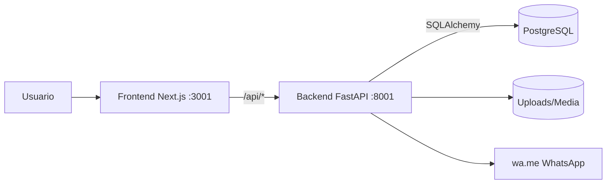
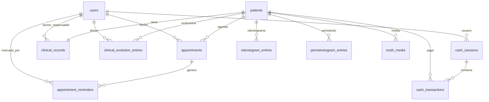

# Documento Maestro Enterprise - DentalSimple (M&D Odontologia Especializada)

Version: v1.2 (SQLite + UUID — ver Changelog v1.2)
Fecha: 2026-07-14
Repositorio analizado: `C:\PROYECTOS\DentalSimple`

## 1. Resumen Ejecutivo

### Objetivo
Consolidar, en un solo artefacto tecnico, la arquitectura, inventario, flujos, reglas de negocio, riesgos y deuda tecnica del sistema DentalSimple para operar con trazabilidad total de codigo.

### Estado
- Estado general: funcional en entorno local con Docker Compose (frontend, backend, Postgres).
- Madurez funcional: alta en flujo clinico-operativo base (pacientes, ficha, agenda, caja, documentos, reportes).
- Madurez de ingenieria: media (sin testing automatizado, con deuda de mantenibilidad y docs parciales/desalineadas).

### Cobertura
- Backend FastAPI, modelos SQLAlchemy, migraciones Alembic, servicios y routers.
- Frontend Next.js App Router, rutas, layouts, componentes, librerias de dominio.
- Infraestructura de despliegue local y Railway.
- Seguridad, configuracion, auditoria tecnica y matrices de dependencia.

### Nivel de madurez
- Producto: medio-alto (MVP robusto para clinica unica).
- Arquitectura: medio (modular por capas, con acoplamiento controlado).
- Operaciones: medio (dockerizado, sin CI/CD formal).
- Calidad: media (suite de integración API + E2E/unit mínimos en flujos núcleo; odontograma fuera de cobertura intencional).

### Arquitectura
- Monorepo con frontend y backend desacoplados por API REST.
- Persistencia central en **SQLite** (archivo local; Postgres opcional vía `DATABASE_URL`). PK/FK UUID string.
- Scheduler embebido (APScheduler) para recordatorios.
- Generacion documental PDF en backend (ReportLab).

### Tecnologias
- Frontend: Next.js 14, React 18, TypeScript, Tailwind.
- Backend: FastAPI, SQLAlchemy 2, Alembic, psycopg 3.
- Seguridad: JWT (PyJWT) + bcrypt.
- Infra: Docker/Docker Compose, Railway.

### Versiones
- Node: 18 (imagen `node:18-alpine`) - `Dockerfile.frontend:5`.
- Python: 3.12 (imagen `python:3.12-slim`) - `Dockerfile.backend:3`.
- Next: `^14.2.35` - `frontend/package.json:15`.
- React: `^18.3.1` - `frontend/package.json:17`.
- FastAPI: `>=0.115.6` - `backend/requirements.txt:1`.
- SQLAlchemy: `>=2.0.36` - `backend/requirements.txt:3`.

### Repositorio
- Monorepo Git con carpetas principales `backend/`, `frontend/`, `docs/`, `scripts/`.
- Archivos de orquestacion en raiz: `docker-compose.yml`, `Dockerfile.backend`, `Dockerfile.frontend`, `Makefile`.

### Dependencias principales
- Backend: fastapi, uvicorn, sqlalchemy, alembic, psycopg, pydantic-settings, bcrypt, PyJWT, reportlab, apscheduler.
- Frontend: next, react, react-dom, tailwindcss, lucide-react, konva/react-konva, pdfjs-dist.

## 2. Arquitectura General

### Arquitectura logica
- Capa Presentacion: Next.js (paginas, layouts, componentes UI).
- Capa Aplicacion: routers FastAPI + servicios de negocio.
- Capa Dominio/Persistencia: modelos SQLAlchemy + **SQLite** (UUID PK/FK).
- Capa Integracion: WhatsApp por enlace `wa.me`, archivos media, logo clinica.

### Arquitectura fisica
- Servicio `frontend` expuesto en `:3001`.
- Servicio `backend` expuesto en `:8001`.
- Servicio `db` Postgres expuesto en `:5434` local.
- Montaje de uploads: `./backend/app/assets/uploads:/app/app/assets/uploads`.

### Arquitectura por capas
- Frontend -> `src/app`, `src/components`, `src/lib`.
- Backend -> `routers` (API), `services` (negocio), `models/schemas` (datos), `core` (seguridad/deps).

### Arquitectura modular
- Modulos funcionales: Auth/Users, Pacientes, Ficha Clinica, Odontograma, Periodontograma, Agenda/Recordatorios, Caja, Documentos, Reportes, Configuracion.

### Arquitectura de despliegue
- Local: Docker Compose con 3 servicios.
- Produccion: Railway con servicios backend/frontend y base de datos Postgres.

### Diagrama ASCII
```text
                        +-----------------------------+
                        |     Usuario (Web Browser)   |
                        +-------------+---------------+
                                      |
                                      v
                          +-----------+-----------+
                          | Next.js Frontend :3001|
                          | App Router + UI       |
                          +-----------+-----------+
                                      |
                    /api/* proxy      | HTTP JSON + PDF
                                      v
                          +-----------+-----------+
                          | FastAPI Backend :8001 |
                          | Routers + Services    |
                          +-----+-------------+---+
                                |             |
                 SQLAlchemy      |             | File media/logo
                                v             v
                        +-------+------+   +--+----------------+
                        | Postgres :5432|  | assets/uploads    |
                        +--------------+   +--------------------+
```

### Diagrama Mermaid


### Flujo completo
1. Usuario inicia sesion en frontend.
2. Frontend obtiene token JWT y consume endpoints del backend.
3. Backend valida auth/rol, ejecuta reglas y persiste en Postgres.
4. Para documentos, backend genera PDF y devuelve stream.
5. Para recordatorios, scheduler crea pendientes y usuario los marca como enviados por WhatsApp.

## 3. Inventario del Proyecto

### Todos los directorios
Directorios versionados detectados:

```text
backend
backend/alembic
backend/alembic/versions
backend/app
backend/app/assets
backend/app/assets/uploads
backend/app/constants
backend/app/core
backend/app/models
backend/app/odontogram
backend/app/routers
backend/app/schemas
backend/app/services
backend/app/utils
docs
frontend
frontend/public
frontend/public/dientes
frontend/public/odontogram
frontend/src
frontend/src/app
frontend/src/app/agenda
frontend/src/app/api/[...path]
frontend/src/app/caja
frontend/src/app/configuracion
frontend/src/app/dashboard
frontend/src/app/pacientes
frontend/src/app/pacientes/[id]
frontend/src/app/pacientes/nuevo
frontend/src/app/reportes
frontend/src/components
frontend/src/components/agenda
frontend/src/components/odontogram
frontend/src/components/odontogram/realista
frontend/src/components/periodontogram
frontend/src/components/ui
frontend/src/lib
frontend/src/types
scripts
```

### Todos los archivos
- Inventario completo de archivos versionados en Anexo A.2 (Capitulo 25).
- Fuente de verdad usada: `git ls-files`.

### Clasificacion
- Infraestructura y despliegue: Dockerfiles, Compose, Railway, Makefile.
- Backend API y dominio: `backend/app/*`, `backend/alembic/*`.
- Frontend app web: `frontend/src/*`, `frontend/public/*`.
- Documentacion funcional/tecnica: `docs/*`, `README.md`, `PRODUCT.md`, `DESIGN.md`.
- Scripts de soporte grafico/odontograma: `scripts/*`.

### Descripcion
- El repositorio implementa un HIS odontologico mono-clinica con enfoque en ficha clinica unificada, integracion operativa agenda-caja-documentos y reportes.

## 4. Stack Tecnologico

### Frontend
- Next.js 14 App Router + React 18 + TypeScript + Tailwind CSS.

### Backend
- FastAPI + SQLAlchemy ORM + Alembic + **SQLite** (Postgres opcional).

### Frameworks
- FastAPI (API REST), Next.js (SSR/CSR), Pydantic v2 (validacion).

### Versiones
- Referencias en `frontend/package.json` y `backend/requirements.txt` (rangos semver/minimos).

### Node
- Runtime de contenedor: Node 18 (alpine).

### Python
- Runtime de contenedor: Python 3.12 (slim).

### ORM
- SQLAlchemy 2.x.

### UI
- Tailwind + componentes custom (`frontend/src/components/ui/*`) + lucide-react.

### Testing
- No hay framework de test configurado en scripts npm ni en backend.

### Docker
- Docker Compose 3 servicios en local.

### Cloud
- Railway documentado para despliegue de frontend/backend + Postgres.

### Infraestructura
- Estado: sin IaC formal, sin pipeline CI/CD en `.github/workflows`.

## 5. Base de Datos

### Todas las tablas
1. users
2. patients
3. clinical_records
4. clinical_evolution_entries
5. odontogram_entries
6. odontogram_change_log
7. odontogram_snapshots
8. appointments
9. appointment_reminders
10. cash_sessions
11. cash_transactions
12. documents_generated
13. clinic_settings
14. periodontogram_entries
15. tooth_media
16. clinical_audit_log

### Todos los campos
- Definicion consolidada en Anexo B.1 (tabla por entidad con campos, tipos y nulabilidad).

### Constraints
- Unicidad: `users.email`, `patients.numero_ficha`, parcial documento paciente, `clinical_records.patient_id` (1:1).
- Integridad referencial via FK entre modulos clinicos, agenda, caja y auditoria.

### FK
- Principales: `appointments.patient_id -> patients.id`, `appointments.doctor_id -> users.id`, `cash_transactions.cash_session_id -> cash_sessions.id`, `clinical_records.patient_id -> patients.id`, etc.

### PK
- Todas las tablas usan `id` entero autoincremental como PK.

### Indices
- Indices por campos de busqueda: fechas de cita, documento, patient_id en tablas transaccionales.
- Indices unicos compuestos definidos por migracion en odontograma/perio.

### Triggers
- No se detectan triggers SQL definidos en migraciones.

### Views
- No se detectan vistas SQL definidas.

### Procedimientos
- No se detectan stored procedures/functions SQL.

### Enums
- No hay enums SQL nativos; se usan `String` con validacion logica en aplicacion.

### Migraciones
- 13 migraciones Alembic encadenadas (desde `2905d1e9dd7e` hasta `k8b9c0d1e2f3`).

### Historial
- Evolutivo: esquema inicial -> ampliacion ficha -> sincronizacion JSON -> configuracion clinica -> odontograma avanzado -> periodonto/media/auditoria -> especialidades/recordatorios.

### Diagrama ER
- Disponible en `docs/ER_diagram.md` (requiere actualizacion para nuevas tablas).

### Mermaid


## 6. Backend

### Todos los modulos
- `auth.py`, `patients.py`, `clinical.py`, `odontogram.py`, `periodontogram.py`, `tooth_media.py`, `audit.py`, `appointments.py`, `cash.py`, `documents.py`, `reports.py`.

### Todos los endpoints
- Inventario completo en Anexo C.1 (metodo, path, auth, tablas implicadas).

### Autenticacion
- JWT access/refresh (`backend/app/core/security.py`).
- Login en `/api/auth/login`, refresh en `/api/auth/refresh`.

### Autorizacion
- `get_current_user` y `require_roles` (`backend/app/core/deps.py`).
- Roles: `ADMIN`, `DOCTOR`, `ASISTENTE`.

### Servicios
- `pdf_generator.py`, `ticket_comprobante.py`, `clinic_profile.py`, `reminder_messages.py`, `audit.py`.

### Validaciones
- Pydantic schemas y validaciones de negocio dentro de routers (ej. horario clinica, solapes, tamaño/logo, RUC).

### Middlewares
- CORS global en `backend/app/main.py`.

### Logs
- Logging basico via `print` en scheduler/lifespan y errores puntuales.

### Errores
- Manejo por `HTTPException` con codigos 400/401/403/404/409.

### Flujos
- Flujos principales: setup/login, alta paciente + creacion ficha 1:1, evolucion clinica, cobranzas, documentacion PDF, recordatorios pendientes.

### Dependencias
- Dependencias de seguridad y DB inyectadas por `Depends(get_db)` y `Depends(get_current_user)`.

## 7. Frontend

### Todas las rutas
- `/`, `/dashboard`, `/agenda`, `/caja`, `/reportes`, `/configuracion`, `/pacientes`, `/pacientes/nuevo`, `/pacientes/[id]`.

### Todas las paginas
- Definidas en `frontend/src/app/**/page.tsx`.

### Todos los componentes
- Inventario en `frontend/src/components/*` y `frontend/src/components/ui/*`.
- Componentes huarfanos detectados: `PatientSearch.tsx`, `ClinicalAuditPanel.tsx`, `SignaturePad.tsx`, `ui/Toolbar.tsx` (sin referencia activa observable en rutas).

### Hooks
- Hook custom principal: `components/odontogram/useOdontogramPatient.ts`.

### Stores
- No hay store global externo (Redux/Zustand); estado en hooks/context local.

### Contexts
- `AuthProvider` en `frontend/src/lib/auth.tsx`.

### Estados
- Estado local por pagina (formularios, carga, filtros) y estado auth por contexto.

### Layouts
- Root layout + layouts protegidos por modulo que envuelven con `ProtectedRoute` y `AppShell`.

### Navegacion
- Sidebar fija + topbar con buscador rapido y recordatorios.

### Permisos
- Proteccion por token en middleware y guard cliente.
- Restriccion por rol en UI de configuracion admin (parcial; enforcement fuerte en backend).

## 8. Modulos Clinicos

### Ficha Clinica
- Implementada en `/pacientes/[id]` con bloques estructurados y actualizacion por secciones.

### Odontograma 2D
- Implementado (anatomico + superficies + snapshots + historial).

### Odontograma 3D
- No implementado operativo; existe documentacion conceptual (`docs/ODONTOGRAMA_3D.md`).

### Agenda
- Vista dia/semana/mes, alta/edicion de citas, validacion de horario y solape.

### Caja
- Apertura/cierre de sesion, ingresos/egresos, comprobante PDF.

### Pacientes
- CRUD principal + busqueda por documento/nombre.

### Presupuestos
- Generacion de presupuesto PDF desde plan activo de ficha.

### Tratamientos
- Catalogos de sugerencia y evolucion clinica con costos/estado.

### Radiografias
- Soporte de media dental por pieza (`tooth_media`), no PACS avanzado.

### Consentimientos
- Estado firmado, fecha y firmas (paciente/odontologo).

### Documentos
- Comprobante, cierre caja, ficha, evolucion, consentimiento, presupuesto.

### Reportes
- Caja, pacientes, tratamientos (JSON/PDF/CSV).

### Usuarios
- Setup inicial, login, CRUD usuarios por ADMIN, reset password.

### Configuracion
- Horario, especialidades, branding/identidad clinica, recordatorios, logo.

## 9. Integraciones

### WhatsApp
- Integracion por deep link `wa.me` (sin API oficial).

### Correo
- No implementado envio por SMTP/transaccional.

### Storage
- Archivos en filesystem local dentro de `backend/app/assets/uploads`.

### Rembg
- No detectado en dependencias ni codigo backend/frontend principal.

### Cloud
- Railway (deploy backend/frontend + Postgres).

### APIs
- API REST interna FastAPI consumida por Next.js.

### Servicios externos
- No hay gateways de pago ni ERP externos en v1.

## 10. Seguridad

### JWT
- Implementado con access/refresh y expiracion.

### Roles
- Roles disponibles: ADMIN/DOCTOR/ASISTENTE.

### Permisos
- Enforced por backend (`require_roles`) y parcialmente por UI.

### RBAC
- Activo en backend (ej. gestion usuarios y configuracion sensible).

### Proteccion CSRF
- No se observa mecanismo especifico CSRF (uso principal por bearer token).

### Proteccion XSS
- Basada en escapes por defecto React; no hay capa dedicada CSP reportada.

### Proteccion SQL Injection
- Uso de ORM/queries SQLAlchemy parametrizadas.

### Rate Limiting
- No implementado.

### CORS
- Configurable via `CORS_ORIGINS` parseado por backend.

### Validaciones
- Pydantic en entrada, validaciones de negocio adicionales en routers.

## 11. Configuracion

### Variables ENV
- Backend: `DATABASE_URL`, `JWT_SECRET`, `CORS_ORIGINS`, `CLINIC_*`, `REMINDER_HOURS_BEFORE`, `PUBLIC_APP_URL`.
- Frontend: `NEXT_PUBLIC_API_URL` (local) y `BACKEND_URL` (proxy server-side).

### Build
- Frontend: `npm run build`.
- Backend: imagen Docker + `start.sh`.

### Deploy
- Local: `docker compose up --build`.
- Railway: archivos `backend/railway.toml` y `frontend/railway.toml`.

### Docker
- Compose de tres servicios y healthchecks en backend/db.

### Scripts
- `Makefile` para db/install/migrate/backend/frontend.

### CI/CD
- No detectado pipeline CI/CD versionado.

## 12. Testing

### Cobertura
- Cobertura automatizada: no definida.

### Tests existentes
- No se detectan archivos de tests versionados.

### Tests faltantes
- Unit tests backend (servicios, seguridad, validaciones).
- Integration tests API (auth, pacientes, agenda, caja, docs).
- E2E frontend (login, ficha, pago, documentos, reportes).

### Mocks
- No se detecta infraestructura de mocks.

### Fixtures
- No se detectan fixtures de prueba.

## 13. Auditoria Tecnica

### Codigo duplicado
- Bloques repetidos y handlers extensos en paginas grandes (`pacientes/[id]`, `caja`, `configuracion`).

### Codigo muerto
- Componentes no referenciados en rutas activas (ver Cap. 7).

### Archivos huerfanos
- `ClinicalAuditPanel.tsx`, `PatientSearch.tsx`, `SignaturePad.tsx`, `components/ui/Toolbar.tsx`.

### Dependencias sin uso
- Requiere auditoria automatizada adicional; hay indicios de utilidades frontend no invocadas (ej. ciertas funciones de `validators.ts`).

### Imports sin uso
- Requiere corrida de linter estricto para listado exacto.

### Funciones nunca llamadas
- Detectadas por inspeccion parcial; requiere analisis estatico completo para cierre formal.

### Componentes sin referencias
- Ver seccion "Archivos huerfanos".

### TODO
- No se encontraron marcadores TODO reales en codigo con patron de busqueda aplicado.

### FIXME
- No se encontraron marcadores FIXME reales.

### HACK
- No se encontraron marcadores HACK reales.

### Antipatrones
- Paginas monoliticas >800 lineas.
- Uso de `localStorage.getItem("access_token")` en algunos componentes en paralelo a abstraccion `apiFetch`.
- Mezcla de estilos UI (inline CSS en login vs sistema de componentes en resto).

### Riesgos
- Mantenibilidad y regresiones por baja modularidad en vistas complejas.

## 14. Deuda Tecnica

Clasificada por prioridad:

### Critica
- Ausencia de testing automatizado para flujos nucleares.

### Alta
- Inconsistencias de manejo de token entre `apiFetch` y fetches directos en frontend.
- Documentacion de modelo/endpoints desactualizada respecto al codigo actual.

### Media
- Archivos de pagina sobredimensionados.
- Logging tecnico limitado para observabilidad operativa.

### Baja
- Limpieza de componentes huarfanos/utilidades no usadas.

## 15. Riesgos

### Escalabilidad
- Scheduler embebido y ausencia de colas externas limitan escalamiento horizontal avanzado.

### Rendimiento
- Consultas y render en paginas extensas pueden degradar UX en datasets grandes.

### Seguridad
- Sin rate limiting; tokens JWT sin revocacion server-side.

### Mantenibilidad
- Alta complejidad ciclomatica en paginas frontend extensas.

### Acoplamiento
- Acoplamiento moderado frontend-backend por contratos directos endpoint a endpoint.

### Complejidad
- Complejidad creciente en modulo ficha clinica y configuracion.

## 16. Reglas de Negocio

Todas las reglas separadas por modulo (evidencia en rutas backend/frontend):

- Auth: setup inicial solo si no hay usuarios (`/api/auth/setup-status`, `/api/auth/setup`).
- Pacientes: creacion de paciente dispara creacion de ficha clinica 1:1.
- Agenda: no permitir solape de citas por doctor y respetar horario clinica (`appointments.py`).
- Recordatorios: scheduler genera pendientes; envio real requiere accion humana (marcar enviado).
- Ficha clinica: resumen financiero calculado por transacciones de caja y evolucion.
- Caja: una sesion activa; cierre calcula resumen por metodo.
- Documentos: formatos PDF por tipo y marcado manual de envio WhatsApp.
- Configuracion: cambios criticos (usuarios, especialidades, perfil clinica) requieren rol ADMIN en backend.

## 17. Flujo Completo del Sistema

Desde inicio de sesion hasta cierre de proceso clinico:
1. Usuario entra a `/` y autentica.
2. Frontend carga contexto auth (`/api/users/me`).
3. Operador crea/selecciona paciente.
4. Se registra/actualiza ficha clinica, odontograma, periodonto, evolucion.
5. Se agenda cita actual o proxima (con reglas de solape y horario).
6. Se registra pago/egreso en caja.
7. Sistema emite comprobante y/o documentos clinicos PDF.
8. Scheduler crea recordatorios; usuario abre WhatsApp y marca envio.
9. Se cierran sesiones de caja y se exportan reportes.

## 18. Matriz de Dependencias

| Modulo | Depende de | Tipo de dependencia |
|---|---|---|
| Auth | users, JWT, bcrypt | Seguridad/identidad |
| Pacientes | patients, clinical_records | Dominio base |
| Ficha Clinica | clinical_records, clinical_evolution_entries, cash_transactions | Clinico-financiera |
| Odontograma | odontogram_entries, change_log, snapshots | Clinica dental |
| Periodontograma | periodontogram_entries, tooth_media | Clinica periodontal |
| Agenda | appointments, appointment_reminders, clinic_settings | Programacion y recordatorios |
| Caja | cash_sessions, cash_transactions, patients | Financiera |
| Documentos | multiples tablas + pdf_generator | Evidencia documental |
| Reportes | cash/appointments/evolution/patients | Analitica |
| Configuracion | clinic_settings, users | Parametrizacion |

## 19. Matriz CRUD

| Entidad | Crea | Consulta | Modifica | Elimina |
|---|---|---|---|---|
| users | `POST /api/users`, `POST /api/auth/setup` | `GET /api/users`, `GET /api/users/me`, `GET /api/users/doctors` | `PATCH /api/users/{id}`, `POST /api/users/{id}/reset-password`, `POST /api/auth/change-password` | Baja logica via `activo` |
| patients | `POST /api/patients` | `GET /api/patients`, `GET /api/patients/{id}`, `GET /api/patients/search` | `PATCH /api/patients/{id}` | No endpoint delete |
| clinical_records | Auto al crear paciente | `GET /api/clinical/{id}/record` | `PATCH /api/clinical/{id}/record`, `PATCH /api/clinical/{id}/consentimiento` | No delete |
| clinical_evolution_entries | `POST /api/clinical/{id}/evolution` | `GET /api/clinical/{id}/evolution` | `PATCH /api/clinical/evolution/{id}` | `DELETE /api/clinical/{id}/evolution/{id}` |
| odontogram_entries | `PUT /api/odontogram/{id}/{pieza}` | `GET /api/odontogram/{id}` | `PUT /api/odontogram/{id}/{pieza}` | `DELETE /api/odontogram/{id}/{pieza}`, `DELETE /api/odontogram/{id}` |
| periodontogram_entries | `PUT /api/periodontogram/{id}/{pieza}` | `GET /api/periodontogram/{id}` | `PUT /api/periodontogram/{id}/{pieza}` | Sobrescritura por upsert |
| appointments | `POST /api/appointments` | `GET /api/appointments` | `PATCH /api/appointments/{id}` | `DELETE /api/appointments/{id}` |
| appointment_reminders | Scheduler | `GET /api/appointments/reminders/pending` | `POST /api/appointments/reminders/{id}/send` | No delete |
| cash_sessions | `POST /api/cash/session/open` | `GET /api/cash/session` | `POST /api/cash/session/close` | No delete |
| cash_transactions | `POST /api/cash/transactions` | `GET /api/cash/transactions`, `GET /api/cash/transactions/patient/{id}` | No update | No delete |
| documents_generated | Auto en endpoints docs | Implito en tracking | `POST /api/documents/whatsapp-sent/{id}` | No delete |
| clinic_settings | Seed/auto create | `GET /api/config/*` | `PATCH /api/config/*`, `PUT /api/config/especialidades`, `POST /api/config/clinic/logo` | Reset parcial (`/especialidades/reset`) |
| tooth_media | `POST /api/tooth-media/{patient_id}` | `GET /api/tooth-media/{patient_id}`, `GET /api/tooth-media/file/{id}` | No update | `DELETE /api/tooth-media/{id}` |
| clinical_audit_log | Auto por servicios | `GET /api/audit/{patient_id}` | No update | No delete |

## 20. Matriz Endpoint -> Frontend

| Pantalla/Componente | Endpoints consumidos |
|---|---|
| Login (`/`) | `/api/auth/setup-status`, `/api/auth/login`, `/api/auth/setup`, `/api/users/me` |
| Dashboard | `/api/cash/session`, `/api/appointments`, `/api/appointments/reminders/pending`, `/api/cash/transactions` |
| Agenda | `/api/appointments`, `/api/users/doctors`, `/api/config/hours`, `/api/patients/{id}` |
| Pacientes lista | `/api/patients` |
| Nuevo paciente | `/api/patients/search`, `/api/patients` |
| Ficha paciente (`/pacientes/[id]`) | `/api/patients/{id}`, `/api/clinical/{id}/record`, `/api/clinical/{id}/evolution`, `/api/clinical/{id}/financial`, `/api/odontogram/*`, `/api/periodontogram/*`, `/api/cash/transactions*`, `/api/documents/*` |
| Caja | `/api/cash/session`, `/api/cash/session/open`, `/api/cash/session/close`, `/api/cash/transactions`, `/api/documents/comprobante/*`, `/api/documents/cierre-caja/*` |
| Reportes | `/api/reports/caja`, `/api/reports/pacientes`, `/api/reports/tratamientos` |
| Configuracion | `/api/config/clinic`, `/api/config/clinic/logo`, `/api/config/hours`, `/api/config/reminders`, `/api/config/especialidades`, `/api/users*`, `/api/auth/change-password` |
| Topbar/FichaQuickOpen | `/api/appointments/reminders/pending`, `/api/appointments/reminders/{id}/send`, `/api/patients/search` |

## 21. Matriz Base de Datos -> Backend

| Tabla | Endpoints principales que la usan |
|---|---|
| users | `/api/auth/*`, `/api/users*`, `/api/appointments` (doctor), `/api/audit/*` |
| patients | `/api/patients*`, `/api/clinical/*`, `/api/appointments*`, `/api/documents/*`, `/api/reports/*` |
| clinical_records | `/api/clinical/{id}/record`, `/api/clinical/{id}/consentimiento`, `/api/documents/ficha|consentimiento|presupuesto` |
| clinical_evolution_entries | `/api/clinical/{id}/evolution*`, `/api/documents/evolucion`, `/api/reports/tratamientos` |
| odontogram_entries | `/api/odontogram/*`, `/api/documents/ficha` |
| odontogram_change_log | `/api/odontogram/{id}/history`, upserts/deletes en `/api/odontogram/*` |
| odontogram_snapshots | `/api/odontogram/{id}/snapshots`, `/api/odontogram/{id}/compare` |
| appointments | `/api/appointments*`, scheduler de recordatorios, `/api/reports/pacientes` |
| appointment_reminders | `/api/appointments/reminders/*`, scheduler |
| cash_sessions | `/api/cash/session*`, `/api/documents/cierre-caja/*` |
| cash_transactions | `/api/cash/transactions*`, `/api/clinical/{id}/financial`, `/api/reports/caja` |
| documents_generated | `/api/documents/*`, `/api/documents/whatsapp-sent/{id}` |
| clinic_settings | `/api/config/*`, validacion horario agenda |
| periodontogram_entries | `/api/periodontogram/*` |
| tooth_media | `/api/tooth-media/*` |
| clinical_audit_log | `/api/audit/{patient_id}` + escritura por servicios de auditoria |

## 22. Matriz Backend -> Frontend

| Backend modulo | Consumido por frontend |
|---|---|
| auth | `src/lib/auth.tsx`, pagina `/` |
| users | `configuracion/page.tsx`, `agenda/page.tsx` |
| patients | `pacientes/page.tsx`, `pacientes/nuevo/page.tsx`, `pacientes/[id]/page.tsx`, `Topbar.tsx`, `PatientPicker.tsx` |
| clinical | `pacientes/[id]/page.tsx` |
| odontogram | `components/odontogram/useOdontogramPatient.ts`, `pacientes/[id]/page.tsx` |
| periodontogram | `components/periodontogram/Periodontograma.tsx` |
| tooth_media | `components/odontogram/ToothAttachments.tsx` |
| appointments | `agenda/page.tsx`, `dashboard/page.tsx`, `Topbar.tsx` |
| cash | `caja/page.tsx`, `dashboard/page.tsx`, `pacientes/[id]/page.tsx` |
| documents | `DocumentActions.tsx`, `caja/page.tsx`, `reportes/page.tsx`, `pacientes/[id]/page.tsx` |
| reports | `reportes/page.tsx` |
| config | `configuracion/page.tsx`, `SpecialtySelect.tsx`, `agenda/page.tsx` |
| audit | `ClinicalAuditPanel.tsx` (no montado actualmente) |

## 23. Convenciones

### Naming
- Backend: snake_case para campos/variables; endpoints REST en minuscula.
- Frontend: PascalCase en componentes, camelCase en funciones/props.

### Estilos
- Predominio Tailwind en app principal.
- Excepcion: login con estilos inline en objeto JS.

### Buenas practicas
- Separacion por modulos y capas.
- Uso de schemas para contratos API.
- Token refresh con reintento centralizado en `apiFetch`.

### Patrones
- API REST + BFF ligero por proxy Next (`src/app/api/[...path]/route.ts`).
- Upsert en odontograma/periodonto.
- Scheduler embebido para recordatorios.

## 24. Glosario

- Ficha Clinica: registro longitudinal clinico-financiero del paciente.
- Evolucion: atencion/tratamiento puntual con costo, estado y proxima cita.
- Odontograma: representacion del estado dental por pieza/superficie.
- Periodontograma: medicion periodontal por pieza.
- A cuenta: pago parcial imputado a tratamiento.
- Caja: sesion diaria de movimientos financieros.
- Recordatorio pendiente: mensaje preparado para cita proxima.
- Consentimiento: aceptacion informada del plan/acto clinico.
- Plan de tratamiento: propuesta estructurada (JSON) de tratamientos y costos.
- Documento generado: evidencia PDF emitida por el sistema.
- Rol ADMIN: perfil con permisos de administracion global.
- Rol DOCTOR: perfil clinico asistencial.
- Rol ASISTENTE: perfil operativo con permisos restringidos.

## 25. Anexos

### Diagramas
- ER actual base: `docs/ER_diagram.md`.
- Diagramas de odontograma: `docs/ODONTOGRAMA_SPEC.md`, `docs/ODONTOGRAMA_REALISTA.md`, `docs/ODONTOGRAMA_CLINICO_REALISTA.md`, `docs/ODONTOGRAMA_3D.md`.

### Tablas
- Matrices tecnicas incluidas en capitulos 18 a 22.

### Referencias
- `README.md`, `PRODUCT.md`, `DESIGN.md`, `docs/RAILWAY.md`, `docs/RESUMEN_EJECUTIVO.md`.

### Estadisticas
- Tablas modeladas: 16.
- Migraciones Alembic versionadas: 13.
- Routers backend principales: 11 (mas subrouter `config`).
- Rutas frontend de negocio: 9.

### Inventarios completos

#### Anexo A.1 - Directorios versionados
```text
backend
backend/alembic
backend/alembic/versions
backend/app
backend/app/assets
backend/app/assets/uploads
backend/app/constants
backend/app/core
backend/app/models
backend/app/odontogram
backend/app/routers
backend/app/schemas
backend/app/services
backend/app/utils
docs
frontend
frontend/public
frontend/public/dientes
frontend/public/odontogram
frontend/src
frontend/src/app
frontend/src/app/agenda
frontend/src/app/api/[...path]
frontend/src/app/caja
frontend/src/app/configuracion
frontend/src/app/dashboard
frontend/src/app/pacientes
frontend/src/app/pacientes/[id]
frontend/src/app/pacientes/nuevo
frontend/src/app/reportes
frontend/src/components
frontend/src/components/agenda
frontend/src/components/odontogram
frontend/src/components/odontogram/realista
frontend/src/components/periodontogram
frontend/src/components/ui
frontend/src/lib
frontend/src/types
scripts
```

#### Anexo A.2 - Archivos versionados (fuente: `git ls-files`)
```text
.gitattributes
.gitignore
DESIGN.md
Dockerfile.backend
Dockerfile.frontend
Makefile
PRODUCT.md
README.md
backend/.dockerignore
backend/.env.example
backend/Dockerfile
backend/alembic.ini
backend/alembic/env.py
backend/alembic/script.py.mako
backend/alembic/versions/2905d1e9dd7e_initial_schema_all_tables.py
backend/alembic/versions/ad74dc2fd5c0_sync_schema_after_manual_column_.py
backend/alembic/versions/b8e4f1a2c3d0_clinic_settings_horario.py
backend/alembic/versions/c9f2a1b3d4e5_consentimiento_firmas.py
backend/alembic/versions/d1a7e8f9b0c1_unique_patient_document.py
backend/alembic/versions/e2b3c4d5e6f7_odontogram_anatomico.py
backend/alembic/versions/f1030bfb1b16_ficha_clinica_fields_and_plan_jsonb.py
backend/alembic/versions/f3c4d5e6f7a8_odontogram_history.py
backend/alembic/versions/g4d5e6f7a8b9_periodonto_media_audit.py
backend/alembic/versions/h5e6f7a8b9c0_appointment_especialidad.py
backend/alembic/versions/i6f7a8b9c0d1_clinic_center_data.py
backend/alembic/versions/j7a8b9c0d1e2_clinic_especialidades.py
backend/alembic/versions/k8b9c0d1e2f3_clinic_reminder_config.py
backend/app/__init__.py
backend/app/alembic_helpers.py
backend/app/assets/logo-md.png
backend/app/assets/uploads/.gitkeep
backend/app/config.py
backend/app/constants/especialidades.py
backend/app/core/__init__.py
backend/app/core/deps.py
backend/app/core/roles.py
backend/app/core/security.py
backend/app/database.py
backend/app/db_health.py
backend/app/main.py
backend/app/migrate.py
backend/app/models/__init__.py
backend/app/models/appointment.py
backend/app/models/cash.py
backend/app/models/clinic_settings.py
backend/app/models/clinical.py
backend/app/models/document.py
backend/app/models/patient.py
backend/app/models/periodontogram.py
backend/app/models/user.py
backend/app/odontogram/__init__.py
backend/app/odontogram/conditions.py
backend/app/odontogram/numbering.py
backend/app/odontogram/plans.py
backend/app/odontogram/treatments.py
backend/app/routers/__init__.py
backend/app/routers/appointments.py
backend/app/routers/audit.py
backend/app/routers/auth.py
backend/app/routers/cash.py
backend/app/routers/clinical.py
backend/app/routers/documents.py
backend/app/routers/odontogram.py
backend/app/routers/patients.py
backend/app/routers/periodontogram.py
backend/app/routers/reports.py
backend/app/routers/tooth_media.py
backend/app/schemas/__init__.py
backend/app/schemas/appointment.py
backend/app/schemas/cash.py
backend/app/schemas/clinical.py
backend/app/schemas/patient.py
backend/app/schemas/user.py
backend/app/services/__init__.py
backend/app/services/audit.py
backend/app/services/clinic_profile.py
backend/app/services/pdf_generator.py
backend/app/services/reminder_messages.py
backend/app/services/ticket_comprobante.py
backend/app/utils/__init__.py
backend/app/utils/ficha.py
backend/boot.py
backend/railway.toml
backend/requirements.txt
backend/start.sh
docker-compose.yml
docs/AGENDA_GRILLA_SPEC.md
docs/ER_diagram.md
docs/Logo.png
docs/ODONTOGRAMA_3D.md
docs/ODONTOGRAMA_CLINICO_REALISTA.md
docs/ODONTOGRAMA_REALISTA.md
docs/ODONTOGRAMA_SPEC.md
docs/Odontograma.jpg
docs/RAILWAY.md
docs/RESUMEN_AGENDA_GRILLA.md
docs/RESUMEN_EJECUTIVO.md
docs/RESUMEN_MODERNIZACION_UI.md
docs/SISTEMA_DISENO.md
docs/_sample_ticket_80mm.pdf
frontend/.dockerignore
frontend/.env.example
frontend/Dockerfile
frontend/next-env.d.ts
frontend/next.config.js
frontend/package-lock.json
frontend/package.json
frontend/postcss.config.js
frontend/public/Logo.png
frontend/public/apple-icon.png
frontend/public/dientes/.gitkeep
frontend/public/dientes/11.png
frontend/public/dientes/12.png
frontend/public/dientes/13.png
frontend/public/dientes/14.png
frontend/public/dientes/15.png
frontend/public/dientes/16.png
frontend/public/dientes/17.png
frontend/public/dientes/18.png
frontend/public/dientes/21.png
frontend/public/dientes/22.png
frontend/public/dientes/23.png
frontend/public/dientes/24.png
frontend/public/dientes/25.png
frontend/public/dientes/26.png
frontend/public/dientes/27.png
frontend/public/dientes/28.png
frontend/public/dientes/31.png
frontend/public/dientes/32.png
frontend/public/dientes/33.png
frontend/public/dientes/34.png
frontend/public/dientes/35.png
frontend/public/dientes/36.png
frontend/public/dientes/37.png
frontend/public/dientes/38.png
frontend/public/dientes/41.png
frontend/public/dientes/42.png
frontend/public/dientes/43.png
frontend/public/dientes/44.png
frontend/public/dientes/45.png
frontend/public/dientes/46.png
frontend/public/dientes/47.png
frontend/public/dientes/48.png
frontend/public/dientes/README.md
frontend/public/favicon.png
frontend/public/icon.png
frontend/public/index.html
frontend/public/logo-md.png
frontend/public/odontogram/Odontograma-referencia.jpg
frontend/railway.toml
frontend/src/app/agenda/layout.tsx
frontend/src/app/agenda/page.tsx
frontend/src/app/api/[...path]/route.ts
frontend/src/app/apple-icon.png
frontend/src/app/caja/layout.tsx
frontend/src/app/caja/page.tsx
frontend/src/app/configuracion/layout.tsx
frontend/src/app/configuracion/page.tsx
frontend/src/app/dashboard/layout.tsx
frontend/src/app/dashboard/page.tsx
frontend/src/app/globals.css
frontend/src/app/icon.png
frontend/src/app/layout.tsx
frontend/src/app/pacientes/[id]/page.tsx
frontend/src/app/pacientes/layout.tsx
frontend/src/app/pacientes/nuevo/page.tsx
frontend/src/app/pacientes/page.tsx
frontend/src/app/page.tsx
frontend/src/app/reportes/layout.tsx
frontend/src/app/reportes/page.tsx
frontend/src/components/AppShell.tsx
frontend/src/components/BrandLogo.tsx
frontend/src/components/Button.tsx
frontend/src/components/ClientProviders.tsx
frontend/src/components/ClinicalAuditPanel.tsx
frontend/src/components/DocumentActions.tsx
frontend/src/components/FichaQuickOpen.tsx
frontend/src/components/Input.tsx
frontend/src/components/Odontograma.tsx
frontend/src/components/PatientPicker.tsx
frontend/src/components/PatientSearch.tsx
frontend/src/components/ProtectedRoute.tsx
frontend/src/components/Sidebar.tsx
frontend/src/components/SignaturePad.tsx
frontend/src/components/SpecialtySelect.tsx
frontend/src/components/Topbar.tsx
frontend/src/components/TreatmentAutocomplete.tsx
frontend/src/components/UbigeoSelect.tsx
frontend/src/components/VoiceDictation.tsx
frontend/src/components/agenda/DayGrid.tsx
frontend/src/components/agenda/MonthGrid.tsx
frontend/src/components/agenda/WeekGrid.tsx
frontend/src/components/odontogram/OdontogramaAnatomico.tsx
frontend/src/components/odontogram/ProposeTreatmentModal.tsx
frontend/src/components/odontogram/SurfaceCross.tsx
frontend/src/components/odontogram/ToothAttachments.tsx
frontend/src/components/odontogram/ToothSVG.tsx
frontend/src/components/odontogram/realista/DienteImagenReal.tsx
frontend/src/components/odontogram/realista/OdontogramaRealista.css
frontend/src/components/odontogram/realista/OdontogramaRealista.tsx
frontend/src/components/odontogram/realista/PanelTratamientoRealista.tsx
frontend/src/components/odontogram/realista/cargadorImagenes.ts
frontend/src/components/odontogram/realista/mapeoDientesRealista.ts
frontend/src/components/odontogram/realista/useOdontogramaRealista.ts
frontend/src/components/odontogram/realista/zonasTratamientoRealista.ts
frontend/src/components/odontogram/toothAnatomy.ts
frontend/src/components/odontogram/toothAssetsReferencia.ts
frontend/src/components/odontogram/useOdontogramPatient.ts
frontend/src/components/periodontogram/Periodontograma.tsx
frontend/src/components/shell.ts
frontend/src/components/ui/Badge.tsx
frontend/src/components/ui/Button.tsx
frontend/src/components/ui/Card.tsx
frontend/src/components/ui/EmptyState.tsx
frontend/src/components/ui/PageContainer.tsx
frontend/src/components/ui/Toolbar.tsx
frontend/src/components/ui/index.ts
frontend/src/lib/api.ts
frontend/src/lib/auth.tsx
frontend/src/lib/authCookie.ts
frontend/src/lib/calendar.ts
frontend/src/lib/datetime.ts
frontend/src/lib/especialidades.ts
frontend/src/lib/ficha.ts
frontend/src/lib/odontogramConditions.ts
frontend/src/lib/odontogramNumbering.ts
frontend/src/lib/odontogramTreatments.ts
frontend/src/lib/printPdf.ts
frontend/src/lib/tratamientos.ts
frontend/src/lib/treatmentPlans.ts
frontend/src/lib/ubigeo-peru.json
frontend/src/lib/validators.ts
frontend/src/lib/whatsapp.ts
frontend/src/middleware.ts
frontend/src/types/pdfjs-build.d.ts
frontend/tailwind.config.ts
frontend/tsconfig.json
frontend/tsconfig.tsbuildinfo
scripts/calibrate_teeth_boxes.py
scripts/extract_teeth_from_reference.py
```

#### Anexo B.1 - Campos por tabla
La descomposicion detallada de campos (tipo, nullability, PK/FK/unique/index) se obtuvo de:
- `backend/app/models/*.py`
- `backend/alembic/versions/*.py`

#### Anexo C.1 - Endpoints backend (sync código — excluye odontograma/periodontograma)

Fuente regenerada desde `backend/app/routers/*.py` (script `backend/scripts/dump_routes.py`). Endpoints de odontograma/periodontograma/tooth_media se omiten a propósito (módulo cerrado).

| Método | Path | Handler |
|--------|------|---------|
| GET | `/api/auth/setup-status` | `setup_status` |
| POST | `/api/auth/setup` | `setup` (rate limit) |
| POST | `/api/auth/login` | `login` (rate limit) |
| POST | `/api/auth/refresh` | `refresh` |
| POST | `/api/auth/logout` | `logout` (revoca JTIs) |
| POST | `/api/auth/change-password` | `change_password` (bump `token_version`) |
| GET | `/api/users/doctors` | `list_doctors` |
| GET | `/api/users` | `list_users` |
| POST | `/api/users` | `create_user` |
| PATCH | `/api/users/{user_id}` | `update_user` |
| POST | `/api/users/{user_id}/reset-password` | `reset_password` (bump `token_version`) |
| GET | `/api/users/me` | `me` |
| GET | `/api/patients/search` | `search_patients` |
| GET | `/api/patients` | `list_patients` |
| GET | `/api/patients/{patient_id}` | `get_patient` |
| POST | `/api/patients` | `create_patient` |
| PATCH | `/api/patients/{patient_id}` | `update_patient` |
| GET | `/api/clinical/{patient_id}/record` | `get_record` |
| PATCH | `/api/clinical/{patient_id}/record` | `update_record` |
| PATCH | `/api/clinical/{patient_id}/consentimiento` | `update_consentimiento` |
| GET | `/api/clinical/{patient_id}/evolution` | `list_evolution` |
| POST | `/api/clinical/{patient_id}/evolution` | `create_evolution` |
| PATCH | `/api/clinical/evolution/{entry_id}` | `update_evolution` |
| DELETE | `/api/clinical/{patient_id}/evolution/{entry_id}` | `delete_evolution` |
| GET | `/api/clinical/{patient_id}/financial` | `financial_summary` |
| GET | `/api/appointments` | `list_appointments` |
| POST | `/api/appointments` | `create_appointment` |
| PATCH | `/api/appointments/{appointment_id}` | `update_appointment` |
| DELETE | `/api/appointments/{appointment_id}` | `delete_appointment` |
| GET | `/api/appointments/reminders/pending` | `pending_reminders` |
| POST | `/api/appointments/reminders/{reminder_id}/send` | `mark_reminder_sent` |
| GET | `/api/config/reminders` | `get_reminder_config_api` |
| PATCH | `/api/config/reminders` | `update_reminder_config_api` |
| GET | `/api/config/hours` | `get_clinic_hours` |
| PATCH | `/api/config/hours` | `update_clinic_hours` |
| GET | `/api/config/especialidades` | `list_especialidades` |
| PUT | `/api/config/especialidades` | `update_especialidades` |
| POST | `/api/config/especialidades/reset` | `reset_especialidades` |
| GET | `/api/config/clinic` | `get_clinic_profile_api` |
| PATCH | `/api/config/clinic` | `update_clinic_profile_api` |
| POST | `/api/config/clinic/logo` | `upload_clinic_logo` |
| GET | `/api/config/clinic/logo-file` | `get_clinic_logo_file` |
| GET | `/api/cash/session` | `get_current_session` |
| POST | `/api/cash/session/open` | `open_session` |
| POST | `/api/cash/session/close` | `close_session` |
| GET | `/api/cash/transactions` | `list_transactions` |
| GET | `/api/cash/transactions/patient/{patient_id}` | `list_patient_payments` |
| POST | `/api/cash/transactions` | `create_transaction` |
| GET | `/api/documents/comprobante/{transaction_id}` | `download_comprobante` |
| GET | `/api/documents/cierre-caja/{session_id}` | `download_cierre_caja` |
| GET | `/api/documents/ficha/{patient_id}` | `download_ficha` |
| GET | `/api/documents/evolucion/{entry_id}` | `download_evolucion` |
| GET | `/api/documents/consentimiento/{patient_id}` | `download_consentimiento` |
| GET | `/api/documents/presupuesto/{patient_id}` | `download_presupuesto` |
| POST | `/api/documents/whatsapp-sent/{document_id}` | `mark_whatsapp_sent` |
| GET | `/api/reports/caja` | `report_caja` |
| GET | `/api/reports/pacientes` | `report_pacientes` |
| GET | `/api/reports/tratamientos` | `report_tratamientos` |
| GET | `/api/audit/{patient_id}` | `list_audit` |
| GET | `/api/health` | `health` |

Auth notes (v1.1): access/refresh JWT incluyen `jti` + `ver`; logout y rotación de refresh escriben en `revoked_tokens`; cambio/reset de contraseña incrementan `users.token_version`.

#### Anexo C.1 - Endpoints backend (nota histórica v1.0)
Se listan en seccion dedicada del Capitulo 6 y matrices de capitulos 19-22, con fuente en:
- `backend/app/routers/*.py`
- `backend/app/main.py`

---

## Changelog v1.1

Fecha: 2026-07-13  
Referencia: `PROMPT_FIX_CRITICOS_DENTALSIMPLE.md` (hallazgos críticos/altos de Caps. 14–15).

| Cambio | Por qué |
|--------|---------|
| Suite pytest de auth, pacientes, agenda, caja, documentos + Playwright/Vitest frontend | Cierra ausencia total de testing en flujos núcleo |
| `getToken()` unificado; lint `check-token-access`; excepciones odontograma documentadas | Elimina inconsistencia `apiFetch` vs `localStorage` directo |
| Tabla `revoked_tokens` + `users.token_version`; rate limit login/setup (`RATE_LIMIT_*`) | JWT revocable y mitigación fuerza bruta |
| Anexo C.1 regenerado; ER con `revoked_tokens` / `token_version` | Docs alineadas al código real (sin retocar inventario odontograma) |

Odontograma 2D / periodontograma: **sin cambios** (módulo cerrado).

---

## Changelog v1.2

Fecha: 2026-07-14  
Referencia: `PROMPT_MIGRACION_SQLITE_UUID_DENTALSIMPLE.md`, auditoría `MIGRATION_AUDIT_SQLITE.md`.

**Motivo:** preparar instalación sin Docker ni daemon Postgres en 3 PCs del consultorio, y dejar IDs globales (UUID) listos para una futura sincronización multi-PC.

| Antes | Después |
|-------|---------|
| PostgreSQL (TIMESTAMPTZ, SERIAL int PK) | **SQLite** archivo local (`sqlite:///./data/clinica.db`), WAL + `foreign_keys=ON` |
| PK/FK enteras autoincrementales | **UUID `String(36)`** generados en aplicación |
| `DATABASE_URL` Postgres por default | Default SQLite; Postgres queda opcional (legacy / transición) |

| Cambio | Por qué |
|--------|---------|
| Modelos + routers/schemas/frontend tipados a `id: string` | FK y paths dejan de asumir entero |
| Alembic `render_as_batch=True`; revisión `m0sqlite_uuid_baseline`; bootstrap `create_all` + stamp en SQLite nuevo | Histórico Alembic con JSONB/`now()` no es replayable en SQLite vacío |
| Script ETL `backend/scripts/pg_to_sqlite_uuid.py` | Cutover de datos reales Postgres → SQLite con remapeo de FKs |
| Citas: persistencia de `fecha_hora` en UTC (SQLite no conserva tz) | Solape y horarios siguen siendo correctos |
| Docs: `ER_diagram.md`, `.env.example`, este changelog | Inventario alineado al código |

**Fuera de alcance (explícito):** motor de sincronización entre PCs, backup Google Drive, rol `CAJERO`.  
Odontograma / periodontograma: **solo esquema** (motor + tipo PK/FK); **sin** cambios de reglas clínicas ni UI.
