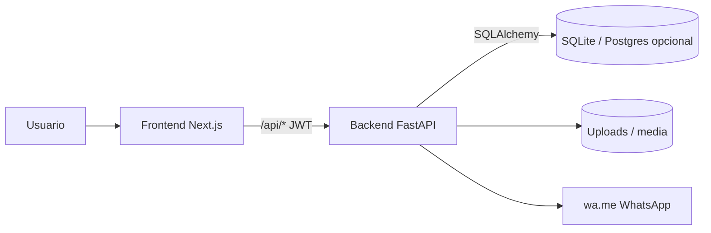

# Documento Maestro Enterprise — DentalSimple (M&D Odontología Especializada)

| Campo | Valor |
|-------|--------|
| **Versión** | **v1.3** (edición auditoría) |
| **Fecha** | 2026-07-14 |
| **Repositorio** | `C:\PROYECTOS\DentalSimple` (`vargasgrup/DentalFacil`) |
| **Commit de referencia** | `db0bc7b` (agenda UUID + SQLite/UUID en `8e52098`) |
| **Clasificación** | Artefacto técnico de auditoría / trazabilidad |
| **Audiencia** | Dueño de producto, desarrollo, QA, auditor externo |

---

## 0. Control del documento (para auditorías)

### 0.1 Propósito
Ser la **única fuente de verdad escrita** sobre qué es el sistema, qué está implementado, qué está fuera de alcance, cómo verificarlo en código y qué riesgos residuales existen.

### 0.2 Metodología de elaboración
1. Inventario de código versionado (`git ls-files`).
2. Lectura de modelos (`backend/app/models/*`), routers (`backend/app/routers/*`), config (`backend/app/config.py`), migración (`backend/app/migrate.py`).
3. Cruce con tests (`backend/tests/*`, Playwright/Vitest).
4. Cruzado con docs satélite: `MIGRATION_AUDIT_SQLITE.md`, `docs/ER_diagram.md`, `EXCEPCIONES_ODONTOGRAMA.md`, `docs/RAILWAY.md`.
5. Cada afirmación material lleva **evidencia** (ruta de archivo) o se marca como **brecha / residual**.

### 0.3 Convención de estados

| Etiqueta | Significado |
|----------|-------------|
| **IMPLEMENTADO** | Existe en código y es operable |
| **PARCIAL** | Existe con limitaciones conocidas |
| **PLANIFICADO / FUERA DE ALCANCE** | No forma parte de la versión auditada |
| **CERRADO** | Módulo estabilizado; cambios solo de infraestructura salvo nuevo prompt |

### 0.4 Cómo auditar (checklist de verificación)

| # | Control | Cómo verificar | Evidencia esperada |
|---|---------|----------------|--------------------|
| A1 | Arranque sin Postgres | `DATABASE_URL` default SQLite; `python -m pytest` o levantar backend | `backend/app/config.py`, `data/clinica.db` |
| A2 | PK/FK UUID | Crear paciente → `id` string 36 chars | `test_uuid_chain.py`, schemas `id: str` |
| A3 | Auth revocable | Login → logout → access 401; change-password invalida tokens | `test_auth.py`, `revoked_tokens`, `token_version` |
| A4 | Rate limit login | >N intentos → 429 | `test_auth_rate_limit.py` |
| A5 | Paciente + ficha 1:1 | POST patient → GET clinical record | `test_patients.py` |
| A6 | Solape citas | Misma doctora, ventana solapada → 409 | `test_appointments.py` |
| A7 | Caja sesión única | TX solo con sesión abierta | `test_cash.py` |
| A8 | PDF comprobante | GET comprobante → `%PDF` | `test_documents.py` |
| A9 | Frontend typecheck | `npx tsc --noEmit` en `frontend/` | IDs tipados `string` |
| A10 | Odontograma sin cambio funcional v1.2 | Diff solo tipado UUID / rutas | Changelog v1.2 + `EXCEPCIONES_ODONTOGRAMA.md` |

### 0.5 Fuera de alcance explícito (no auditar como “faltante crítico” de esta versión)

| Ítem | Estado | Notas |
|------|--------|-------|
| Motor de sincronización multi-PC | **FUERA DE ALCANCE** | UUIDs preparan el terreno; no hay cola ni conflictos |
| Backup Google Drive | **FUERA DE ALCANCE** | Prompt separado |
| Rol `CAJERO` | **FUERA DE ALCANCE** | Roles: `ADMIN`, `DOCTOR`, `ASISTENTE` |
| WhatsApp Business API / SMTP | **NO IMPLEMENTADO** | Solo `wa.me` + marca “enviado” |
| Odontograma 3D operativo | **NO IMPLEMENTADO** | Doc conceptual `docs/ODONTOGRAMA_3D.md` |
| CI/CD GitHub Actions | **NO IMPLEMENTADO** | Deploy vía Railway al push |
| Lógica clínica odontograma/perio | **CERRADO** | v1.1/v1.2: sin reglas ni UI clínica nuevas |

---

## 1. Resumen ejecutivo

### 1.1 Producto
HIS odontológico mono-clínica (**M&D Odontología Especializada**) para ficha clínica, odontograma/periodontograma, agenda, caja, documentos PDF y reportes.

### 1.2 Estado actual (v1.3)
| Dimensión | Valor |
|-----------|--------|
| Estado general | **Funcional** — local con SQLite (sin Docker DB) y deploy Railway |
| Persistencia default | **SQLite** `sqlite:///./data/clinica.db` (WAL + `foreign_keys=ON`) |
| Identificadores | **UUID `String(36)`** en PK/FK (app-generated) |
| Madurez funcional | Alta en flujo clínico-operativo base |
| Madurez ingeniería | Media-alta: suite pytest flujos núcleo + Vitest/Playwright parcial |
| Operaciones | Media: Docker/Railway; **sin** pipeline CI formal |

### 1.3 Arquitectura en una frase
Monorepo **Next.js 14 + FastAPI**; API REST JWT; persistencia **SQLite (Postgres opcional)**; PDFs ReportLab; recordatorios APScheduler embebido.

### 1.4 Tecnologías y versiones (evidencia)

| Componente | Versión / nota | Fuente |
|------------|----------------|--------|
| Node (imagen) | 18 alpine | `Dockerfile.frontend`, `frontend/Dockerfile` |
| Python (imagen) | 3.12 slim | `Dockerfile.backend`, `backend/Dockerfile` |
| Next.js | `^14.2.35` | `frontend/package.json` |
| React | `^18.3.1` | `frontend/package.json` |
| FastAPI | `>=0.115.6` | `backend/requirements.txt` |
| SQLAlchemy | `>=2.0.36` | `backend/requirements.txt` |
| Alembic | `>=1.14.0` | `backend/requirements.txt` |
| Autenticación | JWT (PyJWT) + bcrypt | `backend/app/core/security.py` |

### 1.5 URLs de referencia
| Entorno | URL / puerto |
|---------|----------------|
| Frontend local | `http://localhost:3001` |
| Backend local | `http://localhost:8001` |
| Frontend prod (ejemplo) | `https://mdodontologia.up.railway.app` |
| Backend prod | Railway service backend (`docs/RAILWAY.md`) |

---

## 2. Arquitectura

### 2.1 Capas
| Capa | Ubicación | Responsabilidad |
|------|-----------|-----------------|
| Presentación | `frontend/src/app`, `components`, `lib` | UI, auth client, proxy `/api/*` |
| API | `backend/app/routers` | Contratos HTTP, auth, orquestación |
| Servicios | `backend/app/services` | PDF, perfil clínica, recordatorios, audit |
| Dominio / ORM | `backend/app/models`, `schemas` | Entidades y contratos Pydantic |
| Persistencia | SQLite archivo (o Postgres) | `database.py`, Alembic, `migrate.py` |
| Integración | filesystem + `wa.me` | Media/logo; sin gateways de pago |

### 2.2 Diagrama de despliegue (actual)

```text
                    +---------------------------+
                    |     Navegador / clínica   |
                    +-------------+-------------+
                                  |
                                  v
                    +-------------+-------------+
                    | Next.js Frontend :3001    |
                    | App Router + proxy /api/* |
                    +-------------+-------------+
                                  |
                                  v
                    +-------------+-------------+
                    | FastAPI Backend :8001     |
                    | JWT + routers + services  |
                    +------+--------------+-----+
                           |              |
              SQLAlchemy   |              |  disco
                           v              v
                 +---------+------+   +---+----------------+
                 | SQLite file    |   | assets/uploads +   |
                 | clinica.db     |   | tooth_media        |
                 | (Postgres opt) |   +--------------------+
                 +----------------+
```



### 2.3 Arranque y bootstrap BD
| Escenario | Comportamiento | Evidencia |
|-----------|----------------|-----------|
| SQLite nueva (sin `users` / sin alembic_version) | `Base.metadata.create_all` + seed `clinic_settings` + `alembic stamp` head | `backend/app/migrate.py` |
| SQLite existente | `upgrade head` / recuperación de cadena | idem |
| Postgres | `alembic upgrade head` (+ recuperación columnas duplicadas) | idem |
| Head Alembic | `m0sqlite_uuid_baseline` | `migrate.py` `HEAD_REVISION` |
| Auth schema extra | `ensure_auth_schema` en lifespan/boot | `ensure_auth_schema.py`, `boot.py` |

### 2.4 Despliegue
| Modo | Piezas | Notas |
|------|--------|-------|
| Local mínimo | Backend + frontend + archivo SQLite | **Sin** daemon Postgres |
| Docker Compose | frontend + backend + Postgres 16 | Legacy / transición (`docker-compose.yml`) |
| Railway | `backend/railway.toml`, `frontend/railway.toml` | Imágenes Docker raíz o por carpeta |

---

## 3. Inventario del proyecto

### 3.1 Árbol lógico (directorios clave)
```text
backend/app/{core,models,routers,schemas,services,odontogram,utils}
backend/alembic/versions/          # 15 revisiones (cadena hasta m0sqlite…)
backend/tests/                     # pytest flujos núcleo
backend/scripts/pg_to_sqlite_uuid.py
frontend/src/{app,components,lib}
docs/                              # este maestro, ER, Railway, specs odontograma
MIGRATION_AUDIT_SQLITE.md
EXCEPCIONES_ODONTOGRAMA.md
PROMPT_MIGRACION_SQLITE_UUID_DENTALSIMPLE.md
```

### 3.2 Clasificación de artefactos
| Clase | Contenido |
|-------|-----------|
| Infra / deploy | Dockerfiles, Compose, `railway.toml`, Makefile |
| Dominio API | `backend/app/*`, Alembic |
| UI | `frontend/src/*`, `frontend/public/*` |
| Docs auditoría | este documento, `MIGRATION_AUDIT_SQLITE.md`, `ER_diagram.md` |
| Tests | `backend/tests/*`, `frontend` Vitest/Playwright |

Inventario de archivos versionados: ejecutar `git ls-files` (Anexo A.2 histórico puede desactualizarse; **priorizar git**).

---

## 4. Stack tecnológico

### 4.1 Backend
FastAPI, Uvicorn, SQLAlchemy 2, Alembic (`render_as_batch=True`), Pydantic v2 / Settings, bcrypt, PyJWT, ReportLab, qrcode, APScheduler.  
Drivers: SQLite nativo; Postgres vía `psycopg` si `DATABASE_URL` lo indica.

### 4.2 Frontend
Next.js App Router, React 18, TypeScript, Tailwind, lucide-react, konva/react-konva (odontograma), pdfjs-dist.

### 4.3 Testing
| Capa | Herramienta | Ubicación |
|------|-------------|-----------|
| API integración | pytest + httpx / TestClient | `backend/tests/` |
| Unit frontend | Vitest | `frontend/src/lib/api.test.ts` |
| E2E | Playwright | `frontend/e2e/` |

### 4.4 Observabilidad
Logging principalmente por `print` en lifespan/scheduler. **Sin** APM/métricas formales. Residual de auditoría.

---

## 5. Base de datos

### 5.1 Motor
| Atributo | Valor |
|----------|--------|
| Default | SQLite archivo `./data/clinica.db` |
| Pragmas | `journal_mode=WAL`, `foreign_keys=ON` (`database.py`) |
| Alternativa | `postgresql+psycopg://…` |
| Timestamps | ORM `DateTime(timezone=True)`; **app debe persistir UTC** (SQLite no conserva tz nativo) |
| Dinero | `Numeric(10,2)` — nunca Float en caja/evolución |

### 5.2 Inventario de tablas (17)

| # | Tabla | PK | Notas |
|---|-------|-----|-------|
| 1 | `users` | UUID | `email` unique; `token_version` |
| 2 | `revoked_tokens` | `jti` string | FK `user_id` UUID |
| 3 | `patients` | UUID | `numero_ficha` unique (int negocio) |
| 4 | `clinical_records` | UUID | 1:1 `patient_id` unique |
| 5 | `clinical_evolution_entries` | UUID | costos Numeric |
| 6 | `odontogram_entries` | UUID | superficies JSON |
| 7 | `odontogram_change_log` | UUID | before/after JSON |
| 8 | `odontogram_snapshots` | UUID | entries JSON |
| 9 | `periodontogram_entries` | UUID | Numeric sondaje |
| 10 | `tooth_media` | UUID | paths disco |
| 11 | `clinical_audit_log` | UUID | detail JSON |
| 12 | `appointments` | UUID | `fecha_hora` UTC app |
| 13 | `appointment_reminders` | UUID | |
| 14 | `cash_sessions` | UUID | una activa (regla app) |
| 15 | `cash_transactions` | UUID | |
| 16 | `documents_generated` | UUID | |
| 17 | `clinic_settings` | UUID fijo singleton | `CLINIC_SETTINGS_ID` |

Generación ID: `backend/app/models/ids.py` → `new_uuid()`, `CLINIC_SETTINGS_ID = 00000000-0000-4000-8000-000000000001`.

### 5.3 Constraints y uniques (negocio / schema)

| Constraint | Dónde | Tipo |
|------------|-------|------|
| `users.email` unique | modelo | DB |
| `patients.numero_ficha` unique | modelo | DB |
| `(tipo_documento, numero_documento)` unique | modelo (portable; sin `postgresql_where`) | DB |
| `clinical_records.patient_id` unique | modelo | DB 1:1 |
| Odontograma `(patient_id, pieza_fdi, denticion)` | migraciones históricas | **Auditar:** puede no estar en `__table_args__` ORM → riesgo en SQLite greenfield `create_all` |
| Periodonto compuesto similar | migraciones | mismo riesgo residual |
| Solape citas / sesión caja única | routers | **App**, no constraint SQL |

### 5.4 Triggers / views / procedures / enums SQL
**Ninguno** en el código (confirmado en auditoría SQLite). Roles y estados son `String` validados en aplicación.

### 5.5 Alembic

Cadena lineal (HEAD al final):

`2905d1e9dd7e` → … → `l9c0d1e2f3a4` → **`m0sqlite_uuid_baseline`**

| Control | Detalle |
|---------|---------|
| Batch mode | `render_as_batch=True` en `alembic/env.py` |
| Histórico PG | JSONB / `now()` — **no replayable** limpio en SQLite vacío |
| Greenfield SQLite | `create_all` + stamp HEAD |
| Cutover datos | `backend/scripts/pg_to_sqlite_uuid.py` (+ backup `pg_dump` obligatorio antes) |

Diagrama ER actualizado: `docs/ER_diagram.md`.  
Auditoría tipos: `MIGRATION_AUDIT_SQLITE.md`.

---

## 6. Backend

### 6.1 Entrypoints
| Archivo | Rol |
|---------|-----|
| `backend/boot.py` | Migrate + auth schema + uvicorn (Railway/Docker) |
| `backend/app/main.py` | App FastAPI, CORS, lifespan, scheduler, `GET /api/health` |
| `backend/start.sh` | Arranque contenedor |

### 6.2 Routers incluidos
`auth`, `users`, `patients`, `clinical`, `odontogram`, `periodontogram`, `tooth_media`, `audit`, `appointments`, `config`, `cash`, `documents`, `reports` (`main.py`).

### 6.3 Autenticación y autorización (control de seguridad)

| Control | Implementación | Evidencia |
|---------|----------------|-----------|
| Access JWT | claims `sub`, `role`, `type=access`, `exp`, `jti`, `ver` | `core/security.py` |
| Refresh JWT | `type=refresh` + `jti` + `ver` | idem |
| Validación | tipo access; JTI no revocado; user `activo`; `ver == token_version` | `deps.py` |
| Logout | escribe `revoked_tokens` | `routers/auth.py` |
| Rotación refresh | revoca refresh anterior | idem |
| Cambio/reset password | `token_version += 1` | idem / users |
| Rate limit | login 10/min; setup 3/min (in-memory) | `core/rate_limit.py`, env `RATE_LIMIT_*` |
| Roles | `ADMIN`, `DOCTOR`, `ASISTENTE` | `core/roles.py` |
| RBAC | `require_roles` en endpoints sensibles | users, config clínica, etc. |

### 6.4 Middleware
Solo `CORSMiddleware` (`CORS_ORIGINS`). Sin CSRF clásico (API bearer). Sin CSP reportada en Next.

### 6.5 Servicios de negocio
`pdf_generator.py`, `ticket_comprobante.py`, `clinic_profile.py`, `reminder_messages.py`, `audit.py`.

### 6.6 Errores HTTP típicos
| Código | Uso |
|--------|-----|
| 400 | Validación negocio (horario, datos) |
| 401 | Token inválido/expirado/revocado |
| 403 | Inactivo / rol insuficiente |
| 404 | Recurso inexistente |
| 409 | Solape agenda / conflicto |
| 422 | Validación Pydantic |
| 429 | Rate limit auth |

Inventario de endpoints (Anexo C.1). Odontograma/periodontograma/tooth_media existen pero se tratan como **módulo cerrado** en cambios funcionales.

---

## 7. Frontend

### 7.1 Rutas de negocio
| Ruta | Función |
|------|---------|
| `/` | Login / setup inicial |
| `/dashboard` | Resumen operativo |
| `/agenda` | Citas (IDs doctor/paciente **string UUID**) |
| `/caja` | Sesión y movimientos |
| `/reportes` | Caja / pacientes / tratamientos |
| `/configuracion` | Clínica, horas, especialidades, usuarios (ADMIN) |
| `/pacientes` | Listado |
| `/pacientes/nuevo` | Alta |
| `/pacientes/[id]` | Ficha + odontograma/perio + financieros + docs |

### 7.2 Seguridad cliente
| Pieza | Rol |
|-------|-----|
| `lib/api.ts` | `getToken`, `apiFetch`, refresh en 401 |
| `lib/auth.tsx` | `AuthProvider`; `User.id: string` |
| `middleware.ts` | Gate cookie JWT (forma); `/` pública |
| `lib/authCookie.ts` | Cookie `ds_access_token` |

### 7.3 Excepción token odontograma
`ToothAttachments.tsx` aún usa `localStorage.getItem("access_token")` — documentado en `EXCEPCIONES_ODONTOGRAMA.md` (**PARCIAL** respecto a token hub unificado).

### 7.4 Layout / navegación
Layouts protegidos + `ProtectedRoute` + `AppShell` (Sidebar + Topbar). Enforcement de rol fuerte en backend; UI restringe parcialmente pantallas admin.

---

## 8. Módulos clínicos y operativos

| Módulo | Estado | Notas de auditoría |
|--------|--------|-------------------|
| Ficha clínica | IMPLEMENTADO | 1:1 al crear paciente |
| Evolución | IMPLEMENTADO | CRUD + costos |
| Odontograma 2D | IMPLEMENTADO / **CERRADO** | Anatomico + realista; cambios v1.2 solo UUID |
| Periodontograma | IMPLEMENTADO / **CERRADO** | idem |
| Media dental | IMPLEMENTADO | Filesystem |
| Agenda | IMPLEMENTADO | Horario Lima + solape + UTC persist |
| Recordatorios | PARCIAL | Scheduler crea; envío humano vía WhatsApp link |
| Caja | IMPLEMENTADO | Sesión única; ingreso/egreso |
| Documentos PDF | IMPLEMENTADO | Comprobante, cierre, ficha, evolución, consentimiento, presupuesto |
| Reportes | IMPLEMENTADO | JSON/export según UI |
| Configuración | IMPLEMENTADO | Horario, especialidades, branding, reminder hours |
| Usuarios | IMPLEMENTADO | Setup, CRUD ADMIN, reset password |
| Auditoría clínica | IMPLEMENTADO (API) | Panel UI (`ClinicalAuditPanel`) puede no estar montado |

---

## 9. Integraciones

| Integración | Estado | Evidencia |
|-------------|--------|-----------|
| WhatsApp | PARCIAL (`wa.me`) | `lib/whatsapp.ts`, marcado enviado en API |
| Correo SMTP | NO | — |
| Storage cloud | NO | Disco local `assets/uploads` |
| Pasarela de pagos | NO | — |
| Google Drive backup | FUERA DE ALCANCE | — |
| Sync multi-PC | FUERA DE ALCANCE | UUIDs como prerrequisito |

---

## 10. Seguridad (matriz de controles)

| Área | Control | Estado | Evidencia / residual |
|------|---------|--------|----------------------|
| Identidad | JWT access/refresh | IMPLEMENTADO | `security.py` |
| Revocación | `revoked_tokens` + `token_version` | IMPLEMENTADO | v1.1 |
| Fuerza bruta | Rate limit login/setup | IMPLEMENTADO | in-memory (no compartido multi-réplica) |
| Secretos | `JWT_SECRET` env | PARCIAL | default inseguro en código si no se override |
| SQL injection | ORM parametrizado | IMPLEMENTADO | — |
| XSS | Escape React | PARCIAL | sin CSP formal |
| CSRF | N/A bearer | Aceptable API | — |
| CORS | Allowlist | IMPLEMENTADO | `CORS_ORIGINS` |
| HTTPS | Plataforma (Railway) | Dependiente deploy | — |
| Uploads | Validaciones logo/media | PARCIAL | revisar límites tamaño/MIME en routers |
| Auditoría de acceso | no SIEM | NO | solo logs print + clinical_audit_log |

---

## 11. Configuración (variables de entorno)

### 11.1 Backend (`backend/.env.example` / `config.py`)

| Variable | Default / rol |
|----------|----------------|
| `DATABASE_URL` | `sqlite:///./data/clinica.db` |
| `JWT_SECRET` | **obligatorio cambiar en prod** |
| `JWT_ALGORITHM` | `HS256` |
| `ACCESS_TOKEN_EXPIRE_MINUTES` | `60` |
| `REFRESH_TOKEN_EXPIRE_DAYS` | `7` |
| `RATE_LIMIT_LOGIN_PER_MINUTE` | `10` |
| `RATE_LIMIT_SETUP_PER_MINUTE` | `3` |
| `APP_NAME`, `CORS_ORIGINS`, `BACKEND_PORT` | clínica / CORS / puerto |
| `CLINIC_NAME|PHONE|ADDRESS|RUC|EMAIL`, `CLINIC_TICKET_SERIE` | Identidad ticket |
| `PUBLIC_APP_URL` | Links públicos |
| `REMINDER_HOURS_BEFORE` | `24` |
| `TOOTH_MEDIA_ROOT` | opcional (comentario) |
| ETL cutover | `SOURCE_DATABASE_URL` / `TARGET_DATABASE_URL` (script, no Settings) |

### 11.2 Frontend (`frontend/.env.example`)
| Variable | Uso |
|----------|-----|
| `NEXT_PUBLIC_API_URL` | Local directo al backend |
| `BACKEND_URL` | Proxy server-side en Railway (cuando público API vacío) |

---

## 12. Testing (evidencia de calidad)

### 12.1 Backend pytest (`backend/tests/`)

| Archivo | Qué prueba |
|---------|------------|
| `test_auth.py` | setup-status, login, refresh, logout, change-password / `token_version` |
| `test_auth_rate_limit.py` | 429 login |
| `test_patients.py` | alta + ficha; documento duplicado |
| `test_appointments.py` | horario OK; solape 409; fuera de horario |
| `test_cash.py` | open → tx → close |
| `test_documents.py` | PDF comprobante |
| `test_uuid_chain.py` | cadena UUID paciente→ficha→cita→caja→odontograma |

Comando: `cd backend && python -m pytest -q`  
Expectativa post-v1.2: **17 passed** (referencia de desarrollo 2026-07-14).

### 12.2 Frontend
- Vitest: recuperación auth en `api.test.ts`
- Playwright: `e2e/auth.spec.ts`, `pacientes.spec.ts`, `caja.spec.ts`
- Odontograma: **fuera de cobertura intencional**

### 12.3 Gaps de testing (deuda)
- Tests de carga / concurrencia caja
- Rate limit multi-worker
- ETL `pg_to_sqlite_uuid` automatizado en CI
- Cobertura formal % no definida
- E2E odontograma/perio

---

## 13. Auditoría técnica (código)

| Hallazgo | Severidad | Estado v1.3 |
|----------|-----------|-------------|
| Ausencia total de tests flujos núcleo | Crítica (histórica) | **Mitigada** (pytest + parcial FE) |
| Token inconsistente `apiFetch` vs localStorage | Alta (histórica) | **Mitigada** salvo excepción odontograma |
| Docs desalineadas int/PK Postgres | Alta (histórica) | **Mitigada** (este doc + ER + changelog) |
| Páginas monoliticas (`pacientes/[id]`, caja, config) | Media | Residual |
| Componentes posiblemente huérfanos | Baja | `ClinicalAuditPanel`, `PatientSearch`, `SignaturePad`, `ui/Toolbar` — revalidar con search |
| Unique compuestos odontograma en `create_all` SQLite | Media | Residual — validar en instalación nueva |
| Rate limit in-memory | Media (multi-réplica) | Residual Railway |
| Logs no estructurados | Baja | Residual |
| `JWT_SECRET` default | Alta si prod sin override | Control operativo |

Marcadores `TODO`/`FIXME`/`HACK`: no hay uso sistemático relevante (revalidar con ripgrep en cada auditoría).

---

## 14. Deuda técnica (priorizada)

### Crítica
- Ninguna abierta respecto a “cero tests” o “JWT irrevocable” (cerradas en v1.1).

### Alta
1. Confirmar `JWT_SECRET` y CORS productivos en Railway en cada release.
2. Unificar `ToothAttachments` a `getToken()` cuando se reabra odontograma.
3. Garantizar uniques compuestos odontograma/perio en bootstrap SQLite.

### Media
4. Observabilidad (logging estructurado / health checks ricos).
5. Modularizar páginas frontend grandes.
6. CI que ejecute `pytest` + `tsc` en PR.

### Baja
7. Limpieza componentes no montados.
8. Eliminar dependencia Compose Postgres del camino “default local”.

---

## 15. Riesgos

| Riesgo | Impacto | Mitigación actual | Residual |
|--------|---------|-------------------|----------|
| Pérdida archivo SQLite | Alto | Backup operativo manual / ETL | Sin Drive aún |
| Corrupción / un solo writer SQLite | Medio | WAL; un proceso backend típico | Multi-escritor frágil |
| Despliegue multi-réplica rate-limit | Medio | — | Límites por proceso |
| Sync futuro sin motor | — | UUIDs listos | No hay sync |
| Regresión odontograma | Alto clínico | Módulo cerrado + excepciones doc | Tests FE ausentes |
| Secreto JWT débil | Alto | `.env.example` + docs | Proceso humano |

---

## 16. Reglas de negocio (verificables)

| ID | Regla | Evidencia |
|----|-------|-----------|
| RN-01 | Setup inicial solo si cero usuarios | `/api/auth/setup-status`, `/setup` |
| RN-02 | Roles válidos: ADMIN/DOCTOR/ASISTENTE | `roles.py` |
| RN-03 | Alta paciente crea ficha clínica 1:1 | `patients.py` + `test_patients` |
| RN-04 | `numero_ficha` único auto | modelo + router |
| RN-05 | Documento único por tipo+número | índice + validación app |
| RN-06 | Cita dentro de horario clínica (America/Lima) | `appointments._assert_within_clinic_hours` |
| RN-07 | No solape mismo doctor (estados programada/completada) | `_check_overlap` → 409 |
| RN-08 | `fecha_hora` persistida UTC | create/update appointments |
| RN-09 | Una sesión de caja abierta | `cash.py` |
| RN-10 | TX requiere caja abierta | `cash.py` |
| RN-11 | Saldo financiero = sum costos evolución − ingresos caja | `clinical` financial |
| RN-12 | Recordatorios: generar pendientes; envío = marcado manual | scheduler + `/reminders/{id}/send` |
| RN-13 | Config sensible / usuarios: ADMIN | `require_roles` |
| RN-14 | Logout / rotación / password invalidan tokens | `revoked_tokens` / `token_version` |

---

## 17. Flujo completo del sistema

1. Setup (primer ADMIN) o login JWT.
2. Frontend guarda access/refresh; cookie forma gate.
3. Alta/búsqueda paciente → ficha 1:1.
4. Registro clínico: anamnesis, plan JSON, odontograma/perio, evolución, consentimiento.
5. Agenda cita (horario + solape).
6. Cobro en caja (sesión abierta) → comprobante PDF.
7. Documentos clínicos/financieros PDF; opcional marcar WhatsApp.
8. Scheduler genera recordatorios; usuario envía por `wa.me` y marca.
9. Cierre de caja + reportes.

---

## 18. Matriz de dependencias entre módulos

| Módulo | Depende de | Tipo |
|--------|------------|------|
| Auth | users, JWT, bcrypt, revoked_tokens | Seguridad |
| Pacientes | patients, clinical_records | Dominio base |
| Ficha | clinical_*, cash_transactions | Clínico-financiera |
| Odontograma | odontogram_*, tooth_media | Clínica dental |
| Periodontograma | periodontogram_entries | Clínica periodontal |
| Agenda | appointments, reminders, clinic_settings | Operación |
| Caja | cash_*, patients | Financiera |
| Documentos | múltiples + PDF services | Evidencia |
| Reportes | cash / appointments / evolution / patients | Analítica |
| Configuración | clinic_settings, users | Parametrización |

---

## 19. Matriz CRUD

| Entidad | Crea | Lee | Actualiza | Elimina |
|---------|------|-----|-----------|---------|
| users | setup / POST users | list / me / doctors | PATCH / reset-password / change-password | baja lógica `activo` |
| patients | POST | GET/search | PATCH | no delete API |
| clinical_records | auto | GET record | PATCH record/consent | no |
| evolution | POST | GET | PATCH | DELETE |
| odontogram_entries | PUT upsert | GET | PUT | DELETE pieza/paciente |
| periodontogram | PUT | GET | PUT | sobrescribe |
| appointments | POST | GET | PATCH | DELETE |
| reminders | scheduler | pending | mark send | no |
| cash_sessions | open | get | close | no |
| cash_transactions | POST | list | no | no |
| documents | auto al generar PDF | implícito | whatsapp-sent | no |
| clinic_settings | seed singleton | GET config | PATCH/PUT/logo | reset especialidades |
| tooth_media | POST | GET/file | no | DELETE |
| clinical_audit_log | servicios | GET audit | no | no |
| revoked_tokens | logout/refresh | interno | no | GC opcional por expire |

*(Paths: ver Anexo C.1; IDs path params = UUID string.)*

---

## 20. Matriz pantalla → API

| Pantalla | Endpoints principales |
|----------|----------------------|
| `/` | setup-status, login, setup, users/me |
| Dashboard | cash/session, appointments, reminders, transactions |
| Agenda | appointments*, doctors, hours, patients/{id} |
| Pacientes | patients* |
| Ficha `[id]` | patients, clinical*, odontogram*, periodontogram*, cash, documents* |
| Caja | cash/session*, transactions, documents comprobante/cierre |
| Reportes | reports/* |
| Configuración | config/*, users*, change-password |
| Topbar | reminders, patients/search |

---

## 21. Matriz tabla → backend

| Tabla | Uso principal |
|-------|---------------|
| users | auth, users, doctor FKs |
| revoked_tokens | logout / refresh validation |
| patients | patients, clinical, agenda, docs, reports |
| clinical_records | clinical + PDFs ficha/consent/presupuesto |
| clinical_evolution_entries | evolution + reportes tratamientos |
| odontogram_* | odontogram routers + ficha PDF |
| periodontogram_entries | periodontogram |
| tooth_media | tooth-media |
| appointments / reminders | agenda + scheduler |
| cash_* | caja + financial + reportes |
| documents_generated | documents |
| clinic_settings | config + validación horario |
| clinical_audit_log | audit |

---

## 22. Matriz backend → frontend

| Backend | Consumidores FE |
|---------|-----------------|
| auth / users | `auth.tsx`, `/`, `configuracion`, `agenda` |
| patients | pacientes/*, Topbar, PatientPicker |
| clinical | `pacientes/[id]` |
| odontogram | `useOdontogramPatient`, ficha |
| periodontogram | `Periodontograma.tsx` |
| tooth_media | `ToothAttachments.tsx` |
| appointments | agenda, dashboard, Topbar |
| cash | caja, dashboard, ficha |
| documents | DocumentActions, caja, ficha, reportes |
| reports | reportes |
| config | configuracion, SpecialtySelect, agenda |
| audit | ClinicalAuditPanel (posible no montado) |

---

## 23. Convenciones

| Tema | Convención |
|------|------------|
| IDs API/FE | **string UUID**; `numero_ficha` permanece int de negocio |
| Naming BE | snake_case campos; paths REST minúsculas |
| Naming FE | PascalCase componentes; camelCase props |
| Estilos | Tailwind + tokens brand (`DESIGN.md`); login unificado a componentes UI |
| Patrones | Proxy Next `/api/[...path]`; upsert odontograma/perio; scheduler embebido |

---

## 24. Glosario

| Término | Definición |
|---------|------------|
| Ficha clínica | Registro longitudinal clínico-financiero 1:1 con paciente |
| Evolución | Atención/tratamiento con costo, a cuenta, estado |
| Odontograma | Estado dental por pieza/superficie |
| Periodontograma | Mediciones periodontales por pieza |
| A cuenta | Pago parcial imputado |
| Caja | Sesión financiera diaria |
| Recordatorio pendiente | Mensaje sugerido previo a cita |
| UUID | Identificador `String(36)` de entidad (sync-ready) |
| Token version | Contador que invalida JWT tras password change |
| JTI | ID único de JWT para revocación |
| WAL | Write-Ahead Logging de SQLite |
| Módulo cerrado | Sin cambios de lógica/UI salvo prompt explícito |

---

## 25. Anexos

### A — Diagramas y referencias
- ER: `docs/ER_diagram.md`
- Migración SQLite/UUID: `MIGRATION_AUDIT_SQLITE.md`, `PROMPT_MIGRACION_SQLITE_UUID_DENTALSIMPLE.md`
- Excepciones odontograma: `EXCEPCIONES_ODONTOGRAMA.md`
- Deploy: `docs/RAILWAY.md`
- Producto/diseño: `PRODUCT.md`, `DESIGN.md`, `README.md`
- Specs odontograma: `docs/ODONTOGRAMA_*.md`

### B — Campos por tabla
Fuente de verdad: `backend/app/models/*.py` + migraciones.  
Para auditoría de columnas, preferir lectura de modelos + `inspect(engine)` sobre una BD de prueba, no copiar tablas estáticas obsoletas.

### C.1 — Endpoints backend (núcleo; excluye detalle odontograma cerrado)

| Método | Path | Handler / notas |
|--------|------|-----------------|
| GET | `/api/auth/setup-status` | público |
| POST | `/api/auth/setup` | rate limit |
| POST | `/api/auth/login` | rate limit |
| POST | `/api/auth/refresh` | rota refresh |
| POST | `/api/auth/logout` | revoca JTIs |
| POST | `/api/auth/change-password` | bump `token_version` |
| GET | `/api/users/doctors` | autenticado |
| GET/POST | `/api/users` | ADMIN |
| PATCH | `/api/users/{user_id}` | ADMIN |
| POST | `/api/users/{user_id}/reset-password` | ADMIN |
| GET | `/api/users/me` | autenticado |
| GET | `/api/patients`, `/search`, `/{id}` | |
| POST/PATCH | `/api/patients`[`/{id}`] | |
| GET/PATCH | `/api/clinical/{id}/record` | |
| PATCH | `/api/clinical/{id}/consentimiento` | |
| GET/POST | `/api/clinical/{id}/evolution` | |
| PATCH | `/api/clinical/evolution/{entry_id}` | |
| DELETE | `/api/clinical/{id}/evolution/{entry_id}` | |
| GET | `/api/clinical/{id}/financial` | |
| GET/POST | `/api/appointments` | |
| PATCH/DELETE | `/api/appointments/{id}` | |
| GET | `/api/appointments/reminders/pending` | |
| POST | `/api/appointments/reminders/{id}/send` | marca enviado |
| GET/PATCH | `/api/config/reminders`, `/hours` | |
| GET/PUT/POST | `/api/config/especialidades`[+`/reset`] | mutación ADMIN |
| GET/PATCH/POST/GET | `/api/config/clinic`[+logo] | |
| GET/POST | `/api/cash/session`[+open/close] | |
| GET/POST | `/api/cash/transactions`[+patient] | |
| GET | `/api/documents/{comprobante\|cierre-caja\|ficha\|evolucion\|consentimiento\|presupuesto}/…` | PDF |
| POST | `/api/documents/whatsapp-sent/{id}` | |
| GET | `/api/reports/caja\|pacientes\|tratamientos` | |
| GET | `/api/audit/{patient_id}` | |
| GET | `/api/health` | público |

Auth notes: access/refresh con `jti`+`ver`; path IDs = **UUID string**.

### C.2 — Familia odontograma / perio / media (existencia, módulo cerrado)
Prefijos: `/api/odontogram/*`, `/api/periodontogram/*`, `/api/tooth-media/*`.  
Inventario funcional: specs en `docs/ODONTOGRAMA_*.md`. No ampliar en auditorías de infraestructura salvo schema UUID.

### D — Estadísticas de control (2026-07-14)

| Métrica | Valor |
|---------|--------|
| Tablas persistidas | 17 (16 + `revoked_tokens`) |
| Revisines Alembic | 15 (HEAD `m0sqlite_uuid_baseline`) |
| Tests pytest núcleo | 7 archivos / ~17 casos verdes |
| Roles | 3 (`ADMIN`, `DOCTOR`, `ASISTENTE`) |
| PK default | UUID string (no int) |
| Motor default | SQLite |

### E — Procedimiento de cutover Postgres → SQLite (auditoría operativa)

**Local / ETL genérico**
1. `pg_dump` de la instancia viva **fuera del repo**.
2. `SOURCE_DATABASE_URL=… TARGET_DATABASE_URL=sqlite:///./data/clinica.db python -m scripts.pg_to_sqlite_uuid`
3. Validar checklist §0.4 (A1–A10).

**Railway staging remoto (pruebas pre-Tauri)** — ver `docs/RAILWAY.md` (fuente detallada):
1. Volume Backend en `/data`.
2. `DATABASE_URL=sqlite:////data/clinica.db` + `SOURCE_DATABASE_URL` = Postgres (solo cutover).
3. `python -m scripts.railway_sqlite_cutover` en shell del Backend.
4. Health: `engine=sqlite`, `user_count>0`; login + pacientes/agenda/caja.
5. Quitar `SOURCE_DATABASE_URL`; apagar Postgres; **réplicas = 1**.
6. Guardia de arranque: `app/schema_guard.py` aborta si Postgres aún tiene PK integer bajo este build.

---

## Changelog

### v1.3 — 2026-07-14 (edición auditoría)

| Cambio | Por qué |
|--------|---------|
| Reescritura orientada a auditoría: control documental, checklist A1–A10, matrices de controles, RN numeradas, residuales explícitos | Permitir auditorías sin depender de knowledge tribal |
| Alineación total al estado **SQLite + UUID** y suite de tests real | El maestro v1.0–v1.1 todavía afirmaba Postgres/int/sin tests |
| Inclusión de gaps residuales (uniques ORM, rate-limit memoria, excepción ToothAttachments, JWT_SECRET) | Auditar con honestidad |
| Referencia commit `db0bc7b` (fix type agenda post-UUID) | Trazabilidad release Railway |
| Railway staging = Volume `/data` + cutover script + schema guard | Mismo SQLite+UUID para testers remotos pre-Tauri |

### v1.2 — 2026-07-14

Migración infraestructura: SQLite default, UUID PK/FK, Alembic batch + baseline, ETL PG→SQLite, UTC en citas, docs ER.  
**Fuera de alcance:** sync multi-PC, Drive, rol CAJERO. Odontograma/perio: solo esquema.

### v1.1 — 2026-07-13

Tests flujos núcleo, token hub, `revoked_tokens` + `token_version`, rate limit login/setup. Odontograma sin cambios funcionales.

---

*Fin del Documento Maestro Enterprise v1.3. Para re-auditoría: actualizar §0.5 outs-of-scope, §12 resultados de test, §13 hallazas nuevas, y el commit de referencia en la portada.*
