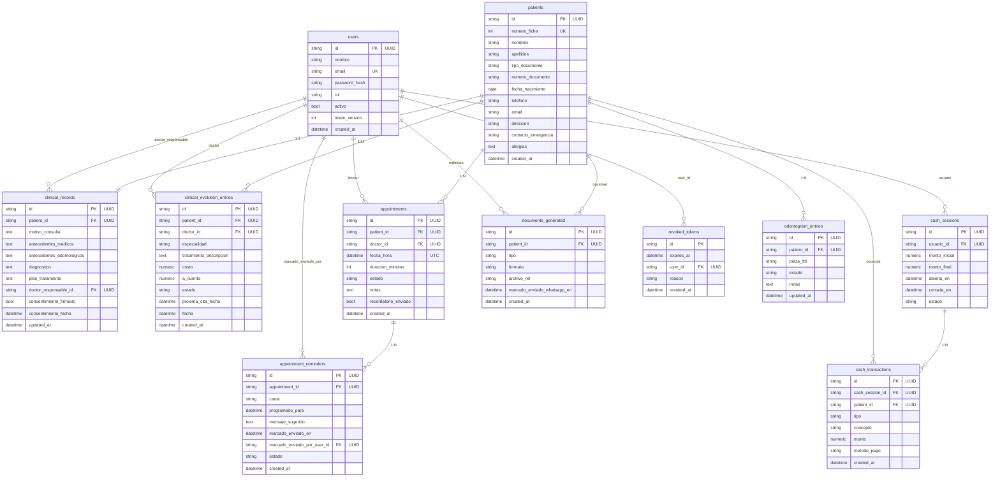

# Diagrama Entidad-Relación — M&D Odontología Especializada

**Motor:** SQLite (archivo local; Postgres legacy opcional vía `DATABASE_URL`).  
**PK/FK:** UUID `string(36)` en todas las tablas con `id` (generados en aplicación).  
`revoked_tokens.jti` sigue siendo string JWT id; su FK `user_id` es UUID.

Notas: tablas de odontograma histórico / periodontograma / media (`odontogram_change_log`, `odontogram_snapshots`, `periodontogram_entries`, `tooth_media`, `clinic_settings`) también usan UUID string como PK/FK; solo el tipo de ID cambió — la lógica clínica no.
