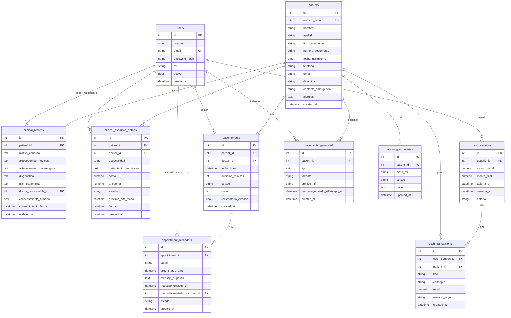

# Diagrama Entidad-Relación — M&D Odontología Especializada

```mermaid
erDiagram
    users ||--o{ clinical_records : "doctor_responsable"
    users ||--o{ clinical_evolution_entries : "doctor"
    users ||--o{ appointments : "doctor"
    users ||--o{ cash_sessions : "usuario"
    users ||--o{ appointment_reminders : "marcado_enviado_por"
    users ||--o{ documents_generated : "indirecto"

    patients ||--|| clinical_records : "1:1"
    patients ||--o{ clinical_evolution_entries : "1:N"
    patients ||--o{ odontogram_entries : "1:N"
    patients ||--o{ appointments : "1:N"
    patients ||--o{ cash_transactions : "opcional"
    patients ||--o{ documents_generated : "opcional"

    appointments ||--o{ appointment_reminders : "1:N"

    cash_sessions ||--o{ cash_transactions : "1:N"

    users {
        int id PK
        string nombre
        string email UK
        string password_hash
        string rol
        bool activo
        datetime created_at
    }

    patients {
        int id PK
        int numero_ficha UK
        string nombres
        string apellidos
        string tipo_documento
        string numero_documento
        date fecha_nacimiento
        string telefono
        string email
        string direccion
        string contacto_emergencia
        text alergias
        datetime created_at
    }

    clinical_records {
        int id PK
        int patient_id FK
        text motivo_consulta
        text antecedentes_medicos
        text antecedentes_odontologicos
        text diagnostico
        text plan_tratamiento
        int doctor_responsable_id FK
        bool consentimiento_firmado
        datetime consentimiento_fecha
        datetime updated_at
    }

    clinical_evolution_entries {
        int id PK
        int patient_id FK
        int doctor_id FK
        string especialidad
        text tratamiento_descripcion
        numeric costo
        numeric a_cuenta
        string estado
        datetime proxima_cita_fecha
        datetime fecha
        datetime created_at
    }

    odontogram_entries {
        int id PK
        int patient_id FK
        string pieza_fdi
        string estado
        text notas
        datetime updated_at
    }

    appointments {
        int id PK
        int patient_id FK
        int doctor_id FK
        datetime fecha_hora
        int duracion_minutos
        string estado
        text notas
        bool recordatorio_enviado
        datetime created_at
    }

    appointment_reminders {
        int id PK
        int appointment_id FK
        string canal
        datetime programado_para
        text mensaje_sugerido
        datetime marcado_enviado_en
        int marcado_enviado_por_user_id FK
        string estado
        datetime created_at
    }

    cash_sessions {
        int id PK
        int usuario_id FK
        numeric monto_inicial
        numeric monto_final
        datetime abierta_en
        datetime cerrada_en
        string estado
    }

    cash_transactions {
        int id PK
        int cash_session_id FK
        int patient_id FK
        string tipo
        string concepto
        numeric monto
        string metodo_pago
        datetime created_at
    }

    documents_generated {
        int id PK
        int patient_id FK
        string tipo
        string formato
        string archivo_ref
        datetime marcado_enviado_whatsapp_en
        datetime created_at
    }
```
